# API & Examples

Global appearance control, the full HTTP endpoint surface, WebSocket triggers, one-shot notifications, five worked scene examples, and the validation rule appendix.

---

## Global Appearance Control

Three values define the current look of all panels, independent of any playing scene:

| Setting | Range | Description |
|---|---|---|
| **Brightness** | 0–255 | Global multiplier applied on top of every animation's per-frame brightness |
| **Base Colors** | 3 × #RRGGBB | Primary, secondary, tertiary colours used by the `userColors` palette |
| **Palette** | name string | Currently active gradient palette (e.g. `"lava"`) |

These are persisted in `/config/appearance.json` and restored on every boot. They take effect immediately — the panel resolves all animation colours at frame time using the current palette/base-colours, so a mid-flight change appears on the very next rendered frame without restarting anything.

### Persistence file

```json
{
  "schemaVersion": 1,
  "brightness": 192,
  "baseColors": ["#FF4400", "#FF8800", "#000000"],
  "palette": "lava"
}
```

!!! info "Scene play does not persist appearance"
    Playing a scene does **not** change or persist the global appearance state. The scene's `"colors"` and `"palette"` fields define the colour context for that scene's animations only. To change the persistent appearance alongside a scene play, call the appearance endpoints explicitly before or after.

### HTTP endpoints

```http
GET    /api/appearance
PATCH  /api/appearance        {"brightness":192, "baseColors":["#FF4400","#FF8800","#000000"], "palette":"lava"}
```

All fields are optional — omit any you don't want to change. Returns `202 {}` on success (validated synchronously; the broadcast to panels is applied on the next main-loop tick), `422 {"error":"..."}` on invalid input, and persists to the filesystem.

---

## HTTP API Reference

All endpoints are on port 80 (`http://lightnet-<chipid>.local`).

### Appearance

| Method | Path | Body / Response |
|---|---|---|
| `GET` | `/api/appearance` | `{"brightness":N,"baseColors":["#..","#..","#.."],"palette":"..."}` |
| `PUT` | `/api/appearance` | Same shape, any subset of fields |
| `GET` | `/api/appearance/brightness` | `{"value":N}` |
| `PUT` | `/api/appearance/brightness` | `{"value":N}` — N: 0–255 |
| `GET` | `/api/appearance/colors` | `{"primary":"#..","secondary":"#..","tertiary":"#.."}` |
| `PUT` | `/api/appearance/colors` | Any subset of `primary`/`secondary`/`tertiary` |
| `GET` | `/api/appearance/palette` | `{"palette":"lava"}` |
| `PUT` | `/api/appearance/palette` | `{"palette":"lava"}` — must be a known palette name |

### Palettes (library management)

| Method | Path | Body / Response |
|---|---|---|
| `GET` | `/api/palettes` | `["rainbow","lava",...]` |
| `GET` | `/api/palettes/:name` | Palette JSON |
| `POST` | `/api/palettes` | Palette JSON body |
| `DELETE` | `/api/palettes/:name` | 403 for built-ins |

### Scenes (scene library)

| Method | Path | Body / Response |
|---|---|---|
| `POST` | `/api/scenes` | Scene JSON body — saves to `/scenes/<name>.json` |
| `GET` | `/api/scenes` | `[{"name":"sunset"},...]` |
| `GET` | `/api/scenes/:name` | Scene JSON (raw file passthrough) |
| `DELETE` | `/api/scenes/:name` | — |

### Scene playback

| Method | Path | Body / Response |
|---|---|---|
| `POST` | `/api/scenes/play/one-shot` | Full scene JSON body — stored under the hidden name `@one-shot`, then played by name (so it survives resume / power-cycle like a named scene; names starting with `@` are hidden from `GET /api/scenes` and cannot be used as a saved-scene name) |
| `POST` | `/api/scenes/play` | — replays `lastPlayedScene` from `GET /api/state` (by name if it was a stored scene, or `@one-shot` if it was a one-shot play); `404` if nothing has been played yet |
| `POST` | `/api/scenes/:name/play` | — (plays stored scene by name) |
| `POST` | `/api/scenes/stop` | — |
| `POST` | `/api/scenes/speed` | `{"speed":<float>}` — change playback speed [0.1, 10.0] while playing |

Playback status (`playing`, `speed`) and `lastPlayedSceneIsStored` are reported via `GET /api/state` (see [`docs/api.md`](../api.md#29-state)).

### One-shot / triggers

| Method | Path | Body / Response |
|---|---|---|
| `POST` | `/api/animations/play` | Flat layer object: `{"group":N,"panels":..., "type":"BREATHE","color":"#FF0000","duration":2000}` |
| `POST` | `/api/animations/trigger` | `{"group":1,"value":200}` — fires a REACTIVE beat |

### Error responses

| Code | Meaning |
|---|---|
| `200 {}` | Success (read-only or filesystem/config mutation) |
| `202 {}` | Accepted — validated; the packet-emitting work was queued onto the main loop (scene play/stop/speed, one-shot, trigger, appearance) |
| `404 {"error":"not_found"}` | Scene / palette doesn't exist |
| `409 {"error":"schema_too_new","scene":N,"firmware":M}` | Scene file has a newer schema version than the firmware supports |
| `422 {"error":"<message>"}` | Validation failure — no changes applied |

---

## WebSocket Triggers

Connect to `ws://lightnet-<chipid>.local/ws` using the binary WebsocketApi protocol.

To fire a beat trigger for a REACTIVE animation on group 1 with peak level 200:

```
MSG_ANIMATION_TRIGGER (type=8) payload:
  uint8_t groupId = 1
  uint8_t value   = 200   // 0-255 peak level
```

The controller broadcasts `PACKET_ANIMATION_UPDATE_PARAMS` with `PARAM_TRIGGER` to all panels in that group. Each panel running a REACTIVE animation on that group instantly jumps to `colorTo` and begins decaying toward `colorFrom` at its configured `decayRate`.

For music sync, fire triggers on beat events. At 120 BPM the inter-beat window is 500 ms. The controller spends only ~140 µs of I²C time per trigger; between triggers there is zero I²C traffic.

---

## Notifications & One-Shot Animations

The scene player is single-instance — only one scene plays at a time. Notifications that should appear *over* an ambient scene use a **free group ID** that doesn't conflict with the scene.

Use `POST /api/animations/play` to send a single animation step directly, bypassing the scene system. The body is a **flat object** — all step fields live at the root alongside `group` and `panels`:

```json
{
  "group": 250,
  "panels": "all",
  "type": "PULSE",
  "colorFrom": "#000000",
  "colorTo": "#FF0000",
  "duration": 500,
  "params": [
    64,
    64
  ]
}
```

All the same step fields documented in [Animation Types](types.md) and [Controller Runners](types.md#controller-runners) are supported. The notification runs on group 250 while the ambient scene continues on groups 1–N. The panel's AnimationPlayer handles both groups independently.

For chained steps on a notification (e.g. pulse → fade), use a short scene via `POST /api/scenes/play/one-shot` with a free group ID instead.

---

## Examples

### Example 1 — Ambient breathe (single colour)

```json
{
  "name": "warm-breathe",
  "loop": true,
  "colors": {
    "primary": "#FF8800"
  },
  "palette": "userColors",
  "layers": [
    {
      "group": 1,
      "panels": "all",
      "sequence": [
        {
          "type": "BREATHE",
          "colorFrom": "#000000",
          "colorTo": { "useColor": 0 },
          "duration": 4000,
          "loop": true
        }
      ]
    }
  ]
}
```

Change colour mid-flight: `PUT /api/appearance/colors {"primary":"#0044FF"}` — the breathe immediately shifts to blue on the next frame.

---

### Example 2 — Colour wash with wave overlay

```json
{
  "name": "lava-wave",
  "loop": true,
  "palette": "lava",
  "layers": [
    {
      "group": 1,
      "panels": "all",
      "sequence": [
        {
          "type": "SOLID",
          "color": { "palette": 128 }
        }
      ]
    },
    {
      "group": 2,
      "panels": "all",
      "sequence": [
        {
          "runner": "WAVE",
          "color": { "palette": 220 },
          "duration": 4000,
          "params": [4]
        },
        {
          "type": "SOLID",
          "color": { "palette": 128 },
          "duration": 1000
        }
      ]
    }
  ]
}
```

Group 1 holds a static dim background. Group 2 cycles: bright wave sweeps across, then holds the background level for a beat, then repeats.

---

### Example 3 — Music-reactive fire

```json
{
  "name": "fire-reactive",
  "loop": true,
  "palette": "embers",
  "layers": [
    {
      "group": 1,
      "panels": "all",
      "sequence": [
        {
          "type": "REACTIVE",
          "colorFrom": { "palette": 50 },
          "colorTo": { "palette": 220 },
          "duration": 0,
          "params": [210]
        }
      ]
    }
  ]
}
```

Send WebSocket trigger on every beat: `MSG_ANIMATION_TRIGGER group=1 value=255`. Panels jump to the bright orange end of the embers palette and decay over ~1.2 s.

---

### Example 4 — Scene with two spatial zones, different palettes

```json
{
  "name": "split-zones",
  "loop": true,
  "layers": [
    {
      "group": 1,
      "panels": [0, 1, 2, 3, 4],
      "palette": "ocean",
      "sequence": [
        {
          "type": "HUE_CYCLE",
          "duration": 0,
          "loop": true,
          "params": [8]
        }
      ]
    },
    {
      "group": 2,
      "panels": [5, 6, 7, 8, 9],
      "palette": "lava",
      "sequence": [
        {
          "type": "BREATHE",
          "colorFrom": "#000000",
          "colorTo": { "palette": 200 },
          "duration": 3000,
          "loop": true
        }
      ]
    }
  ]
}
```

Panels 0–4 cycle through ocean hues. Panels 5–9 breathe lava orange. Spatial palette override is valid because the two panel sets don't overlap.

---

### Example 5 — Boot-up sequence that settles into ambient

```json
{
  "name": "startup",
  "loop": false,
  "palette": "rainbow",
  "layers": [
    {
      "group": 1,
      "panels": "all",
      "sequence": [
        {
          "runner": "WAVE",
          "color": { "palette": 0 },
          "duration": 1500,
          "params": [5]
        },
        {
          "runner": "RIPPLE",
          "color": { "palette": 128 },
          "duration": 1200,
          "params": [3, 0]
        },
        {
          "type": "TRANSITION",
          "colorFrom": { "palette": 200 },
          "colorTo": { "useColor": 0 },
          "duration": 2000
        },
        {
          "type": "BREATHE",
          "colorFrom": "#000000",
          "colorTo": { "useColor": 0 },
          "duration": 0
        }
      ]
    }
  ]
}
```

Play once (`loop: false`). The sequence runs wave → ripple → colour transition → infinite breathe in the base colour.

### Example 6 — Full choreography (`startAfter`, gap, async, barrier)

Every timing mechanism in one looping scene — parallel start, `startAfter`
sequencing, a leading gap, the phase-locked scene-cycle barrier, and an async
free-runner:

```json
{
  "name": "choreo_demo",
  "loop": true,
  "layers": [
    {
      "group": "intro",
      "sequence": [
        {
          "type": "FADE",
          "colorFrom": "#00000",
          "colorTo": "#FFFFFF",
          "duration": 2000
        }
      ]
    },
    {
      "group": "accent",
      "sequence": [
        {
          "runner": "WAVE",
          "color": { "palette": 200 },
          "duration": 2000
        }
      ]
    },
    {
      "group": "main",
      "startAfter": "intro",
      "sequence": [
        { "duration": 500 },
        { "type": "BREATHE", "colorTo": "#0040FF", "duration": 3000 }
      ]
    },
    {
      "group": "bg",
      "async": true,
      "sequence": [
        {
          "type": "BLINK",
          "colorTo": "#FF8000",
          "duration": 1500,
          "params": [200]
        }
      ]
    }
  ]
}
```



```mermaid
%%{init: {'gantt': {'barHeight': 70, 'barGap': 8, 'topPadding': 50, 'leftPadding': 160, 'fontSize': 44}}}%%
gantt
  title One scene cycle (loop = true) · ms axis
  dateFormat x
  axisFormat %Lms

  section intro · sync
    FADE 2000ms            :0, 2000
    hold · waits barrier   :done, 2000, 5500

  section accent · sync
    WAVE 2000ms            :0, 2000
    hold · waits barrier   :done, 2000, 5500

  section main · startAfter intro
    waiting · dark         :done, 0, 2000
    GAP 500ms              :done, 2000, 2500
    BREATHE 3000ms         :2500, 5500

  section bg · async
    BLINK 1500ms           :active, 0, 1500
    BLINK 1500ms           :active, 1500, 3000
    BLINK 1500ms           :active, 3000, 4500
    BLINK · crosses barrier :active, 4500, 6000

  section barrier
    sync layers restart ↻  :milestone, 5500, 0
```

| Layer | Mechanism | Behaviour |
|---|---|---|
| `intro`, `accent` | **Parallel** (no `startAfter`) | Both start at t=0. `accent` finishes at 2000 but **holds** until the barrier. |
| `main` | **`startAfter: intro`** + **gap** | Stays dark until `intro` ends (2000), waits a 500ms gap, then breathes. |
| barrier | **Phase-lock** | Fires at 5500 — the end of the longest dependency chain (`intro → main`), not the longest single layer. All sync layers reset **together**, so nothing drifts. |
| `bg` | **`async: true`** | Blinks every 1500ms, ignoring the barrier — note the blink crossing 5500 and continuing into the next cycle. |

---

## Appendix: Validation Rules

These apply to `POST /api/scenes` and `POST /api/scenes/play/one-shot`. All violations return `HTTP 422`.

| Field | Rule |
|---|---|
| Scene name | `[a-zA-Z0-9_-]`, 1–18 chars; names cannot start with `@` (reserved for internal scenes such as `@one-shot`, used by `POST /api/scenes/play/one-shot`) |
| Layer count | 1–8 |
| Steps per layer | 1–12 |
| `group` | Name (string) or number 1–254; unique within the scene |
| Step `id` | Optional, `[a-zA-Z0-9_-]` (no `:`), unique within the layer's sequence (`schemaVersion: 8`+) |
| `startAfter` | `"group"` or `"group:stepId"` (`schemaVersion: 8`+); must name an existing group (and step, if given); no self-reference, no dependency cycles |
| `async` | Bool; loops the layer independently of the barrier. No effect when `startAfter` is set |
| `type` + `runner` | Mutually exclusive — cannot both be set |
| Step with neither `type` nor `runner` | Treated as a **gap** (timed no-op); only `duration` is used |
| `type` value | Must be a known animation type string |
| `runner` value | `WAVE`, `RIPPLE`, `CHASE`, `WHEEL`, `BOUNCE`, `RAIN`, `SPARKLE`, or `MATRIX` |
| `duration` | 0–65535 ms; 0 only on the last step of a layer |
| Color values | Valid `#RRGGBB` hex, `{r,g,b}` each 0–255, `{"palette":0-255}`, or `{"useColor":0-2}` |
| `params[i]` | 0–255 |
| `params` length | 0–4 |
| Panel indices | 1–254; unique panel addresses (panels are numbered from 1) |
| Panel list length | 1–32 per layer |
| Layer palette override | Layers with different effective palettes should not share any target panel (not validated at save time) |
| Infinite last step | Holds forever; layer (or its last step, if targeted via `startAfter: "group:stepId"`) can't be a `startAfter` target, and blocks the whole-scene loop |

---

## Panel targeting & directionality

Beyond `"all"` and explicit index arrays, a layer's `"panels"` accepts **graph selectors** and
**tags**, and runner steps accept a **source** for directionality. Full grammar, semantics, and
worked examples live in [Scene Authoring → Targeting panels](scene-authoring.md#6-targeting-panels-the-panels-field) and
[Scene Authoring → Directionality](scene-authoring.md#8-directionality--the-source-field); a summary:

- **Targeting** (`"panels"`): `"all"`, `[1,3,5]`, `{"exclude":[2]}` (v2, unchanged), plus graph
  selectors `"root"` / `"leaves"` / `"branches"` / `"depth:1-2"` / `"subtree:N"` / `"neighbors:N"` /
  `"fraction:0-0.33"` / `"first:K"` / `"last:K"` / `"even"` / `"odd"`, the per-device `"tag:<name>"`,
  and composition objects `{"any":[…]}` / `{"all":[…]}` / `{"not":…}`. A selector that matches no
  panel here skips the layer (or uses an optional sibling `"fallback"` selector).
- **Directionality** (runner steps `WAVE`/`RIPPLE`/`CHASE`/`BOUNCE`/`RAIN`, and `WHEEL`'s pivot):
  `"source"` ∈ `root` | `leaves` | `panel:N` (default `root`) sets the graph origin the effect
  emanates from; `"reverse": true` flips it. The legacy `"originPanel"` is accepted and maps to
  `source:panel:N`. `SPARKLE` has no directionality — `source`/`reverse`/`directionality`/`angle`
  are ignored.
- **Per-device config** (resolved against, set via the [Topology API](../api.md#27-topology-logical-root-panel-tags)):
  the **logical root** re-centres `depth`/`subtree`/`source:root`; **tags** map `tag:<name>` to panels
  on this device. Both are device-local and not part of the shared scene.
