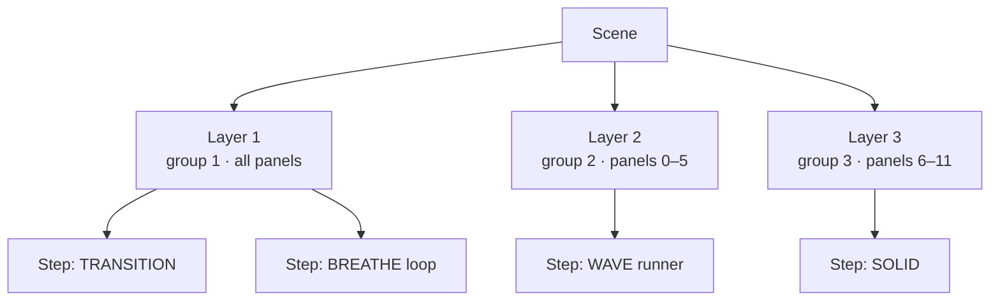

# Concepts

The Lightnet animation system lets you define multi-layer, palette-driven light shows in JSON and send them to panels over HTTP. Panel-local animations run entirely on the ATmega after a single setup packet — zero per-frame I²C traffic. Controller runners are computed on the ESP and stream per-panel color values each frame.

The palette and scene model draws inspiration from the [WLED](https://github.com/Aircoookie/WLED) project.

Core building blocks of the Lightnet animation system — scenes, layers, steps, groups, palettes, color references, and how steps advance over time.

---

## Scene

A **scene** is the top-level playback unit. It groups one or more layers that run simultaneously. A scene can loop indefinitely or play once and stop.



Scenes are stored as JSON files on the controller's filesystem (LittleFS) at `/scenes/<name>.json`. The HTTP body and the stored file share the same JSON format.

---

## Layer

A **layer** is an animation track inside a scene. Each layer:

- Targets a set of panels (`"all"`, a list, or an exclude list)
- Belongs to a **group** — a name (e.g. `"intro"`) or a number (1–254). Panels run all groups concurrently without interference.
- Runs a sequence of steps back-to-back, advancing automatically when the current step ends
- Optionally declares **`startAfter`** — the name of another layer's group (`"intro"`) or one of its steps (`"intro:flash"`, `schemaVersion: 8`+) that it waits for. Unset ⇒ the layer starts immediately at scene start (parallel). Set ⇒ the layer stays dark until the referenced layer's sequence (or just the named step) finishes (sequential).

Because groups are independent, panels can run several overlapping layers simultaneously. A
panel playing group `ambient` (breathe) and group `notify` (pulse) at the same time runs **both
at once** and **composites** them into its single colour output each frame — they no longer
overwrite each other. How they combine is set by each layer's [`blend` mode](#layer-compositing),
and layers are stacked in **array order** (earlier layers are below later ones). A panel runs up
to `MAX_ANIM_SLOTS` (18) composited layers; if more layers target one panel the extra ones (by
array order) are dropped.

### Layer ordering (`startAfter`)

`startAfter` turns the flat "everything starts at t=0" model into a dependency
graph, so you can both **sequence** and **parallelise** groups from one field:

```json
"layers": [
  { "group": "intro", "panels": [1, 2], "sequence": [ /* … */ ] },
  { "group": "main", "startAfter": "intro", "panels": [3], "sequence": [ /* … */ ] }
]
```

`main` stays dark until `intro`'s whole sequence completes, then begins. Layers
that share the same `startAfter` (or none) run in parallel.

A step within `intro` can be given an optional `id` (e.g. `"id": "flash"`), and
another layer can target it with `"startAfter": "intro:flash"` — that layer starts
as soon as `intro`'s `flash` step finishes, while the rest of `intro`'s sequence
keeps playing independently. Step `id`s are unique within their layer and `:` is
reserved as the group/step separator. Requires `schemaVersion: 8`.

Validation rejects: an unknown `startAfter` target (group or step), a
self-reference, a dependency **cycle**, and a `startAfter` target whose targeted
step (the named step, or the sequence's last step if none is named) is infinite
(`duration:0`) — such a step never finishes, so its dependents would never start.

---

## Step

A **step** is a single animation segment within a layer's sequence. Steps are executed in order, advancing automatically when `durationMs` elapses. A step can be:

- A **panel-local animation** (`"type": "BREATHE"`, etc.) — runs entirely on the ATmega with zero per-frame I²C traffic
- A **controller runner** (`"runner": "WAVE"`, etc.) — computed on the ESP each frame, sends per-panel color values over I²C
- A **gap** (no `type` and no `runner`, only `duration`) — a timed no-op used to offset a layer's start or pause between animations

### Gap steps

A step with neither `type` nor `runner` is a **gap**: the controller sends
nothing and simply waits `duration` before advancing. The layer's panels **hold**
their current state during the gap (which is black at scene start, since all
panels are cleared when a scene begins). Use a gap to delay a layer's first
animation or to insert a pause:

```json
"sequence": [
  { "duration": 500 },  // dark/hold for 500ms
  { "type": "BREATHE", "colorTo": "#0040FF", "duration": 4000 }
]
```

To force an explicit black instead of holding, use `{"type":"SOLID","color":"#000000","duration":N}`.

---

## Group

Groups are the synchronisation unit. When the controller fires a `GENERAL CALL START` on a group, every panel that has an animation queued for that group starts simultaneously (±2.5 µs jitter).

A `group` may be written as a **name** (`"group": "intro"`) or a **number** (`"group": 3`). Names are the preferred, readable form; the controller maps each distinct name to an auto-assigned numeric ID (1, 2, 3…) in order of first appearance at parse time, so the on-the-wire protocol is unchanged. Numbers (1–254) still work for back-compat; 0 is reserved.

`startAfter` references a layer by its group **name**, optionally followed by
`:stepId` to target one of that layer's steps (see [Layer ordering](#layer-ordering-startafter)).

!!! note "Groups must be unique within a scene"
    The controller validates this on save. Two layers cannot share the same group name/ID. Avoid mixing named and numeric groups in one scene — a name auto-assigned to `1` collides with a literal `"group": 1`.

---

## Layer compositing

When two or more layers target the same panel, the panel runs them concurrently and **composites**
them — folding each layer's colour onto an accumulator, in **layer array order** (the first layer
in `layers[]` is the bottom of the stack). Each layer is one of:

- A **source** layer (any normal animation/runner) — produces a colour and combines it with what's
  below via its `blend` mode.
- A **modifier** layer (a panel-local step with `animates` set to something other than `color`) —
  has no colour of its own; it *transforms* the colour accumulated below it (brightness/
  saturation/hue).

The accumulator starts from the scene [`background`](#scene-background) (black by default).

### Blend modes (`"blend"` on a layer)

| Mode | Effect (`below` ⊕ `layer`) |
|---|---|
| `opaque` (default) | the layer's colour replaces what's below |
| `add` | `below + layer` (clamped) — light accumulates |
| `max` | per-channel `max` — non-destructive lighten; **black is transparent** |
| `multiply` | `below × layer / 255` — darken / mask |
| `screen` | soft lighten |
| `darken` | per-channel `min` — non-destructive darken; **white is transparent** |
| `overlay` | multiply shadows, screen highlights — boosts contrast |
| `difference` | per-channel `\|below − layer\|` — inverts toward the layer's colour |
| `subtract` | `below − layer`, clamped to `0` — punches the layer's colour out of what's below |

`max`/`add`/`screen` treat black as transparent, so they layer an accent over a background without
clobbering it. **Runner layers default to `max`** for exactly this reason (a runner's off-phase is
black); a standalone runner over a black background looks identical to before.

### Modifier layers

A modifier is a panel-local step (any `type` except `HUE_CYCLE`) with `animates` set to `dim`,
`desaturate`, `hue`, `invert`, `brighten`, or `saturate`. It animates a scalar from `from` → `to`
(0–255) over its `duration` and applies it to everything composited below it:

| `animates` | `from`/`to` meaning | Identity |
|---|---|---|
| `dim` | brightness scale down toward black (255 = full) | 255 |
| `desaturate` | saturation scale down toward grey (255 = unchanged) | 255 |
| `hue` | hue rotation (0…255 = full turn) | 0 |
| `invert` | cross-fade toward RGB-inverted colour (255 = fully inverted) | 0 |
| `brighten` | push brightness up toward white (255 = white) | 0 |
| `saturate` | push saturation up toward fully saturated (255 = max) | 0 |

A finished modifier **holds** its final value (consistent with the "finished layer holds last
frame" model), so a saturate-down that ends keeps applying. To release it, end the modifier with a
step ramping back to identity. A modifier placed *above* a source (later in `layers[]`) transforms
that source; placed below, it has nothing to act on.

### Scene background

A scene may set `"background": "#RRGGBB"` (default black). It is pushed to every panel once at scene
start as the **compositor base**: layers fold over it, and a panel with no active layer simply
displays it. This is the clean way to put a static ambient colour under animated accents.

---

## Palettes

A **palette** is a 16-stop gradient of `(position, R, G, B)` entries. The controller linearly interpolates between stops to produce smooth colour transitions. Every animation step references colour through a palette position, a base-colour slot, or an explicit inline RGB value — all three are unified under the same `ColorRef` mechanism.

### Palette JSON schema

```json
{
  "schemaVersion": 1,
  "name": "lava",
  "stops": [
    [0, "#000000"],
    [46, "#240000"],
    [96, "#711100"],
    [148, "#8E0301"],
    [204, "#FF4702"],
    [255, "#FFFFFF"]
  ]
}
```

Rules:

- Positions must be strictly increasing, 0–255
- First stop must have position 0; last must have position 255
- 1–16 stops. Fewer stops = coarser gradient.

### Built-in palettes

These are always available and cannot be deleted:

| Name | Description |
|---|---|
| `rainbow` | Full hue spectrum |
| `lava` | Black → dark red → orange → white |
| `ocean` | Dark navy → teal → bright cyan/white |
| `forest` | Dark green → bright lime |
| `party` | Purple → magenta → orange → yellow → cyan |
| `sunset` | Deep purple → warm red → golden orange |
| `aurora` | Dark teal → bright green → purple → pink |
| `embers` | Black → dark red → bright orange-gold |

### Special palette: `userColors`

`userColors` is a synthetic palette built from the current base colours at the moment it is pushed to the panels. It is not stored as a file. When selected:

```
stop[0] = (position=0,   color=primary)
stop[1] = (position=128, color=secondary)
stop[2] = (position=255, color=tertiary)
```

Animations that reference palette positions 0, 128, and 255 will use the primary, secondary, and tertiary base colours respectively. Positions between stops are linearly interpolated.

This is the default palette for new scenes — if no `"palette"` field is specified, animations track the three base colours.

### Per-layer palette override

A layer can specify its own palette, overriding the scene-level default for the panels it targets:

```json
{
  "group": 2,
  "panels": [0, 1, 2],
  "palette": "ocean",
  "sequence": [...]
}
```

!!! warning "Palette overlap constraint"
    Each panel stores only **one active palette** at a time. If two layers with different effective palettes target the same panel, the last palette sent wins and the other layer will see wrong colours. Avoid overlapping panel sets when using layer palette overrides.

---

## Scene Structure

### Full scene example

```json
{
  "schemaVersion": 1,
  "name": "sunset",
  "loop": true,
  "colors": {
    "primary": "#FF4400",
    "secondary": "#FF8800",
    "tertiary": "#000000"
  },
  "palette": "lava",
  "layers": [
    {
      "group": 1,
      "panels": "all",
      "sequence": [
        {
          "type": "TRANSITION",
          "colorFrom": "#000000",
          "colorTo": { "useColor": 0 },
          "duration": 3000
        },
        {
          "type": "BREATHE",
          "colorFrom": "#000000",
          "colorTo": { "useColor": 0 },
          "duration": 4000,
          "loop": true
        }
      ]
    },
    {
      "group": 2,
      "panels": "all",
      "sequence": [
        {
          "runner": "WAVE",
          "color": { "palette": 200 },
          "duration": 8000,
          "params": [3]
        }
      ]
    }
  ]
}
```

### Field reference

**Scene fields**

| Field | Required | Default | Description |
|---|---|---|---|
| `schemaVersion` | No | 1 | Schema version check. `409` if greater than firmware's version (currently 8; v2 = named groups / `startAfter` / gaps, v3 = geometric directionality, v4 = layer blend / modifiers, v5 = WHEEL runner / `repeat`, v6 = brightness/saturation boost modifiers, v7 = BOUNCE/RAIN/SPARKLE runners / `waves` field, v8 = step `id` + `startAfter: "group:stepId"`). |
| `name` | No | — | 1–18 chars, `[a-zA-Z0-9_-]`. Required when saving via `POST /api/scenes`. |
| `loop` | No | `false` | When `true`, the whole scene restarts (all layers together) once every layer has finished — the scene-cycle barrier. |
| `speed` | No | `1.0` | Playback speed multiplier [0.1, 10.0]. Scales all step durations. |
| `colors` | No | white/black/black | Scene's base colours for `userColors` palette and `{"useColor":N}` references. |
| `background` | No | `#000000` | Compositor base colour pushed to all panels at scene start (see [Scene background](#scene-background)). |
| `palette` | No | `"userColors"` | Active palette for all layers that don't have their own override. |
| `layers` | Yes | — | Array of 1–8 layer objects. |

**Layer fields**

| Field | Required | Default | Description |
|---|---|---|---|
| `group` | Yes | — | Group name (string) or number (1–254). Unique within the scene. |
| `panels` | No | `"all"` | Panel targeting — see below. |
| `blend` | No | `opaque` (runners: `max`) | How this layer composites with the layers below it (see [Layer compositing](#layer-compositing)). |
| `palette` | No | scene default | Per-layer palette override. |
| `startAfter` | No | — | Group name of the layer this one waits for, optionally `:stepId` for a specific step (`schemaVersion: 8`+); unset ⇒ starts at scene start. |
| `async` | No | `false` | When `true`, the layer loops on its own, independent of the scene-cycle barrier (see below). Ignored if `startAfter` is set. |
| `sequence` | Yes | — | Ordered array of steps (1–12). |

### Panel targeting

```json
"panels": "all"              // all discovered panels
"panels": [1, 3, 5]          // specific panel addresses (numbered from 1)
"panels": {"exclude": [3]}   // all panels except listed addresses
```

Panel addresses are assigned during discovery in tree-traversal order, starting at **1** (address 0 is the I²C general-call broadcast and is rejected). Up to 32 panels per explicit targeting list.

Beyond these explicit forms, `panels` also accepts **graph selectors** (`"root"`, `"leaves"`,
`"depth:1-2"`, `"subtree:N"`, `"fraction:0-0.5"`, …), per-device **tags** (`"tag:accent"`), and
**composition** (`{"any":[…]}` / `{"all":[…]}` / `{"not":…}`) — these resolve against the panel
tree so a scene adapts to different devices. See
[Scene Authoring → Targeting panels](scene-authoring.md#6-targeting-panels-the-panels-field).

---

## Color References

Every colour field in a step (`colorFrom`, `colorTo`, `color`) accepts any of three forms:

### 1. Inline RGB

```json
"color": "#FF4400"
"color": {"r": 255, "g": 68, "b": 0}
```

The RGB value is stored directly in the step. The panel uses it as-is. This is the `ColorRef` path.

### 2. Palette position

```json
"colorTo": {"palette": 200}
```

Samples the active palette (the one pushed to the panel for this layer) at position 0–255. The panel resolves this at frame time — if the active palette changes mid-flight, the colour updates on the next frame. This is `ColorRef`.

### 3. Base colour slot

```json
"color": {"useColor": 0}   // primary
"color": {"useColor": 1}   // secondary
"color": {"useColor": 2}   // tertiary
```

References one of the three scene (or global) base colours. The panel resolves against its current `baseColors` state. Updating base colours via `PUT /api/appearance/colors` while an animation using `useColor` is running will change the displayed colour on the next frame. This is `ColorRef`.

---

## Sequencing & Timing

### Step advancement

Steps within a layer advance automatically when `durationMs` elapses. The controller checks elapsed time each pass through the main loop. There is no callback mechanism — advancement is purely time-based.

```mermaid
gantt
  title Layer timeline (loop=true, total 6000ms)
  dateFormat x
  axisFormat %Lms
  section Layer
  TRANSITION (2000ms) :0, 2000
  BREATHE (3000ms)    :2000, 5000
  FADE (1000ms)       :5000, 6000
```



Layers without a `startAfter` begin together at scene start; gated layers begin when their dependency finishes (see [Layer ordering](#layer-ordering-startafter)).

### Infinite steps

`"duration": 0` means the step runs indefinitely. This is only valid as the **last step** of a layer. Using duration 0 on a non-last step is a validation error. An infinite last step holds forever — so that layer never "finishes", cannot be a `startAfter` target, and (see below) prevents the whole-scene loop from re-triggering.

### Loop semantics

The scene plays its layer dependency graph **once**: each layer runs its sequence
and then holds its last frame when finished. When **every** layer has finished, a
**scene-cycle barrier** fires:

| Setting | Effect at the barrier |
|---|---|
| `scene.loop: true`  | The whole scene resets and replays — all layers restart **together**, so groups never drift apart over loops. |
| `scene.loop: false` | Playback stops, holding the final frame. |

`step.loop: true` is independent: the animation type cycles within that step's
`durationMs` window (e.g. a BREATHE with `loop:true` breathes continuously for the
duration, then the sequence advances).

!!! note "Phase-locked looping"
    Earlier firmware looped each layer independently, so layers with unequal total
    durations drifted apart. The scene-cycle barrier replaces that: the whole scene
    is the loop unit, keeping multi-group shows synchronised.

### Async layers

A layer marked `"async": true` opts **out** of the barrier and loops on its own
cadence — restarting its sequence the moment it finishes, regardless of what the
other groups are doing. Use it for an independent background effect alongside a
choreographed foreground.

- The barrier is governed only by the **synchronous** (non-async) layers. Async
  layers neither block it nor get reset by it.
- A scene that contains an async layer keeps playing until explicitly stopped
  (the async layer never "finishes"). With `loop:false`, the synchronous layers
  play once and hold while the async layer keeps looping.
- A scene where **every** layer is async simply free-runs all of them forever.
- `async` is ignored on a layer that also sets `startAfter` — a gated layer is
  part of the dependency graph, not independent.

A worked example combining all of these (parallel, `startAfter`, gap, async, and
the barrier) with a to-scale timeline is in
[API & Examples → Example 6](api.md#example-6-full-choreography-startafter-gap-async-barrier).

### Runners in sequences

Runners can be mixed with panel-local steps in the same sequence:

```json
"sequence": [
  {"runner": "RIPPLE", "color": "#FF4400", "duration": 1500, "params": [2, 0]},
  {"type": "FADE", "colorFrom": "#FF4400", "colorTo": "#000000", "duration": 800}
]
```

The controller finishes the runner (waits for `durationMs`) before firing the next step to panels.
