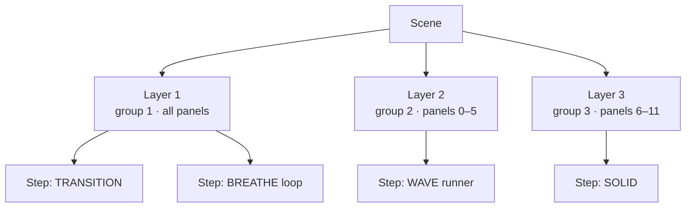

# Concepts

The Lightnet animation system lets you define multi-layer, palette-driven light shows in JSON and send them to panels over HTTP. Panel-local animations run entirely on the ATmega after a single setup packet — zero per-frame I²C traffic. Controller runners are computed on the ESP and stream per-panel brightness each frame.

The palette and scene model draws inspiration from the [WLED](https://github.com/Aircoookie/WLED) project.

Core building blocks of the Lightnet animation system — scenes, layers, steps, groups, palettes, color references, and how steps advance over time.

---

## Scene

A **scene** is the top-level playback unit. It groups one or more layers that run simultaneously. A scene can loop indefinitely or play once and stop.



Scenes are stored as JSON files on the controller's SPIFFS filesystem at `/scenes/<name>.json`. The HTTP body and the stored file share the same JSON format.

---

## Layer

A **layer** is an independent animation track inside a scene. Each layer:

- Targets a set of panels (`"all"`, a list, or an exclude list)
- Belongs to a **group ID** (1–254) — panels run all groups concurrently without interference
- Runs a sequence of steps back-to-back, advancing automatically when the current step ends

Because groups are independent, panels can run several overlapping layers simultaneously. A panel playing group 1 (ambient breathe) and group 2 (notification pulse) at the same time works without any interaction.

---

## Step

A **step** is a single animation segment within a layer's sequence. Steps are executed in order, advancing automatically when `durationMs` elapses. A step can be:

- A **panel-local animation** (`"type": "BREATHE"`, etc.) — runs entirely on the ATmega with zero per-frame I²C traffic
- A **controller runner** (`"runner": "WAVE"`, etc.) — computed on the ESP each frame, sends per-panel brightness over I²C

---

## Group

Groups are the synchronisation unit. When the controller fires a `GENERAL CALL START` on group 3, every panel that has an animation queued for group 3 starts simultaneously (±2.5 µs jitter). Groups 1–254 are valid; 0 is reserved for system use.

!!! note "Group IDs must be unique within a scene"
    The controller validates this on save. Two layers cannot share the same group ID.

---

## Palettes

A **palette** is a 16-stop gradient of `(position, R, G, B)` entries. The controller linearly interpolates between stops to produce smooth colour transitions. Every animation step references colour through a palette position, a base-colour slot, or an explicit inline RGB value — all three are unified under the same `ColorRef` mechanism.

### Palette JSON schema

```json
{
  "schemaVersion": 1,
  "name": "lava",
  "stops": [
    [0,   "#000000"],
    [46,  "#240000"],
    [96,  "#711100"],
    [148, "#8E0301"],
    [204, "#FF4702"],
    [255, "#FFFFFF"]
  ]
}
```

Rules:

- Positions must be strictly increasing, 0–255
- First stop must have position 0; last must have position 255
- 1–16 stops. Fewer stops = coarser gradient.

### Built-in palettes

These are always available and cannot be deleted:

| Name | Description |
|---|---|
| `rainbow` | Full hue spectrum |
| `lava` | Black → dark red → orange → white |
| `ocean` | Dark navy → teal → bright cyan/white |
| `forest` | Dark green → bright lime |
| `party` | Purple → magenta → orange → yellow → cyan |
| `sunset` | Deep purple → warm red → golden orange |
| `aurora` | Dark teal → bright green → purple → pink |
| `embers` | Black → dark red → bright orange-gold |

### Special palette: `userColors`

`userColors` is a synthetic palette built from the current base colours at the moment it is pushed to the panels. It is not stored as a file. When selected:

```
stop[0] = (position=0,   color=primary)
stop[1] = (position=128, color=secondary)
stop[2] = (position=255, color=tertiary)
```

Animations that reference palette positions 0, 128, and 255 will use the primary, secondary, and tertiary base colours respectively. Positions between stops are linearly interpolated.

This is the default palette for new scenes — if no `"palette"` field is specified, animations track the three base colours.

### Per-layer palette override

A layer can specify its own palette, overriding the scene-level default for the panels it targets:

```json
{
  "group": 2,
  "panels": [0, 1, 2],
  "palette": "ocean",
  "sequence": [...]
}
```

!!! warning "Palette overlap constraint"
    Each panel stores only **one active palette** at a time. If two layers with different effective palettes target the same panel, the last palette sent wins and the other layer will see wrong colours. Avoid overlapping panel sets when using layer palette overrides.

---

## Scene Structure

### Full scene example

```json
{
  "schemaVersion": 1,
  "name": "sunset",
  "loop": true,
  "colors": {
    "primary":   "#FF4400",
    "secondary": "#FF8800",
    "tertiary":  "#000000"
  },
  "palette": "lava",
  "layers": [
    {
      "group": 1,
      "panels": "all",
      "sequence": [
        {
          "type": "TRANSITION",
          "colorFrom": {"useColor": 2},
          "colorTo":   {"useColor": 0},
          "brightnessFrom": 0,
          "brightnessTo": 220,
          "duration": 3000
        },
        {
          "type": "BREATHE",
          "color": {"useColor": 0},
          "brightnessFrom": 60,
          "brightnessTo": 220,
          "duration": 4000,
          "loop": true
        }
      ]
    },
    {
      "group": 2,
      "panels": "all",
      "sequence": [
        {
          "runner": "WAVE",
          "color": {"palette": 200},
          "duration": 8000,
          "params": [3]
        }
      ]
    }
  ]
}
```

### Field reference

| Field | Required | Default | Description |
|---|---|---|---|
| `schemaVersion` | No | 1 | Schema version check. `409` if greater than firmware's version. |
| `name` | No | — | 1–18 chars, `[a-zA-Z0-9_-]`. Required when saving via `POST /api/scenes`. |
| `loop` | No | `false` | When `true`, all layers restart from step 0 after their last step completes. |
| `speed` | No | `1.0` | Playback speed multiplier [0.1, 10.0]. Scales all step durations. |
| `colors` | No | white/black/black | Scene's base colours for `userColors` palette and `{"useColor":N}` references. |
| `palette` | No | `"userColors"` | Active palette for all layers that don't have their own override. |
| `layers` | Yes | — | Array of 1–8 layer objects. |

### Panel targeting

```json
"panels": "all"              // all discovered panels
"panels": [0, 2, 5]          // specific panel indices (0-based)
"panels": {"exclude": [3]}   // all panels except listed indices
```

Panel indices are assigned during discovery in tree-traversal order. Up to 32 panels per layer targeting list.

---

## Color References

Every colour field in a step (`colorFrom`, `colorTo`, `color`) accepts any of three forms:

### 1. Inline RGB

```json
"color": "#FF4400"
"color": {"r": 255, "g": 68, "b": 0}
```

The RGB value is stored directly in the step. The panel uses it as-is. This is the `ColorRef` path.

### 2. Palette position

```json
"colorTo": {"palette": 200}
```

Samples the active palette (the one pushed to the panel for this layer) at position 0–255. The panel resolves this at frame time — if the active palette changes mid-flight, the colour updates on the next frame. This is `ColorRef`.

### 3. Base colour slot

```json
"color": {"useColor": 0}   // primary
"color": {"useColor": 1}   // secondary
"color": {"useColor": 2}   // tertiary
```

References one of the three scene (or global) base colours. The panel resolves against its current `baseColors` state. Updating base colours via `PUT /api/colors` while an animation using `useColor` is running will change the displayed colour on the next frame. This is `ColorRef`.

---

## Sequencing & Timing

### Step advancement

Steps within a layer advance automatically when `durationMs` elapses. The controller checks elapsed time each pass through the main loop. There is no callback mechanism — advancement is purely time-based.

```mermaid
gantt
  title Layer timeline (loop=true, total 6000ms)
  dateFormat x
  axisFormat %Lms
  section Layer
  TRANSITION (2000ms) :0, 2000
  BREATHE (3000ms)    :2000, 5000
  FADE (1000ms)       :5000, 6000
```



Multiple layers within a scene run in parallel from the same start moment. Each layer advances independently.

### Infinite steps

`"duration": 0` means the step runs indefinitely. This is only valid as the **last step** of a layer in a **looping scene**. Using duration 0 on a non-last step is a validation error.

### Loop semantics

!!! note "Two independent loop mechanisms"
    | Setting | Effect |
    |---|---|
    | `scene.loop: true` | Layer restarts from step 0 after all steps complete |
    | `step.loop: true`  | The animation type cycles within this step's `durationMs` window |

    Both can be combined: a BREATHE with `loop: true` and a finite `durationMs` breathes continuously for that duration, then the scene advances to the next step.

### Runners in sequences

Runners can be mixed with panel-local steps in the same sequence:

```json
"sequence": [
  {"runner": "RIPPLE", "color": "#FF4400", "duration": 1500, "params": [2, 0]},
  {"type": "FADE", "color": "#FF4400", "brightnessTo": 0, "duration": 800}
]
```

The controller finishes the runner (waits for `durationMs`) before firing the next step to panels.
