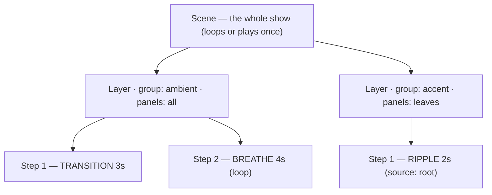

# Scene Authoring Guide

Everything you need to write Lightnet scenes by hand and use every feature to its full
potential: how scenes work, how the panel network is shaped, every JSON property, how to
target panels and give effects direction, and a library of ready-to-use example scenes.

This guide is the authoring home. Two reference docs go deeper on specific pieces and are
linked where relevant:

- [Animation Types](types.md) — the exhaustive per-type / per-runner parameter tables.
- [Concepts](concepts.md) — palette internals and the lower-level timing model.

Scenes are JSON. The exact same document is used whether you `POST` it to play inline, save
it for later, or store it as a file — see the [HTTP API](api.md).

---

## 1. The mental model

A **scene** is a light show. It is built from three nested pieces:



- A **scene** holds 1–8 **layers** that all play **at the same time**.
- A **layer** targets a **set of panels** and runs a **sequence** of 1–12 **steps**, one
  after another.
- A **step** is one animation segment with a duration.

Two kinds of step exist, and the difference matters for how they behave:

| Step kind | Field | Runs where | Cost |
|---|---|---|---|
| **Panel-local animation** | `"type"` | On each panel's own chip (ATmega) | One setup packet, then **zero** per-frame traffic |
| **Controller runner** | `"runner"` | On the controller (ESP), every frame | A `SET_COLOR` packet per panel per frame |

A panel-local animation (BREATHE, FADE, …) is told once *what* to do and runs itself. A
runner (WAVE, RIPPLE, CHASE) is a *moving* effect the controller computes by sending each
panel a new colour every frame. Use panel-local types for per-panel effects; use runners for
motion *across* panels.

---

## 2. How the panels are connected — topology

To use targeting and directional effects well, you need the shape of the network.

A Lightnet device is a **controller** driving a **tree** of panels over a single I²C bus.
During boot the controller *discovers* the panels and gives each a **1-based index**. Index
**1** is always the panel wired to the controller (the **root**); the rest fan out from it.

```
 controller
     │
    [1]  root            depth 0
    ╱ ╲
 [2]   [3]               depth 1
  │      │
 [4]    [5]              depth 2
          │
         [6]             depth 3
```

For a given physical wiring these indices are **stable across reboots** — they only change
if you physically re-wire the panels. From this tree the controller derives everything
targeting and directionality use:

| Concept | On the example tree |
|---|---|
| **root** | panel `1` (depth 0) |
| **depth** | hops from the root: `1`→0, `2`,`3`→1, `4`,`5`→2, `6`→3 |
| **leaves** | panels with no children: `4`, `6` |
| **branches** | panels that fork (≥2 children): `1` |
| **neighbors** of `3` | panels wired directly to it: `1`, `5` |
| **subtree** of `3` | itself + everything below: `3`, `5`, `6` |
| **canonical order** | a stable depth-first walk: `1, 2, 4, 3, 5, 6` |

Two consequences make scenes **portable** between devices with different panel counts and
wiring:

1. You can target panels by **role in the tree** ("the leaves", "two hops from the root")
   instead of fixed numbers, so the same scene adapts to whatever panels exist.
2. Moving effects travel by **graph distance**, so "ripple outward from the centre" means
   the same thing on any device.

> The panel you call "the centre" can be changed per device with the **logical root**
> (§10) — without editing the scene.

---

## 3. How playback works — timing & choreography

When a scene starts, **all panels are cleared to black**, then:

- Every layer **without** `startAfter` begins immediately, in parallel.
- Within a layer, steps play in order; each advances when its `duration` elapses.
- A layer with `startAfter: "X"` stays dark until layer `X`'s whole sequence finishes.

```mermaid
gantt
  title Two layers, one gated (loop = true)
  dateFormat x
  axisFormat %Lms
  section ambient (group)
  TRANSITION 2s   :0, 2000
  BREATHE 4s      :2000, 6000
  section accent (startAfter ambient)
  (waiting)       :crit, 0, 6000
  WAVE 2s         :6000, 8000
```



When **every** non-async layer has finished, the **scene-cycle barrier** fires:

- `loop: true` → the whole scene restarts, all layers together (they never drift apart).
- `loop: false` → playback stops on the last frame.

`speed` scales every step's duration (e.g. `2.0` = twice as fast). An **async** layer opts
out of the barrier and loops on its own; a **gap** step (no `type`/`runner`) just waits.
The deep timing rules — async, the barrier, infinite steps — are covered in
[Concepts → Sequencing & Timing](concepts.md#sequencing-timing); the property summaries are
in §5 below.

---

## 4. Scene properties

The top-level object:

| Property | Required | Default | What it is |
|---|---|---|---|
| `schemaVersion` | no | `1` | Format version. Rejected (`409`) if newer than the firmware (currently `5` — WHEEL runner / `repeat`). |
| `name` | yes (to save) | — | 1–18 chars, `[a-zA-Z0-9_-]`. The filename when stored. |
| `loop` | no | `false` | Restart the whole scene when all layers finish. |
| `speed` | no | `1.0` | Playback multiplier, clamped to `0.1`–`10.0`. Scales all durations. |
| `colors` | no | white / black / black | The three **base colours** (`primary`, `secondary`, `tertiary`) referenced by `useColor` and the `userColors` palette. |
| `background` | no | `#000000` | Inline RGB **compositor base** pushed to every panel at scene start. Layers fold over it, and a panel with no active layer shows it. Great for a static ambient colour under animated accents. |
| `palette` | no | `"userColors"` | Default palette for layers that don't override it. |
| `layers` | yes | — | 1–8 layer objects, played simultaneously and **composited** (§5.1). |

```json
{
  "name": "my_scene",
  "loop": true,
  "speed": 1.0,
  "palette": "ocean",
  "colors": { "primary": "#10C0FF", "secondary": "#0030A0", "tertiary": "#000000" },
  "layers": [ /* … */ ]
}
```

- **`name`** is required to *save* a scene (`POST /api/scenes`); inline play tolerates it but
  keep it set. Only `[a-zA-Z0-9_-]`, max 18.
- **`loop`** governs the *whole scene*. To loop a single effect forever instead, use a
  one-layer scene whose last step is infinite or `loop`ed (see §7).
- **`speed`** is global; per-step timing is the step's `duration` divided by `speed`.
- **`colors`** + **`palette`** feed the colour system (§9). If you omit `palette`, the scene
  uses `userColors`, a gradient built live from the three base colours.

---

## 5. Layer properties

Each entry in `layers`:

| Property | Required | Default | What it is |
|---|---|---|---|
| `group` | yes | — | A name (`"ambient"`) or number (1–254). **Unique** within the scene. |
| `panels` | no | `"all"` | Which panels this layer drives — see §6. |
| `blend` | no | `opaque` (runners: `max`) | How this layer composites with the layers below it — see §5.1. |
| `sequence` | yes | — | 1–12 steps, played in order — see §7. |
| `startAfter` | no | — | Group **name** to wait for; until it finishes this layer is dark. |
| `async` | no | `false` | Loop this layer independently of the scene barrier (ignored if `startAfter` is set). |
| `palette` | no | scene default | Palette override for this layer's panels (see the overlap caveat in §9). |

- **`group`** is the synchronisation unit — all panels in a group start a step together.
  Prefer **names** (auto-mapped to IDs in first-seen order); don't mix names and numbers in
  one scene, and never reuse a group across two layers.
- **`startAfter`** turns the flat "all start at t=0" model into a dependency graph for
  choreography. The target must exist, can't be the layer itself, can't form a cycle, and
  can't have an infinite last step (it would never finish).
- **`async`** is for a background effect that should keep looping regardless of the
  foreground. A scene with an async layer runs until explicitly stopped.

```json
{
  "group": "ambient",
  "panels": "all",
  "palette": "ocean",
  "sequence": [
    {
      "type": "BREATHE",
      "colorTo": {
        "palette": 200
      },
      "duration": 4000,
      "loop": true
    }
  ]
}
```

### 5.1 Compositing overlapping layers — `blend` & modifiers

Layers that target the same panel run **at the same time** and are composited into the panel's
single colour, in **array order** (earlier layers are *below* later ones). A panel composites up to
**4** layers; extra layers (by array order) are dropped.

Each layer is either a **source** (combines its colour with what's below via `blend`) or a
**modifier** (transforms what's below):

| `blend` | Effect | Notes |
|---|---|---|
| `opaque` | top wins | default for non-runner layers |
| `add` | additive light | black is transparent |
| `max` | per-channel lighten | black is transparent; **runner default** |
| `multiply` | darken / mask | |
| `screen` | soft lighten | black is transparent |
| `darken` | per-channel `min` | non-destructive darken; white is transparent |
| `overlay` | multiply shadows, screen highlights | contrast boost |
| `difference` | per-channel `\|below − layer\|` | inverts toward the layer's colour |
| `subtract` | `below − layer`, clamped to `0` | punches the layer's colour out of what's below |

**Runner layers default to `max`** so a runner's dark phase shows the background/layers below
(a standalone runner over a black base is unchanged). To layer any source over a background, give
it `add`/`max`/`screen`.

**Modifier layers** are steps whose `type` is `MOD_BRIGHTNESS` / `MOD_SATURATION` / `MOD_HUE_SHIFT`
/ `MOD_INVERT` — they animate a scalar `from`→`to` (0–255) and reshape everything composited below.
Put the modifier layer *after* (above) the layers it should affect:

```json
"layers": [
  { "group": "base",  "panels": "all", "sequence": [ { "type": "SOLID", "color": { "palette": 200 }, "duration": 0 } ] },
  { "group": "dim",   "panels": "all", "sequence": [ { "type": "MOD_BRIGHTNESS", "from": 255, "to": 40, "duration": 3000 } ] }
]
```

A finished modifier **holds** its final value; ramp it back to identity (255 / 255 / 0 / 0 for
brightness/saturation/hue/invert) to release.

---

## 6. Targeting panels — the `panels` field

`panels` decides which panels a layer drives. It accepts three families of value, freely
combined. All resolve **at play time against this device's topology** (§2).

### 6.1 Explicit (device-specific, exact)

```json
"panels": "all"            // every discovered panel
"panels": [1, 3, 5]        // exactly these 1-based indices (≤ 32, missing ones skipped)
"panels": { "exclude": [2] } // everything except these
```

Best when you're authoring for *your own* fixed setup and want precise control.

### 6.2 Graph selectors (portable, derived from the tree)

A string token resolved from the topology — these make a scene adapt to any device:

| Selector | Targets | On the §2 tree |
|---|---|---|
| `"root"` | the root panel | `{1}` |
| `"leaves"` | panels with no children | `{4, 6}` |
| `"branches"` | fork panels (≥2 children) | `{1}` |
| `"depth:N"` / `"depth:A-B"` | panels N hops from root (or band A–B) | `depth:1` → `{2,3}`, `depth:1-2` → `{2,3,4,5}` |
| `"subtree:N"` | panel N + all its descendants | `subtree:3` → `{3,5,6}` |
| `"neighbors:N"` | panels wired directly to N | `neighbors:3` → `{1,5}` |
| `"fraction:A-B"` | a slice of the canonical order, `A,B ∈ 0–1` | `fraction:0-0.5` → first half |
| `"first:K"` / `"last:K"` | the first / last K panels in canonical order | `first:2` → `{1,2}` |
| `"even"` / `"odd"` | by parity of canonical position | — |

`fraction` scales with panel count (portable "front half"); `first/last:K` is an absolute
count. `depth`, `subtree`, `neighbors` follow the wiring.

### 6.3 Tags (per-device labels)

A panel can be tagged on the device (e.g. `accent`, `left`) via the
[Topology API](api.md#27-topology-logical-root-panel-tags). A scene then targets the label:

```json
"panels": "tag:accent"
```

The tag resolves to whatever panels *this* device tagged, so a shared scene's intent ("light
the accents") follows to other setups once their owner tags their panels. Tag names are
`[a-zA-Z0-9_-]`, 1–15 chars.

### 6.4 Composition

Combine any of the above with set algebra:

```json
"panels": { "any": ["root", "leaves"] }            // union  → {1,4,6}
"panels": { "all": ["subtree:3", "leaves"] }        // intersect → {6}
"panels": { "not": "subtree:3" }                    // complement → {1,2,4}
"panels": { "any": ["tag:accent", "leaves"] }       // tags compose too
```

### 6.5 What happens when nothing matches

If a selector resolves to **no panels** on the target device (e.g. `subtree:9` where panel 9
doesn't exist, or an untagged `tag:accent`), the layer simply **contributes nothing** — the
scene still plays, that layer is skipped. Explicit indices that don't exist are likewise
skipped. Nothing errors at play time.

```
panels: "leaves"          panels: "subtree:3"        panels: {not:"subtree:3"}
        [1]                       [1]                        [*1]
       ╱  ╲                      ╱  ╲                       ╱  ╲
    [2]    [3]                [2]   [*3]                  [*2]  [3]
     │      │                  │      │                    │     │
   [*4]    [5]               [4]    [*5]                 [*4]   [5]
            │                         │                          │
          [*6]                      [*6]                        [6]
   → 4, 6                   → 3, 5, 6                   → 1, 2, 4
```

---

## 7. Steps — the `sequence`

A step is one animation segment. It is **either** a panel-local animation (`type`) **or** a
controller runner (`runner`) — never both — **or** a gap (neither).

### 7.1 Common step properties

| Property | Applies to | What it is |
|---|---|---|
| `type` | panel-local | Animation name (§7.2). Mutually exclusive with `runner`. |
| `runner` | runner | `WAVE` / `RIPPLE` / `CHASE` (§7.3). |
| `color` / `colorTo` | both | The (target) colour — a [colour reference](#9-colours-palettes). `color` is an alias for `colorTo`. |
| `colorFrom` | most types | Start colour (for fades, breathe, reactive rest, …). |
| `duration` | all | Milliseconds, 0–65535. `0` = infinite, **only** on the last step. |
| `loop` | panel-local | Repeat this step's animation for its `duration`. |
| `pingpong` | panel-local | Reverse at the end instead of restarting. |
| `params` | both | Up to 5 bytes (0–255), type-specific. Prefer the named keys below. |
| `source` | runner | Where a moving effect emanates from (§8). |
| `reverse` | runner | Flip the direction (§8). |
| `animates` / `amount` | runner | What the sweep modulates, and its peak intensity (§7.3). |

### 7.2 Panel-local animation types

Set with `"type"`. Summary below; **full parameter tables are in
[Animation Types](types.md#panel-local-animations)**.

| `type` | Does | Key params (see types.md) |
|---|---|---|
| `SOLID` | Holds one colour | — |
| `FADE` / `TRANSITION` | Linear `colorFrom`→`colorTo` | — |
| `BREATHE` | Smooth oscillation between the two colours | — |
| `PULSE` | Rise → hold → fall flash | `params[0]` rise, `params[1]` fall |
| `BLINK` | On/off square wave | `params[0]` half-period ms |
| `STROBE` | Flash at a frequency | `params[0]` Hz |
| `HUE_CYCLE` | Rainbow rotation (ignores colours) | `params[0]` speed |
| `REACTIVE` | Jumps to `colorTo` on a beat, decays to `colorFrom` | `params[0]` decay rate |

A step with **neither** `type` nor `runner` is a **gap** — a timed hold (panels keep their
current colour for `duration`). Use it to delay a layer or pause between effects.

### 7.3 Controller runners

Set with `"runner"`. Runners are *moving* effects that sweep a coordinate across the targeted
panels over `duration`:

| `runner` | Does | Width |
|---|---|---|
| `WAVE` | A bright band travels along the panels | `waveWidth` (rings) |
| `RIPPLE` | A ring expands outward from the source | `rippleWidth` (rings) |
| `CHASE` | A single lit ring steps outward | — |
| `WHEEL` | Blades rotate continuously about a centre | `thickness` (degrees), `lines` (1–6) |

The **direction** of WAVE/RIPPLE/CHASE is set by `source`/`reverse` — see §8. WHEEL pivots about
`source` the same way (see [Animation Types → WHEEL](types.md#wheel) for its specifics — it always
spins, needs the geometric layout, and has no topology fallback).

```json
{
  "runner": "WAVE",
  "source": "root",
  "color": {
    "palette": 200
  },
  "waveWidth": 2,
  "duration": 2500
}
```

**Repeating sweeps — `repeat`.** Set `"repeat": true` on a WAVE/RIPPLE/CHASE step to replay it
as a continuous train instead of a single pass: `duration` becomes the time for **one lap**, and
several rings/bands/blips stay in flight at once with true dark gaps between them. Colour-only
(`animates:color` — the modifier ramp can't loop cleanly). Needs `schemaVersion: 5`.

```json
{
  "runner": "RIPPLE",
  "source": "root",
  "color": {
    "palette": 96
  },
  "rippleWidth": 1,
  "repeat": true,
  "duration": 1500
}
```

**What the sweep animates — `animates` / `amount`.** By default a runner sweeps `color` (a
per-panel `PULSE` between `color` and the background). Set `animates` to `brightness` /
`saturation` / `hue` / `invert` to sweep one of the modifier properties instead — each panel
snaps to `amount` (peak intensity, 0–255) as the sweep passes and decays back to that property's
identity, so the wave **modulates** what's already showing rather than replacing it:

```json
{
  "runner": "RIPPLE",
  "source": "root",
  "animates": "hue",
  "amount": 120,
  "rippleWidth": 2,
  "duration": 4000
}
```

| `animates` | Modulates | `amount` = peak |
|---|---|---|
| `color` (default) | colour (`color` field) | — |
| `brightness` | dimming | `0` blackout … `255` no change |
| `saturation` | desaturation | `0` greyscale … `255` no change |
| `hue` | hue rotation | `0…255` = a full turn |
| `invert` | colour inversion | `0` no change … `255` fully inverted |

See [Animation Types → Controller Runners](types.md#controller-runners) for the full mechanics.

---

## 8. Directionality — the `source` field

A runner needs to know *which way* to move. Lightnet expresses this as **graph distance from
a source**: each targeted panel gets a coordinate equal to its hop-distance from the source
set, and the effect sweeps that coordinate. This is portable — it works on any tree.

Directionality is **two independent choices**: the field **mode** (`"directionality"`:
`"topology"` *(default)* or `"geometric"`) and the **`"source"`** it emanates from.

`"source"` accepts:

| `source` | The effect… | Coordinate (= distance from) |
|---|---|---|
| `"root"` *(default)* | emanates outward from the root/centre | distance from the root |
| `"leaves"` | converges inward from the tips | distance from the nearest leaf |
| `"panel:N"` | emanates from panel N | distance from panel N |
| `"all"` | every panel pulses together (degenerate) | — |

In **topology** mode (default) "distance" is graph **hops**; in **geometric** mode it is physical
distance (see below). `"reverse": true` flips the coordinate, so the effect travels the other way
(e.g. a ripple that **collapses inward** to the root). A `source` that doesn't exist on a device
falls back to `root`.

### Geometric directionality (`directionality:"geometric"`)

Topology mode sweeps along the **wiring** — great for portability, but it can't express straight
motion across the piece, because graph distance has no notion of 2-D direction.
`"directionality": "geometric"` adds that: the controller computes each panel's flat **(x,y)
position** from the regular-polygon geometry of the tree (the *same* layout the mobile app draws
in its visualizer — no setup, no extra hardware, no protocol change). It then behaves differently
per runner:

**WAVE / CHASE — straight axis sweep.** A line at `"angle"` degrees sweeps across the layout.
`source` is not used here (an axis has no origin, only a direction).

| Field | Meaning |
|---|---|
| `"angle"` | Sweep **axis** in degrees `[0,360)`, measured in the device's computed layout plane. In the app's default (unrotated) view, `0` sweeps horizontally and `90` vertically; the exact on-screen direction also depends on the visualizer's view rotation, so treat the angle as a dial to tune by eye rather than a fixed compass bearing. `reverse` flips which way the sweep travels along the axis. (2° resolution.) |

```json
{
  "runner": "WAVE",
  "directionality": "geometric",
  "angle": 0,
  "color": {
    "palette": 128
  },
  "waveWidth": 3,
  "duration": 5000
}
```

**RIPPLE — Euclidean rings from the `source`.** A ripple has no axis, so `angle` is ignored;
instead a circle grows from the `source` centre and lights **whatever panel surface it
intersects** (physical distance, not hops). Each panel is treated as its circumscribed disc, so it
occupies a *range* of distances from the centre: as the ring grows it lights the nearest panel
first, keeps it lit while the ring crosses it, and — because neighbouring panels overlap in
distance — lights them together during the overlap rather than stepping through one panel at a
time. This is where `source` shines in geometric mode:

| `source` | Geometric ripple |
|---|---|
| `"root"` *(default)* | one ripple from the root's centroid |
| `"panel:N"` | one ripple from panel N's centroid |
| `"leaves"` | **one ripple per leaf**, all expanding inward at once (fronts meet in the middle) |

```json
{
  "runner": "RIPPLE",
  "directionality": "geometric",
  "source": "leaves",
  "color": "#30C0FF",
  "rippleWidth": 2,
  "duration": 2500
}
```

Notes:
- Needs `"schemaVersion": 3`.
- The layout frame is anchored deterministically (lowest panel index), so a given `angle` always
  produces the same sweep on a given device — but it is not a literal compass bearing; tune by eye.
- `reverse` still applies (axis sweep: flips direction ≈ `angle + 180`; ripple: rings collapse
  toward the source instead of expanding).
- Width is on the same scale as the graph field, so `waveWidth`/`rippleWidth` behave comparably.
- If the layout can't be embedded (e.g. degenerate topology), it falls back to topology mode with
  the same `source`.
- The legacy `"source": "geometric"` still parses (→ `directionality:geometric`, axis sweep from
  the default root).

On the §2 tree, a `RIPPLE` with `source:"root"` lights rings outward —
`{1}` → `{2,3}` → `{4,5}` → `{6}`:

```
 t→0      [1]●              t→½    [1]            t→1   [1]
         ╱   ╲                    ╱   ╲                ╱   ╲
       [2]   [3]               [2]●  [3]●           [2]   [3]
        │     │                 │     │              │     │
       [4]   [5]              [4]   [5]            [4]●  [5]●  … then [6]●
              │                       │                          │
             [6]                     [6]                        [6]
```

`source:"leaves"` reverses the rings (starts at `4`,`6` and moves in). `waveWidth` /
`rippleWidth` are measured in **rings (hops)**, so width `2` means "two hops thick"
regardless of device size.

> **Migrating older scenes:** the old `originPanel` field still works and is read as
> `source:"panel:N"`. `WAVE`/`CHASE` that relied on discovery order now default to
> `source:"root"`.

---

## 9. Colours & palettes

Every colour field (`color`, `colorTo`, `colorFrom`) accepts one of four forms:

| Form | Example | Meaning |
|---|---|---|
| Hex string | `"#FF8000"` | A literal RGB colour. |
| Channels | `{ "r": 255, "g": 128, "b": 0 }` | Literal RGB (any channel omitted = 255). |
| Palette position | `{ "palette": 200 }` | Sample the active palette at 0–255. |
| Base colour | `{ "useColor": 0 }` | `0`=primary, `1`=secondary, `2`=tertiary from `colors`. |

- **Palettes** are 16-stop gradients. Use a built-in name (`rainbow`, `lava`, `ocean`,
  `forest`, `party`, `sunset`, `aurora`, `embers`) or one you've uploaded. Full palette
  schema and the built-in list are in [Concepts → Palettes](concepts.md#palettes).
- **`userColors`** (the default palette) is built live from the three base colours, so
  `{"palette":0/128/255}` map to primary/secondary/tertiary. Referencing `useColor` or
  `userColors` lets one scene re-skin instantly when the base colours change.
- **Per-layer `palette`** overrides the scene palette for that layer's panels. ⚠ Each panel
  holds only one active palette — don't point two layers with different palettes at the same
  panel (last one wins). See the [overlap caveat](concepts.md#per-layer-palette-override).

---

## 10. Per-device topology config (logical root + tags)

Two device-local settings let the same scene land correctly on different hardware. They are
**not** part of the scene — they're set once per device via the
[Topology API](api.md#27-topology-logical-root-panel-tags) and persist on the controller.

### Logical root

Re-designates which panel counts as the "root" for `depth`, `subtree`, and the default
runner `source:"root"`. Point it at the panel you think of as the centre and every
center-oriented scene re-centres there — no scene edit:

```
 default root = 1                 logical root = 3
        [1]  depth 0                    [1]  depth 1
       ╱   ╲                           ╱   ╲
    [2]     [3]  depth 1            [2]    [*3] depth 0   ← new centre
     │       │                       │       │
    [4]     [5]                    [4]      [5]
              │                              │
             [6]                            [6]
```

`PUT /api/topology/root` with `{"logicalRoot": 3}`. A value that doesn't exist on the device
falls back to the physical root.

### Tags

A per-device map of panel → labels, set with `PUT /api/panel-tags`
(`{"1":["accent"],"5":["accent"]}`). Scenes reference them as `"tag:<name>"` (§6.3). Because
the mapping lives on the device, a shared scene's `tag:accent` lights *that owner's* accent
panels.

---

## 11. Validation & limits

Saving or playing a scene validates all of these (HTTP `422` with a message on failure):

| Rule | Limit |
|---|---|
| Scene `name` | `[a-zA-Z0-9_-]`, 1–18 chars; required to save |
| `schemaVersion` | ≤ firmware version (currently `5`) — else `409 schema_too_new` |
| `speed` | clamped to 0.1–10.0 |
| Layers per scene | 1–8 |
| `group` | unique across layers; name or 1–254 (don't mix) |
| Steps per layer | 1–12 |
| `type` + `runner` | mutually exclusive |
| `duration` | 0–65535 ms; `0` only on the **last** step of a layer |
| Explicit panel list | indices 1–255, ≤ 32 per layer |
| Tag name | `[a-zA-Z0-9_-]`, 1–15 |
| `source` | `root` / `leaves` / `panel:N` |
| `params` | ≤ 4 entries, each 0–255 |
| `startAfter` | existing group, no self-reference, no cycle, target not infinite |

---

## 12. Example scene library

Copy-paste starting points. Every example here is valid against §11. Selectors/`source` make
the topology-aware ones portable; the index-based ones assume your own wiring.

### Solid hold

```json
{
  "name": "solid_warm",
  "layers": [
    {
      "group": "g",
      "panels": "all",
      "sequence": [
        {
          "type": "SOLID",
          "color": "#FF6000",
          "duration": 0
        }
      ]
    }
  ]
}
```

### Breathing, base-colour driven (re-skins with appearance)

```json
{
  "name": "breathe",
  "loop": true,
  "colors": {
    "primary": "#0080FF",
    "secondary": "#000000",
    "tertiary": "#000000"
  },
  "layers": [
    {
      "group": "ambient",
      "panels": "all",
      "sequence": [
        {
          "type": "BREATHE",
          "colorFrom": {
            "useColor": 1
          },
          "colorTo": {
            "useColor": 0
          },
          "duration": 4000,
          "loop": true
        }
      ]
    }
  ]
}
```

### Background + accent (two layers, no overlap)

```json
{
  "name": "bg_accent",
  "loop": true,
  "palette": "ocean",
  "layers": [
    {
      "group": "bg",
      "panels": {
        "not": "leaves"
      },
      "sequence": [
        {
          "type": "BREATHE",
          "colorTo": {
            "palette": 160
          },
          "duration": 5000,
          "loop": true
        }
      ]
    },
    {
      "group": "accent",
      "panels": "leaves",
      "sequence": [
        {
          "type": "PULSE",
          "colorFrom": "#000000",
          "colorTo": "#FFFFFF",
          "duration": 900,
          "loop": true,
          "params": [
            64,
            96
          ]
        }
      ]
    }
  ]
}
```

### Fade chain that loops

```json
{
  "name": "fade_chain",
  "loop": true,
  "layers": [
    {
      "group": "g",
      "panels": "all",
      "sequence": [
        {
          "type": "FADE",
          "colorFrom": "#FF0000",
          "colorTo": "#00FF00",
          "duration": 1500
        },
        {
          "type": "FADE",
          "colorFrom": "#00FF00",
          "colorTo": "#0000FF",
          "duration": 1500
        },
        {
          "type": "FADE",
          "colorFrom": "#0000FF",
          "colorTo": "#FF0000",
          "duration": 1500
        }
      ]
    }
  ]
}
```

### Wave outward from the centre (portable)

```json
{
  "name": "wave_out",
  "loop": true,
  "palette": "lava",
  "layers": [
    {
      "group": "g",
      "panels": "all",
      "sequence": [
        {
          "runner": "WAVE",
          "source": "root",
          "color": {
            "palette": 210
          },
          "waveWidth": 2,
          "duration": 2500
        }
      ]
    }
  ]
}
```

### Ripple from a specific panel

```json
{
  "name": "ripple_p3",
  "loop": true,
  "layers": [
    {
      "group": "g",
      "panels": "all",
      "sequence": [
        {
          "runner": "RIPPLE",
          "source": "panel:3",
          "color": "#30C0FF",
          "rippleWidth": 2,
          "duration": 1800
        }
      ]
    }
  ]
}
```

### Ripple that collapses inward (reverse)

```json
{
  "name": "ripple_in",
  "loop": true,
  "layers": [
    {
      "group": "g",
      "panels": "all",
      "sequence": [
        {
          "runner": "RIPPLE",
          "source": "leaves",
          "color": "#FFB050",
          "rippleWidth": 2,
          "duration": 2000
        }
      ]
    }
  ]
}
```

### Chase around the leaves

```json
{
  "name": "chase_leaves",
  "loop": true,
  "layers": [
    {
      "group": "g",
      "panels": "leaves",
      "sequence": [
        {
          "runner": "CHASE",
          "source": "root",
          "color": {
            "useColor": 0
          },
          "duration": 1200
        }
      ]
    }
  ]
}
```

### Choreography with `startAfter`

```json
{
  "name": "intro_then_main",
  "loop": true,
  "layers": [
    {
      "group": "intro",
      "panels": "root",
      "sequence": [
        {
          "type": "PULSE",
          "colorFrom": "#000000",
          "colorTo": "#FFFFFF",
          "duration": 700
        }
      ]
    },
    {
      "group": "main",
      "startAfter": "intro",
      "panels": "all",
      "sequence": [
        {
          "runner": "WAVE",
          "source": "root",
          "color": "#00FFAA",
          "waveWidth": 2,
          "duration": 2500
        }
      ]
    }
  ]
}
```

### Async background + synced foreground

```json
{
  "name": "async_bg",
  "loop": true,
  "layers": [
    {
      "group": "bg",
      "panels": "all",
      "async": true,
      "sequence": [
        {
          "type": "BREATHE",
          "colorTo": "#001830",
          "duration": 6000,
          "loop": true
        }
      ]
    },
    {
      "group": "fg",
      "panels": "leaves",
      "sequence": [
        {
          "runner": "RIPPLE",
          "source": "root",
          "color": "#FF4080",
          "rippleWidth": 1,
          "duration": 1500
        }
      ]
    }
  ]
}
```

### Tag-driven accent (per-device intent)

```json
{
  "name": "tag_accent",
  "loop": true,
  "palette": "party",
  "layers": [
    {
      "group": "base",
      "panels": {
        "not": "tag:accent"
      },
      "sequence": [
        {
          "type": "SOLID",
          "color": {
            "palette": 30
          },
          "duration": 0
        }
      ]
    },
    {
      "group": "hi",
      "panels": "tag:accent",
      "async": true,
      "sequence": [
        {
          "type": "STROBE",
          "color": "#FFFFFF",
          "duration": 2000,
          "params": [
            6
          ]
        }
      ]
    }
  ]
}
```

### Depth rings (one colour per ring)

```json
{
  "name": "depth_rings",
  "colors": {
    "primary": "#FF3000",
    "secondary": "#FFD000",
    "tertiary": "#00A0FF"
  },
  "layers": [
    {
      "group": "r0",
      "panels": "depth:0",
      "sequence": [
        {
          "type": "SOLID",
          "color": {
            "useColor": 0
          },
          "duration": 0
        }
      ]
    },
    {
      "group": "r1",
      "panels": "depth:1",
      "sequence": [
        {
          "type": "SOLID",
          "color": {
            "useColor": 1
          },
          "duration": 0
        }
      ]
    },
    {
      "group": "r2",
      "panels": "depth:2-9",
      "sequence": [
        {
          "type": "SOLID",
          "color": {
            "useColor": 2
          },
          "duration": 0
        }
      ]
    }
  ]
}
```

### Reactive (music) — trigger over WebSocket

```json
{
  "name": "reactive",
  "layers": [
    {
      "group": "beat",
      "panels": "all",
      "sequence": [
        {
          "type": "REACTIVE",
          "colorFrom": "#100010",
          "colorTo": "#FF00C0",
          "duration": 0,
          "params": [
            200
          ]
        }
      ]
    }
  ]
}
```

Send beats with `POST /api/animations/trigger` or the WebSocket `ANIMATION_TRIGGER` command —
see [API → Reactive trigger](api.md#reactive-trigger-http-alternative-to-websocket).

### Full showcase (parallel + gated + async + runner)

```json
{
  "name": "showcase",
  "loop": true,
  "palette": "aurora",
  "colors": {
    "primary": "#00FFC0",
    "secondary": "#8000FF",
    "tertiary": "#000000"
  },
  "layers": [
    {
      "group": "ambient",
      "panels": "all",
      "async": true,
      "sequence": [
        {
          "type": "BREATHE",
          "colorFrom": "#000010",
          "colorTo": {
            "palette": 90
          },
          "duration": 7000,
          "loop": true
        }
      ]
    },
    {
      "group": "spine",
      "panels": {
        "not": "leaves"
      },
      "sequence": [
        {
          "duration": 500
        },
        {
          "runner": "WAVE",
          "source": "root",
          "color": {
            "palette": 220
          },
          "waveWidth": 2,
          "duration": 2600
        }
      ]
    },
    {
      "group": "tips",
      "startAfter": "spine",
      "panels": "leaves",
      "sequence": [
        {
          "type": "PULSE",
          "colorFrom": "#000000",
          "colorTo": "#FFFFFF",
          "duration": 600,
          "params": [
            40,
            120
          ]
        }
      ]
    }
  ]
}
```
