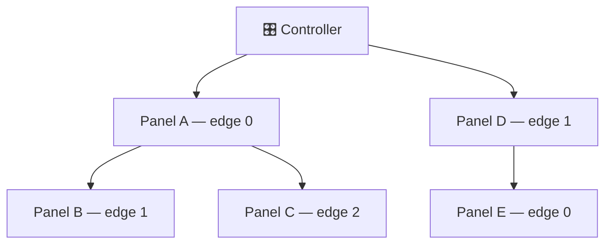
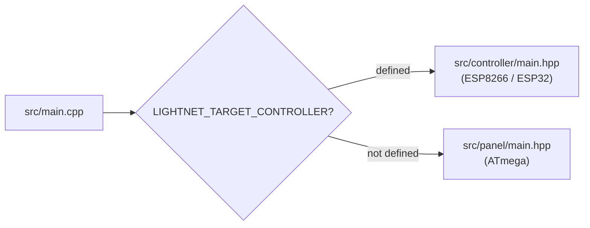
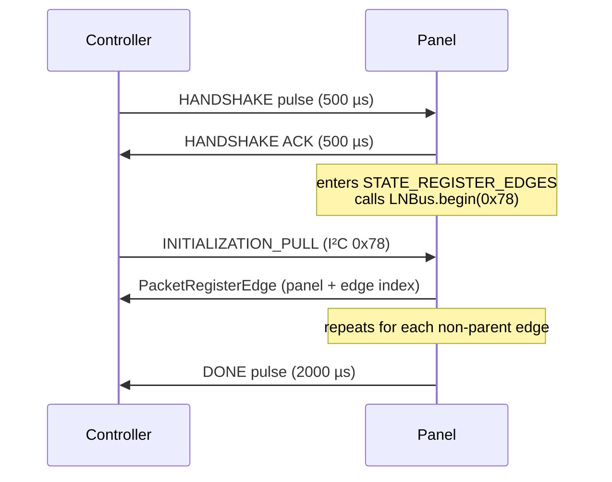
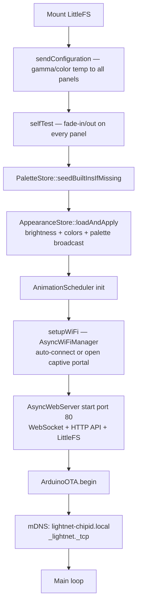

# System Architecture

Internal design reference for the Lightnet controller and panel firmware. Covers topology, library structure, I²C protocol, animation framework internals, discovery, and boot sequence.

---

## Table of Contents

1. [Physical Topology](#1-physical-topology)
2. [Two-Build Source Tree](#2-two-build-source-tree)
3. [Library Structure](#3-library-structure)
4. [I²C Protocol (Internal)](#4-i2c-protocol-internal)
5. [Animation Framework Internals](#5-animation-framework-internals)
6. [Discovery Sequence](#6-discovery-sequence)
7. [Controller Boot & Startup](#7-controller-boot-startup)

---

## 1. Physical Topology

Panels form a **tree structure** rooted at the controller. Each panel has up to 3 edges (physical connectors); edges carry both power and a single-wire ping line. The controller discovers the network by sequentially pinging each edge via GPIO, triggering PCINT interrupts on the receiving ATmega.



After the ping handshake completes, all communication uses **I²C** (`LightnetBus`) carrying structured `Protocol` packets. Panels are assigned sequential indices during discovery and use those indices as I²C addresses for all subsequent unicast traffic.

---

## 2. Two-Build Source Tree

The firmware compiles to two completely different binaries from a single source tree. The flag `LIGHTNET_TARGET_CONTROLLER` (set in `platformio.ini` build flags) selects the target:



There is no runtime branching — the preprocessor eliminates the unused side entirely. Code that belongs to both targets lives in `lib/Lightnet/Common/`.

---

## 3. Library Structure

All firmware code lives under `lib/Lightnet/`.

### Common/ — shared by both targets

| File | Purpose |
|---|---|
| `LightnetBus` | I²C wrapper: `sendPacketAck()` / `sendPacketNack()` / `sendResponsePacket()`, ISR callbacks |
| `LightnetPanelEdge` | Per-edge state machine: `IDLE → WELCOME_SENT → BOOTING → READY`. `updateEdgeState()` is ISR-safe (enqueues to ring buffer); `processEdgeState()` drains in main loop |
| `LightnetPinger` | GPIO ping pulses. `HANDSHAKE` = 500 µs, `DONE` = 2000 µs. Owns an 8-entry ring buffer. |
| `Protocol` | All I²C packet structs (`__packed__`), CRC validation, `setPacketMeta()` |
| `LightnetConfig` | Cross-cutting constants: `LIGHTNET_MAX_PANELS=100`, `PALETTE_STOPS=16`, `BASE_COLORS_COUNT=3` |
| `ColorRef` | 4-byte tagged union: `kind=0` inline RGB, `kind=1` palette position, `kind=2` base-color slot |
| `Palette` | `GradientStop` struct (pos+RGB, 4 B) and `samplePalette()` linear interpolation. No FastLED dependency |

!!! note "`busIsDisabled` is a static shared flag"
    `LightnetPinger::busIsDisabled` is **static** — shared across all pinger instances. It is set during any ping so all pingers ignore ISR samples while a pulse is being driven. Do not instantiate multiple pingers that need independent bus control.

### Controller/ — ESP8266/ESP32 only

**Panels/**

| File | Purpose |
|---|---|
| `PanelsInitializer` | Discovery orchestrator; assigns panel indices, builds edge graph |
| `PanelsController` | Unicast commands to panels: color, on/off, configuration, enter-bootloader |
| `Panel` / `Edge` | In-memory data model of discovered topology |

**Animations/**

| File | Purpose |
|---|---|
| `AnimationScheduler` | `playOnPanels()` PREPARE+START sequence; `sendPrepareToPanel()`/`sendGroupStart()` for compiled runners; `tick()` drives any streaming demo runners |
| `AnimationRunner` | Base class for the streaming runner classes (`WaveRunner`/`RippleRunner`/`ChaseRunner`) — used by demos; scenes compile runners to per-panel pulses instead |
| `RunnerCompile.hpp` | Inverts the runner envelopes to a per-panel local PULSE (onset + shape) |

**Scenes/**

| File | Purpose |
|---|---|
| `ScenePlayer` | Loads and ticks multi-layer scenes; resolves palettes, fires steps |
| `SceneParser` | Parses scene JSON into `SceneLayer[]` structs |
| `SceneStore` | Filesystem persistence for scene files at `/scenes/<name>.json` |
| `AnimationService` | Orchestrates save / play-by-name / play-inline / one-shot / stop |

**Palettes/**

| File | Purpose |
|---|---|
| `PaletteStore` | Built-in palettes compiled in; `resolve(name)` → `GradientStop[]` |

**Appearance/**

| File | Purpose |
|---|---|
| `AppearanceStore` | Owns `/config/appearance.json`; atomic writes, broadcasts to panels on change |

**API/http/**

| Class | Routes | Purpose |
|---|---|---|
| `AppearanceServer` | `GET /api/appearance`, `PATCH /api/appearance` | Appearance read/write |
| `PaletteServer` | `GET/POST /api/palettes`, `GET/DELETE /api/palettes/*` | Palette CRUD |
| `SceneServer` | `GET/POST /api/scenes`, `GET/DELETE/POST /api/scenes/*`, `/api/scenes/status`, `/api/scenes/stop`, `/api/scenes/play` | Scene CRUD + playback |
| `AnimationServer` | `POST /api/animations/play`, `POST /api/animations/trigger` | One-shot play + reactive trigger |
| `TopologyServer` | `GET /api/topology`, `PUT /api/topology/root`, `GET/PUT /api/panel-tags` | Logical root + panel tags (backed by `TopologyConfigStore`) |

**OTA/**

| File | Purpose |
|---|---|
| `TwibootClient` | twiboot host protocol over raw Wire (bypasses LNBus). `connect()` / `writePage()` / `startApp()` |
| `PanelFlasher` | Non-blocking OTA state machine: `ENTER_BL → WAIT_BL → FLASHING → VERIFY → NEXT_PANEL` |
| `FirmwareUpdateServer` | `POST /api/firmware/panels`, `GET /api/firmware/status` |
| `SerialFirmwareReceiver` | Firmware upload over 57600-baud USB serial (LNFW framing + CRC-16) |

### Panel/ — ATmega only

| File | Purpose |
|---|---|
| `LightnetPanel` | Main panel state machine; handles I²C packets, drives edge registration |
| `RGBController` | FastLED wrapper for the single WS2812 LED on PD5. `globalBrightness` multiplier on all output |
| `AnimationPlayer` | Layer compositor: `slots[4]` composited each ~16 ms tick (blend modes + `MOD_*` modifiers + background base). Resolves `ColorRef` → RGB against panel's current palette + base colors |
| `BootloaderBridge` | Writes EEPROM boot-magic `0xB007` then software-jumps to twiboot |

### Controller/API/websocket/ — WebSocket (controller only)

| File | Purpose |
|---|---|
| `WebsocketServer` | `AsyncWebSocket` on `/ws`; lock-free queue swap between ISR and main loop; per-client `ClientSettings` (mirroring flag) with ESP32-safe locking |
| `WebsocketHandler` | Decodes and dispatches commands: `TOGGLE`, `SET_COLOR`, `GET_PANELS_STATES`, `GET_EDGES_LIST`, `ANIMATION_TRIGGER`, `SET_MIRROR`, `PING` |
| `WebsocketApi` | Binary packet structs and namespace for all commands/responses |
| `PacketMirror` | Captures outbound I²C packets; maintains a live-stream ring (flushed at ~30 fps to mirroring clients) and a persistent snapshot (unicast to a client when it enables mirroring) |

### Utils/

`CircularQueue`, `List`, `Crc` (CRC-16/IBM), `Mem`, `Macros`, `Debug` (`PRINTLN`/`PRINTKV`/`PRINTF` — no-ops at `DEBUG=0`), `Gamma` (correction table in PROGMEM).

---

## 4. I²C Protocol (Internal)

Defined in `Common/Protocol.hpp`. All packets use `__attribute__((__packed__))` structs.

### Versions

| Version | Branch | Change |
|---|---|---|
| **v3** | master | Original animation framework |
| **v4** | scenes | `PacketAnimationPrepare`: `colorFrom`/`colorTo` changed from `ColorRGB` (3 B) to `ColorRef` (4 B). Three new appearance packets. |
| **v5** | — | Per-panel brightness removed (animations express brightness through colour). |
| **v6** | compositing | Layer compositor. `PacketAnimationPrepare` gains `composeMode` + `composeOrder` + `startDelayMs` (25 B); `PacketAnimationControl` gains `group_id` (per-slot, 7 B); new `SET_BACKGROUND` packet. Runners are compiled to per-panel local PULSEs. |

!!! warning "Protocol compatibility"
    Panel and controller must be flashed together when upgrading across protocol versions — versions are not interchangeable.

### Packet catalogue

| ID | Name | Dir | Size | Notes |
|---|---|---|---|---|
| 2 | `INITIALIZATION_PULL` | C→P | 7 B | Pull address `0x78`; panel replies with `PacketRegisterEdge` |
| 3 | `REGISTER_EDGE` | P→C | 9 B | Panel index + edge index |
| 4 | `TURN_ON_OFF` | C→P | 6 B | |
| 5 | `SET_COLOR` | C→P | 8 B | |
| 11 | `PANEL_CONFIGURATION` | C→P | — | Gamma correction, color temp/correction |
| 12 | `ANIMATION_PREPARE` | C→P | 25 B | Unicast; buffers a layer (incl. `composeMode`/`composeOrder`/`startDelayMs`), arms for group start |
| 13 | `ANIMATION_START` | General Call | 7 B | Fires all panels with matching group_id |
| 14 | `ANIMATION_CONTROL` | C→P | 7 B | STOP / PAUSE / RESUME / CLEAR_QUEUE; `group_id`=0 → all slots |
| 15 | `FETCH_ANIM_STATE` | C→P | 5 B | Panel replies with 11 B status |
| 16 | `ANIMATION_UPDATE_PARAMS` | General Call | 10 B | Trigger / brightness-mult / speed-scale |
| 17 | `SET_PALETTE` | C→P or GC | 70 B | 16-stop gradient; GC = broadcast to all |
| 18 | `SET_BASE_COLORS` | C→P or GC | 14 B | 3 × RGB base colors |
| 19 | `SET_GLOBAL_BRIGHTNESS` | General Call | 6 B | 0–255 multiplier |
| 20 | `SET_BACKGROUND` | C→P or GC | 8 B | Scene compositor base colour (sent once at scene start) |
| 200 | `RESET_DEVICE` | C→P | 5 B | WDT reset |
| 201 | `ENTER_BOOTLOADER` | C→P | 6 B | Token must be `0xB0` |

### General Call

I²C address `0x00` broadcasts to all panels simultaneously (±2.5 µs jitter). Used for:

- `ANIMATION_START` — fires queued animations in lockstep
- `ANIMATION_UPDATE_PARAMS` — reactive triggers, speed changes
- `SET_PALETTE` / `SET_BASE_COLORS` / `SET_GLOBAL_BRIGHTNESS`

!!! note "Duplicate guard"
    START and UPDATE_PARAMS packets are sent **twice** (300 µs apart) with a `seq_id` duplicate guard so the panel processes exactly one copy.

---

## 5. Animation Framework Internals

### AnimationPlayer (panel side) — layer compositor

- `slots[MAX_ANIM_SLOTS]` (4) — each an independent layer keyed by `group_id`, with its running
  step + a 1-deep pending step (PREPARE buffers `pending`; START activates it).
- `tick()` gated at 16 ms (60 fps), integer math only. Each tick resolves every started slot to one
  contribution (source colour or modifier value), honouring `startDelayMs` (transparent before
  onset) and finish→hold, then `ColorCompose::foldLayers()` sorts by `composeOrder` and folds onto
  the **background base** — one write to the LED.
- Source layers blend via `composeMode`; modifier layers (`MOD_*`) transform the accumulator
  (brightness = RGB multiply; saturation/hue = integer HSV). Finished non-loop slots hold their
  last value.
- `PACKET_SET_BACKGROUND` sets the compositor base (default black; idle panels display it).
- Progress interpolation: `progress_q8 = (elapsed * 256) / durationMs` (q8 fixed-point). The pure
  compose/HSV/fold math lives in `Common/ColorCompose.hpp` (natively tested, mirrored in mobile).
- `resolveColorRef()` called every tick — palette/colour changes take effect next frame with no re-prepare.

### AnimationScheduler (controller side)

- `playOnPanels()`: unicast PREPARE to each target panel (3 retries each), then General Call START twice
- `tick()`: 60 fps frame gate; ticks all active runners, deletes finished ones
- Per-panel `AnimationRecord` in-memory state — avoids polling panels for status queries

### Controller runners — compiled to per-panel local pulses (v6)

As of v6, `ScenePlayer::fireStep` no longer streams a runner: it **compiles** the sweep into one
local PULSE per panel via `Animations/RunnerCompile.hpp` (a closed-form inversion of the
`RunnerMath` envelope), each with its own `startDelayMs` (onset) and pulse shape, then fires one
general-call START. The panels then run the sweep autonomously — **zero per-frame `SET_COLOR`** — and
a runner composites like any other layer (default `max` blend). This removes the per-frame mirror
traffic that previously grew with panel count.

| Runner | Compiled pulse |
|---|---|
| `WAVE` | triangular PULSE, onset `dur·c/(maxCoord+w)`, window `dur·w/(maxCoord+w)` |
| `RIPPLE` | band PULSE from the panel's `[near,far]` radial extent |
| `CHASE` | near-square PULSE, onset `dur·c/(maxCoord+1)`, window `dur/(maxCoord+1)` |
| `WHEEL` | rotating-blade PULSE from the panel's geometric bearing; always `FLAG_LOOP`, `period = duration/lines` |

`"repeat": true` plays WAVE/RIPPLE/CHASE as a continuous train instead of a single pass: the same
`compile*` geometry feeds `compileRepeating()`, which **swaps `colorFrom`/`colorTo`** (lit↔dark) so
the rise→hold→fall envelope reads departing→dark-hold→approaching with `FLAG_LOOP` — true dark gaps
using only the existing PULSE/loop mechanism. WHEEL always uses this engine (`compileWheel`).
Colour-only (`animates:color`); `SCENE_SCHEMA_VERSION` is 5.

The streaming `WaveRunner`/`RippleRunner`/`ChaseRunner` classes remain for the built-in demos.

### Bandwidth budget

| Scenario | I²C cost |
|---|---|
| N panels, all panel-local (BREATHE etc.) | **0 µs/frame** during animation |
| 30 panels, REACTIVE, 120 BPM | **~140 µs per beat** (0 µs between beats) |
| 3-wide WaveRunner | **≤ 600 µs/frame** |
| Setup: PREPARE × 30 panels + 2 General Calls | **~6.2 ms** one-time |

---

## 6. Discovery Sequence

Triggered by `PanelsInitializer::start()`. Runs on each controller boot before WiFi.

### Ping handshake (per edge)



The Panel ISR calls `LNPanel.updateEdgesStates((PINB >> 1) & 0x07, TCNT1)` directly. Timer1 runs free at prescaler 8 (0.5 µs/tick) for pulse-duration measurement.

### Full discovery flow

1. `PanelsInitializer::start()` — initialises I²C as master, attaches CHANGE interrupt on the edge GPIO
2. `PanelsInitializer::boot()` runs every main-loop iteration:
   - Drives `LightnetPanelEdge` state machines
   - While a panel is in `STATE_BOOTING`, pulls address `0x78` every 25 ms
3. Panel: detects HANDSHAKE → replies HANDSHAKE → enters `STATE_REGISTER_EDGES` → calls `LNBus.begin(0x78)`
4. Controller pull delivers `PACKET_INITIALIZATION_PULL`; panel responds with `PacketRegisterEdge` (panel index + edge index)
5. Panel repeats steps 3–4 for each non-parent edge, then sends DONE to its parent
6. Controller detects DONE → `isReady()` returns true (5 s boot timeout)

---

## 7. Controller Boot & Startup

Sequence after `LNPanelsInitializer.isReady() == true`:



!!! info "LittleFS mounted before WiFi"
    `Fs::begin()` is hoisted before WiFi so `PaletteStore` and `AppearanceStore` can read `/palettes/` and `/config/` before the captive-portal blocks (which can take up to 120 s on first boot).

Main loop (`case 1`):
```cpp
ArduinoOTA.handle();
serialFwReceiver->run();
panelFlasher->run();
websocketHandler->handleIncommingMessages();
if (animScheduler) animScheduler->tick(millis());   // drives controller-computed runners
MDNS.update();  // ESP8266 only
```
