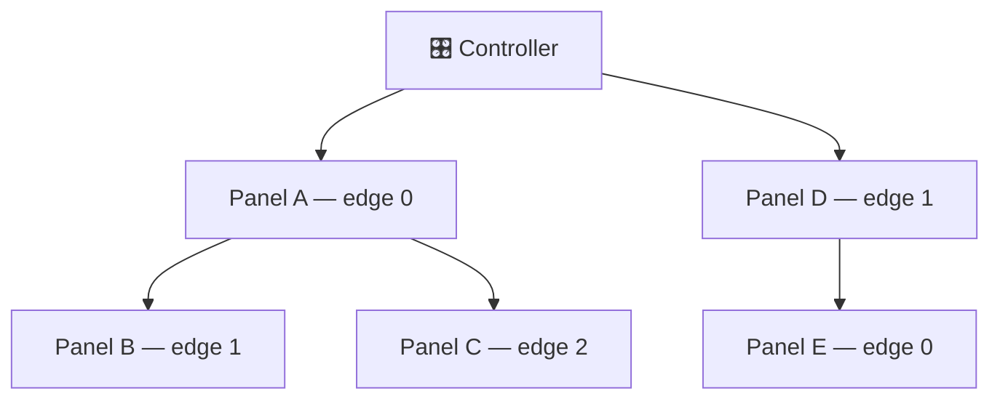
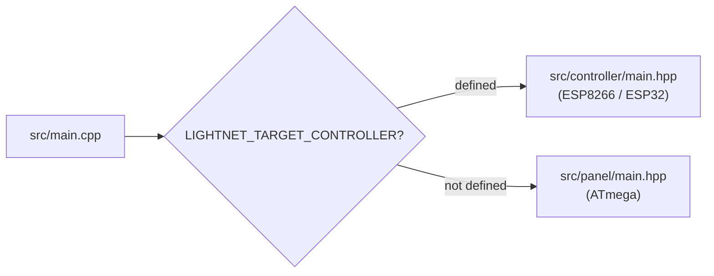
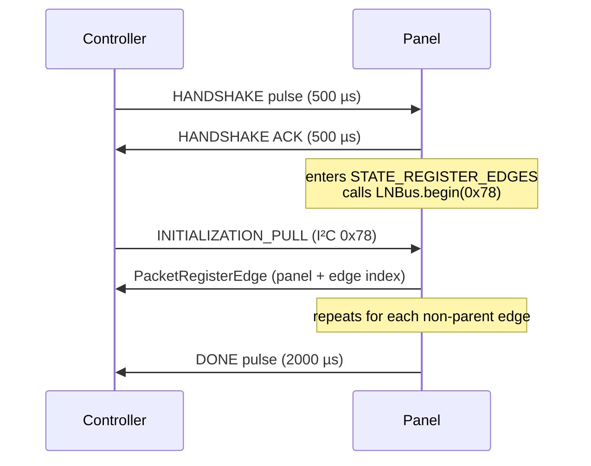
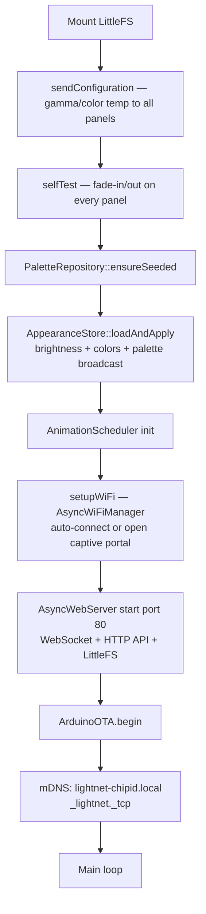

# System Architecture

Internal design reference for the Lightnet controller and panel firmware. Covers topology, library structure, I²C protocol, animation framework internals, discovery, and boot sequence.

---

## Table of Contents

1. [Physical Topology](#1-physical-topology)
2. [Two-Build Source Tree](#2-two-build-source-tree)
3. [Library Structure](#3-library-structure)
4. [I²C Protocol (Internal)](#4-i2c-protocol-internal)
5. [Animation Framework Internals](#5-animation-framework-internals)
6. [Discovery Sequence](#6-discovery-sequence)
7. [Controller Boot & Startup](#7-controller-boot-startup)
8. [Concurrency: Task Model & Deferred Execution](#8-concurrency-task-model-deferred-execution)

---

## 1. Physical Topology

Panels form a **tree structure** rooted at the controller. Each panel has up to 5 edges (physical connectors); edges carry both power and a single-wire ping line. The controller discovers the network by sequentially pinging each edge via GPIO, triggering PCINT interrupts on the receiving ATmega.



After the ping handshake completes, all communication uses **I²C** (`LightnetBus`) carrying structured `Protocol` packets. Panels are assigned sequential indices during discovery and use those indices as I²C addresses for all subsequent unicast traffic.

---

## 2. Two-Build Source Tree

The firmware compiles to two completely different binaries from a single source tree. The flag `LIGHTNET_TARGET_CONTROLLER` (set in `platformio.ini` build flags) selects the target:



There is no runtime branching — the preprocessor eliminates the unused side entirely. Code that belongs to both targets lives in `lib/Lightnet/Common/`.

---

## 3. Library Structure

All firmware code lives under `lib/Lightnet/`.

### Common/ — shared by both targets

| File | Purpose |
|---|---|
| `LightnetBus` | I²C wrapper: `sendPacketAck()` / `sendPacketNack()` / `sendResponsePacket()`, ISR callbacks |
| `LightnetPanelEdge` | Per-edge state machine: `IDLE → WELCOME_SENT → BOOTING → READY`. `updateEdgeState()` is ISR-safe (enqueues to ring buffer); `processEdgeState()` drains in main loop |
| `LightnetPinger` | GPIO ping pulses. `HANDSHAKE` = 500 µs, `DONE` = 2000 µs. Owns an 8-entry ring buffer. |
| `Protocol` | All I²C packet structs (`__packed__`), CRC validation, `setPacketMeta()` |
| `LightnetConfig` | Cross-cutting constants in `Core/Common/LightnetConfig.hpp`: `LIGHTNET_MAX_PANELS` (100 on ESP32, 32 on ESP8266), `PALETTE_STOPS=16`, `BASE_COLORS_COUNT=3` |
| `ColorRef` | 4-byte tagged union in `Core/Common/ColorRef.hpp`: `kind=0` inline RGB, `kind=1` palette position, `kind=2` base-color slot |
| `Palette` | `GradientStop` struct (pos+RGB, 4 B) and `samplePalette()` in `Core/Common/Palette.hpp` |

!!! note "`busIsDisabled` is a static shared flag"
    `LightnetPinger::busIsDisabled` is **static** — shared across all pinger instances. It is set during any ping so all pingers ignore ISR samples while a pulse is being driven. Do not instantiate multiple pingers that need independent bus control.

### Controller/ — ESP8266/ESP32 only

**Panels/**

| File | Purpose |
|---|---|
| `PanelsInitializer` | Discovery orchestrator; assigns panel indices, builds edge graph |
| `PanelsController` | Unicast commands to panels: color, on/off, configuration, enter-bootloader |
| `Panel` / `Edge` | In-memory data model of discovered topology |

**Animations/** (device glue — demos only)

| File | Purpose |
|---|---|
| `AnimationRunner` | Base class for the streaming runner classes (`WaveRunner`/`RippleRunner`/`ChaseRunner`) — used by built-in demos only; scenes compile runners instead |

**Scenes/** (device glue)

| File | Purpose |
|---|---|
| `SceneStore` | Scene persistence in `/data/scenes.db` (`SceneRecord` binary records via `Database`) |
| `ScenesService` | Orchestrates save / play-by-id / play-inline / one-shot / stop. Split into `prepare*` (parse/validate/persist — safe on the AsyncTCP task) and `playParsed*` (emits packets — main loop only) so HTTP handlers can defer playback (see §8) |

### Core/Controller/ — portable scene engine (ESP + native + mobile C ABI)

| File | Purpose |
|---|---|
| `ScenePlayer` | Loads and ticks multi-layer scenes; resolves palettes, fires steps |
| `SceneParser` | Parses scene JSON into `SceneLayer[]` structs |
| `AnimationScheduler` | `playOnPanels()` PREPARE+START sequence; `sendPrepareToPanel()`/`sendGroupStart()` for compiled runners; `tick()` drives any streaming demo runners |
| `RunnerCompile.hpp` | Inverts runner envelopes to a per-panel local PULSE (onset + shape) |
| `PanelSelector` / `PanelSelectorParser` | Panel targeting grammar → RPN → resolved indices |
| `TopologyIndex` / `PanelGraph` / `PanelGeometry` / `PanelField` | Topology views, geometric layout, runner directionality |

**Palettes/**

| File | Purpose |
|---|---|
| `PaletteRepository` | Wraps `PaletteStore` (`/data/palettes.db`); seeds built-ins on boot; `resolve(name)` → `GradientStop[]`; implements `IPaletteResolver` |
| `Store/PaletteStore` | Typed store over `Database<PaletteCodec>` — create / update / remove by name |

**Appearance/**

| File | Purpose |
|---|---|
| `AppearanceStore` | Storage only: owns `/config/appearance.db` (single binary `Database` record) — getters/setters + deferred persistence |
| `AppearanceService` | Behaviour facade over `AppearanceStore`: validates the palette, broadcasts brightness/base-colours/palette to panels on change and on `reapply()` |

**API/http/**

| Class | Routes | Purpose |
|---|---|---|
| `AppearanceServer` | `GET /api/appearance`, `PATCH /api/appearance` | Appearance read/write |
| `PaletteServer` | `GET/POST /api/palettes`, `GET/PUT/DELETE /api/palettes/*` | Palette CRUD |
| `SceneServer` | `GET/POST /api/scenes`, `PATCH/GET/DELETE/POST /api/scenes/*`, `/api/scenes/stop`, `/api/scenes/speed`, `/api/scenes/play`, `/api/scenes/play/one-shot` | Scene CRUD + playback |
| `AnimationServer` | `POST /api/animations/play`, `POST /api/animations/trigger` | One-shot play + reactive trigger |
| `PanelServer` | `GET /api/panels`, `GET /api/panels/edges`, `PUT /api/panels/*` | Per-panel on/color control |
| `StateServer` | `GET /api/state`, `POST /api/state/power` | Runtime power state + scene playback status |
| `ConfigurationServer` | `GET /api/configuration`, `PATCH /api/configuration` | Boot behaviour, logical root (`ConfigurationStore` + `TopologyConfigStore`) |

!!! note "Mutating endpoints defer to the main loop (§8)"
    Every handler that emits I²C packets (scene play/stop/speed, one-shot/trigger, appearance,
    per-panel on/color, power, configuration `logicalRoot`) **validates synchronously, then queues the
    packet-emitting work onto the main loop via `MainLoopQueue` and returns `202 Accepted`**.
    They are injected with a `MainLoopQueue&`. Read-only and pure filesystem/config endpoints stay
    synchronous (`200`). See [§8](#8-concurrency-task-model-deferred-execution).

**OTA/**

| File | Purpose |
|---|---|
| `TwibootClient` | twiboot host protocol over raw Wire (bypasses LNBus). `connect()` / `writePage()` / `startApp()` |
| `PanelFlasher` | Non-blocking OTA state machine: `ENTER_BL → WAIT_BL → FLASHING → VERIFY → NEXT_PANEL` |
| `FirmwareUpdateServer` | `POST /api/firmware/panels`, `GET /api/firmware/status` |
| `SerialFirmwareReceiver` | Firmware upload over 57600-baud USB serial (LNFW framing + CRC-16) |

### Panel/ — ATmega only

| File | Purpose |
|---|---|
| `LightnetPanel` | Main panel state machine; handles I²C packets, drives edge registration |
| `RGBController` | FastLED wrapper for the single WS2812 LED on PD5. `globalBrightness` multiplier on all output |
| `AnimationPlayer` | Layer compositor: `slots[MAX_ANIM_SLOTS]` composited each ~16 ms tick (blend modes + `animates` modifier targets + background base). Resolves `ColorRef` → RGB against panel's current palette + base colors |
| `BootloaderBridge` | Writes EEPROM boot-magic `0xB007` then software-jumps to twiboot |

### Controller/API/websocket/ — WebSocket (controller only)

| File | Purpose |
|---|---|
| `WebsocketServer` | `AsyncWebSocket` on `/ws`; lock-free queue swap between ISR and main loop; per-client `ClientSettings` (mirroring flag) with ESP32-safe locking |
| `WebsocketHandler` | Decodes and dispatches commands: `TOGGLE`, `SET_COLOR`, `GET_PANELS_STATES`, `GET_EDGES_LIST`, `ANIMATION_TRIGGER`, `SET_MIRROR`, `PING` |
| `WebsocketApi` | Binary packet structs and namespace for all commands/responses |
| `PacketMirror` | Captures outbound I²C packets; maintains a live-stream ring (flushed at ~30 fps to mirroring clients) and a persistent snapshot (unicast to a client when it enables mirroring). `capture()` **flushes inline on overflow instead of dropping** — safe only because all callers now run on the main loop (§8); `setServer()` wires the WS server for that self-flush |

### Utils/

`CircularQueue`, `MainLoopQueue` (generic "run this on the main loop" deferral queue — see §8),
`List`, `Crc` (CRC-16/IBM), `Mem`, `Macros`, `Debug` (`PRINTLN`/`PRINTKV`/`PRINTF` — no-ops at
`DEBUG=0`), `Gamma` (correction table in PROGMEM).

---

## 4. I²C Protocol (Internal)

Defined in `Common/Protocol.hpp`. All packets use `__attribute__((__packed__))` structs.

### Versions

| Version | Branch | Change |
|---|---|---|
| **v3** | master | Original animation framework |
| **v4** | scenes | `PacketAnimationPrepare`: `colorFrom`/`colorTo` changed from `ColorRGB` (3 B) to `ColorRef` (4 B). Three new appearance packets. |
| **v5** | — | Per-panel brightness removed (animations express brightness through colour). |
| **v6** | compositing | Layer compositor. `PacketAnimationPrepare` gains `composeMode` + `composeOrder` + `startDelayMs` (25 B); `PacketAnimationControl` gains `group_id` (per-slot, 7 B); new `SET_BACKGROUND` packet. Runners are compiled to per-panel local PULSEs. |

!!! warning "Protocol compatibility"
    Panel and controller must be flashed together when upgrading across protocol versions — versions are not interchangeable.

### Packet catalogue

| ID | Name | Dir | Size | Notes |
|---|---|---|---|---|
| 2 | `INITIALIZATION_PULL` | C→P | 7 B | Pull address `0x78`; panel replies with `PacketRegisterEdge` |
| 3 | `REGISTER_EDGE` | P→C | 9 B | Panel index + edge index |
| 4 | `TURN_ON_OFF` | C→P | 6 B | |
| 5 | `SET_COLOR` | C→P | 8 B | |
| 11 | `PANEL_CONFIGURATION` | C→P | — | Gamma correction, color temp/correction |
| 12 | `ANIMATION_PREPARE` | C→P | 25 B | Unicast; buffers a layer (incl. `composeMode`/`composeOrder`/`startDelayMs`), arms for group start |
| 13 | `ANIMATION_START` | General Call | 7 B | Fires all panels with matching group_id |
| 14 | `ANIMATION_CONTROL` | C→P | 7 B | STOP / PAUSE / RESUME / CLEAR_QUEUE; `group_id`=0 → all slots |
| 15 | `FETCH_ANIM_STATE` | C→P | 5 B | Panel replies with 11 B status |
| 16 | `ANIMATION_UPDATE_PARAMS` | General Call | 10 B | Trigger / brightness-mult / speed-scale |
| 17 | `SET_PALETTE` | C→P or GC | 70 B | 16-stop gradient; GC = broadcast to all |
| 18 | `SET_BASE_COLORS` | C→P or GC | 14 B | 3 × RGB base colors |
| 19 | `SET_GLOBAL_BRIGHTNESS` | General Call | 6 B | 0–255 multiplier |
| 20 | `SET_BACKGROUND` | C→P or GC | 8 B | Scene compositor base colour (sent once at scene start) |
| 200 | `RESET_DEVICE` | C→P | 5 B | WDT reset |
| 201 | `ENTER_BOOTLOADER` | C→P | 6 B | Token must be `0xB0` |

### General Call

I²C address `0x00` broadcasts to all panels simultaneously (±2.5 µs jitter). Used for:

- `ANIMATION_START` — fires queued animations in lockstep
- `ANIMATION_UPDATE_PARAMS` — reactive triggers, speed changes
- `SET_PALETTE` / `SET_BASE_COLORS` / `SET_GLOBAL_BRIGHTNESS`

!!! note "Duplicate guard"
    START and UPDATE_PARAMS packets are sent **twice** (300 µs apart) with a `seq_id` duplicate guard so the panel processes exactly one copy.

---

## 5. Animation Framework Internals

### AnimationPlayer (panel side) — layer compositor, shared with mobile

`lib/Lightnet/Core/Panel/AnimationPlayer.{hpp,cpp}` (+ its pure deps in `Core/Common/`:
`AnimationTypes`, `ColorRef`, `Palette`, `LightnetConfig`, `ProtocolTypes`, and
`Core/Panel/ColorCompose.hpp`) is **portable, host-compilable C++** — no
Arduino/FastLED, time passed as `uint16_t now`, output pulled via `currentColor()`/`takeDirty()`.
It is the **single implementation** of panel-local animation math, compiled into:

- the **Panel** firmware (`LightnetPanel`),
- the **Controller**'s `SIM_MODE` virtual panels (`SimPanel`),
- native unit tests (`test/test_panel_anim`),
- and the **mobile app**, via `lib/Lightnet/Core/CApi` (a thin C ABI) — Android over JNI/NDK,
  iOS over Kotlin/Native cinterop. The mobile `PanelAnimationPlayer` is a thin Kotlin wrapper that
  feeds raw mirrored packet bytes to the native core and only owns mobile-specific clock-domain
  translation (controller millis ↔ mobile monotonic clock). See `lib/Lightnet/Core/README.md` and
  `lib/Lightnet/Core/CApi/README.md`.

### AnimationPlayer (panel side) — layer compositor

- `slots[MAX_ANIM_SLOTS]` (12) — each an independent layer keyed by `group_id`, with its running
  step + a 1-deep pending step (PREPARE buffers `pending`; START activates it).
- `tick()` gated at 16 ms (60 fps), integer math only. Each tick resolves every started slot to one
  contribution (source colour or modifier value). **Non-looping** layers honour `startDelayMs`
  (transparent before onset); **looping** layers (`FLAG_LOOP`) treat `startDelayMs` as an initial
  phase offset so they start immediately and re-fire/sync seamlessly. After onset, the layer
  composites until finish→hold (or repeats if looping), then `ColorCompose::foldLayers()` sorts by
  `composeOrder` and folds onto the **background base** — one write to the LED.
- Source layers blend via `composeMode`; modifier layers (`animates != TARGET_COLOR`) transform
  the accumulator (brightness = RGB multiply; saturation/hue = integer HSV). Finished non-loop
  slots hold their last value.
- `PACKET_SET_BACKGROUND` sets the compositor base (default black; idle panels display it).
- Progress interpolation: `progress_q8 = (elapsed * 256) / durationMs` (q8 fixed-point). The pure
  compose/HSV/fold math lives in `Core/Panel/ColorCompose.hpp` (natively tested, shared with mobile
  via `Core/CApi`).
- `resolveColorRef()` called every tick — palette/colour changes take effect next frame with no re-prepare.

### AnimationScheduler (controller side)

- `playOnPanels()`: unicast PREPARE to each target panel (3 retries each), then General Call START twice
- `tick()`: 60 fps frame gate; ticks all active runners, deletes finished ones
- Per-panel `AnimationRecord` in-memory state — avoids polling panels for status queries

### Controller runners — compiled to per-panel local pulses (v6)

As of v6, `ScenePlayer::fireStep` no longer streams a runner: it **compiles** the sweep into one
local PULSE per panel via `Animations/RunnerCompile.hpp` (a closed-form inversion of the
`RunnerMath` envelope), each with its own `startDelayMs` (onset) and pulse shape, then fires one
general-call START. The panels then run the sweep autonomously — **zero per-frame `SET_COLOR`** — and
a runner composites like any other layer (default `max` blend). This removes the per-frame mirror
traffic that previously grew with panel count.

| Runner | Compiled pulse |
|---|---|
| `WAVE` | triangular PULSE, onset `dur·c/(maxCoord+w)`, window `dur·w/(maxCoord+w)` |
| `RIPPLE` | band PULSE from the panel's `[near,far]` radial extent |
| `CHASE` | near-square PULSE, onset `dur·c/(maxCoord+1)`, window `dur/(maxCoord+1)` |
| `WHEEL` | rotating-blade PULSE from the panel's geometric bearing; always `FLAG_LOOP`, `period = duration/lines` |
| `BOUNCE` | a `WAVE` band whose **peak** reflects at the field edges (centre sweeps `[0,maxCoord]`); `reverse` is XOR'd with a per-layer toggle that flips on every re-fire — forward, then back, forever |

`"repeat": true` plays WAVE/RIPPLE/CHASE as a continuous train instead of a single pass: the same
`compile*` geometry feeds `compileRepeating()`, which **swaps `colorFrom`/`colorTo`** (lit↔dark) so
the rise→hold→fall envelope reads departing→dark-hold→approaching with `FLAG_LOOP` — true dark gaps
using only the existing PULSE/loop mechanism. WHEEL always uses this engine (`compileWheel` via
`compileRepeatingAsym`). `SCENE_SCHEMA_VERSION` is 8.

The streaming `WaveRunner`/`RippleRunner`/`ChaseRunner` classes remain for the built-in demos.

### Controller runners — RAIN / SPARKLE particle spawners (v7)

RAIN and SPARKLE are **not** compiled — they are stochastic particle spawners. The compiled-pulse
model gives "seamless" only by *repeating forever*; a genuinely random, non-repeating effect
requires drops that **finish on their own** rather than being overwritten. So `ScenePlayer` services
these over the step window (`serviceSpawner()` in `tick()`): every `1000/waves` ms it launches one
**drop** — a self-finishing one-shot PULSE — on a pooled `group_id`.

| Aspect | Detail |
|---|---|
| **Pattern** | SPARKLE = one random panel (instant-on + `width` fade); RAIN = a random source→leaf path (`spawnBuildPath`), head cascading via staggered `startDelayMs`, tail fading over `width` rings, `speed` = fall-time |
| **Knobs** | `duration` = play **window** (soft — in-flight drops finish); `waves` = spawn **rate** (per second); `width`/`speed` per above; full `animates` set + `colorFrom`→`colorTo` |
| **Group pool** | each drop takes one `group_id` (one slot per touched panel) from a per-layer pool reserved **above** all normal layer groups (`allocSpawnPools`); the round-robin cursor **persists** across the window re-fire so new drops use fresh ids while old ones drain |
| **Slot reaping** | drop pulses set **`FLAG_REAP_ON_DONE`** (a new, backward-compatible AnimationFlags bit — no I²C protocol bump); the panel frees the slot the instant the one-shot finishes (`AnimationPlayer`), so panels never clog and a recycled broadcast START can't re-fire a drained drop. **All panels must be re-flashed** with this firmware — older panels ignore the flag and would clog. |

Pure helpers (`Animations/RunnerSpawn.hpp`: PRNG, rate accumulator, pool, path, drop timing) are
natively tested in `test_runner_spawn`; the stateful real-time behaviour is verified on sim/device
(`tools/api-shell/mirror-dump.js`).

### Bandwidth budget

| Scenario | I²C cost |
|---|---|
| N panels, all panel-local (BREATHE etc.) | **0 µs/frame** during animation |
| 30 panels, REACTIVE, 120 BPM | **~140 µs per beat** (0 µs between beats) |
| 3-wide WaveRunner (demo streaming path only) | **≤ 600 µs/frame** |
| Setup: PREPARE × 30 panels + 2 General Calls | **~6.2 ms** one-time |

---

## 6. Discovery Sequence

Triggered by `PanelsInitializer::start()`. Runs on each controller boot before WiFi.

### Ping handshake (per edge)



The Panel ISR calls `LNPanel.updateEdgesStates((PINB >> 1) & 0x07, TCNT1)` directly. Timer1 runs free at prescaler 8 (0.5 µs/tick) for pulse-duration measurement.

### Full discovery flow

1. `PanelsInitializer::start()` — initialises I²C as master, attaches CHANGE interrupt on the edge GPIO
2. `PanelsInitializer::boot()` runs every main-loop iteration:
   - Drives `LightnetPanelEdge` state machines
   - While a panel is in `STATE_BOOTING`, pulls address `0x78` every 20 ms
3. Panel: detects HANDSHAKE → replies HANDSHAKE → enters `STATE_REGISTER_EDGES` → calls `LNBus.begin(0x78)`
4. Controller pull delivers `PACKET_INITIALIZATION_PULL`; panel responds with `PacketRegisterEdge` (panel index + edge index)
5. Panel repeats steps 3–4 for each non-parent edge, then sends DONE to its parent
6. Controller detects DONE → `isReady()` returns true (5 s boot timeout)

---

## 7. Controller Boot & Startup

Sequence after `LNPanelsInitializer.isReady() == true`:



!!! info "LittleFS mounted before WiFi"
    `Fs::begin()` is hoisted before WiFi so `PaletteRepository` and `AppearanceStore` can read `/data/palettes.db` and `/config/` before the captive-portal blocks (which can take up to 120 s on first boot).

Main loop (`case 1`), when no panel flash is in progress:
```cpp
ArduinoOTA.handle();
serialFwReceiver->run();
panelFlasher->run();

websocketHandler->handleIncommingMessages();        // drain WS commands   → main loop
mainLoopQueue->drain();                              // drain HTTP-deferred work → main loop (§8)
if (appStateStore->isOn()) animScheduler->tick(millis());  // controller-computed runners
if (appStateStore->isOn()) scenePlayer->tick(millis());    // multi-layer scene playback
appearance->tick(millis()); configStore->tick(millis()); appStateStore->tick(millis());
serviceMirror();                                    // ≤30 fps flush of the mirror ring
MDNS.update();                                      // ESP8266 only
```

The ordering matters — see [§8 Main-loop service order](#main-loop-service-order).

---

## 8. Concurrency: Task Model & Deferred Execution

### 8.1 Two execution contexts

The controller firmware runs on **two concurrent tasks**:

| Task | What runs on it | Examples |
|---|---|---|
| **Main loop** (Arduino `loop()`) | The `case 1` body: scene/animation ticks, mirror flush, queue draining | `scenePlayer->tick()`, `animScheduler->tick()`, `serviceMirror()` |
| **AsyncTCP task** | All `AsyncWebServer` / `AsyncWebSocket` callbacks — HTTP route handlers and WS event/message callbacks | `SceneServer::handlePostPlayScene()`, `WebsocketServer::onMessage()` |

On **ESP32** these are separate FreeRTOS tasks, usually on different cores, preemptively scheduled.
On **ESP8266** the AsyncTCP callbacks run in a context that can preempt `loop()`. Either way the two
tasks run concurrently and share no implicit synchronization.

### 8.2 The hazard: outbound packets must be single-task

Every outbound I²C packet is captured by `PacketMirror::capture()` (registered via
`LNBus.setOnPacketSent()`). `capture()` appends to a single shared ring buffer **with no locks** — it
is written assuming exactly one caller. But `LNBus.sendPacket()` is reached from **both** tasks:

- **Main loop** — `scenePlayer->tick()` / `animScheduler->tick()` emit per-frame `SET_COLOR` and
  step PREPARE/START packets.
- **AsyncTCP** — a synchronous HTTP handler such as `/api/scenes/play/one-shot` calls `loadAndPlay()`, which
  emits a burst of ~300 PREPARE/START packets **inline on the AsyncTCP task**.

Left uncoordinated, `capture()` on the AsyncTCP task races `PacketMirror::flushTo()` on the main loop
over the same buffer — a data race. The same AsyncTCP handlers also mutate `ScenePlayer` state that
the main loop ticks. The invariant that removes the whole class of hazard:

> **All I²C packet emission — and the `ScenePlayer` state it touches — happens on the main-loop task.**

WebSocket commands already obeyed this (see [§8.6](#86-ws-command-queue-sibling-mechanism)). HTTP
handlers did not; `MainLoopQueue` brings them in line.

### 8.3 MainLoopQueue — generic deferred execution

`lib/Lightnet/Utils/MainLoopQueue.hpp` is a generic *"run this on the main loop"* queue. Any task
`post()`s a unit of work; the main loop `drain()`s and runs it.

```
 AsyncTCP task                         main-loop task
 ─────────────                         ──────────────
 post(fn, args, len)                   drain():
   under lock:                           loop:
     ring.push([fn][args]) ──▶ SpscByteQueue ──▶ under lock: ring.pop(blob)
                                                  fn(blob+ , len)   ◀── runs OUTSIDE the lock
```

- **Record format** — a function pointer (`TaskFn = void(*)(const uint8_t*, uint16_t)`) followed by
  a small POD argument blob (≤ `MAX_ARGS` = 64 B). Each endpoint supplies a **captureless lambda**
  (which decays to a `TaskFn`) plus a POD args struct, so there is **no central dispatch switch** —
  work stays defined at the call site and each server owns its own execute function.
- **Storage** is a `SpscByteQueue` (the codebase's lock-free byte-record ring). Both `push` and `pop`
  are wrapped in the **same critical section** `WebsocketServer` uses (`portENTER_CRITICAL` on ESP32,
  `noInterrupts()` on ESP8266). That supplies the memory barrier a multi-core ESP32 needs —
  `SpscByteQueue` alone is only lock-free-safe on a single in-order core — and serializes producer vs
  consumer, so it is robust even if work is posted from the main loop itself.
- **The task `fn()` runs outside the lock** — its record is copied out of the ring under the lock
  first — so a slow or packet-emitting task never blocks the producer.
- **Args are copied by value** into the ring, so they must be self-contained POD with no pointers
  into request-scoped memory. To defer something large (e.g. a ~2.5 KB parsed scene), the handler
  heap-allocates it and passes only the pointer in the args; the task frees it.
- **Overflow is honest** — a full queue makes `post()` return `false`, and the HTTP handler surfaces
  that as `503 busy` rather than dropping the request silently.

Covered by the native suite `test/test_main_loop_queue`.

### 8.4 HTTP handler pattern: validate sync, execute deferred

Every mutating endpoint that emits packets follows one shape:

```cpp
void Server::handleX(req, body, len) {
    // 1. Validate synchronously (pure — no packets): parse, ranges, names, appState.isOn().
    //    Failures return immediately (4xx).
    // 2. Capture validated inputs into a POD args struct (or heap-own a large payload).
    struct Args { Server* self; /* small scalars or a heap pointer */ } args { this, ... };
    // 3. Queue the packet-emitting work; report the outcome.
    bool ok = queue.post(+[](const uint8_t* a, uint16_t) {
        Args x; memcpy(&x, a, sizeof x);
        x.self->service.doIt(...);          // runs on the main loop; frees any heap payload
    }, &args, sizeof args);
    if (!ok) { Http::sendError(req, 503, "busy"); return; }
    Http::sendAccepted(req);                // 202
}
```

The HTTP success code therefore changes meaning: **`202 Accepted` = "validated and queued"**; the
effect lands on the next main-loop tick (sub-millisecond later). Validation failures stay synchronous
(`4xx`); a full queue is `503`. Read-only endpoints and pure filesystem/config mutations stay fully
synchronous and return `200`.

```mermaid
sequenceDiagram
  participant Cl as Client
  participant TCP as AsyncTCP task
  participant Q as MainLoopQueue
  participant Loop as Main loop
  participant Bus as LNBus → PacketMirror

  Cl->>TCP: POST /api/scenes/play/one-shot
  TCP->>TCP: parse + validate (pure, no packets)
  TCP->>Q: post(playParsed, parsed*)
  TCP-->>Cl: 202 Accepted
  Note over Loop: next tick
  Loop->>Q: drain()
  Q->>Loop: playParsed(parsed*) (frees parsed*)
  Loop->>Bus: PREPARE × N + START — capture() on main loop
  Loop->>Loop: serviceMirror() → flush ring to WS clients
```

`ScenesService` is split to support this: `prepareInline()` / `prepareByName()` /
`prepareOneShot()` parse + persist (pure, safe on AsyncTCP, return a heap-ownable result), while
`playParsed()` / `playParsedOneShot()` emit packets and are called from the queued task on the main
loop. The legacy `playScene*` / `playOneShot` methods remain for callers that already run on the main
loop (the demos).

**What defers vs what stays synchronous** — the boundary is exactly "does this handler reach
`capture()` or mutate `ScenePlayer`?":

| Deferred → `202` | Reason |
|---|---|
| `POST /api/scenes/play`, `…/play/one-shot`, `…/:name/play`, `…/stop`, `…/speed` | PREPARE/START packets, `ScenePlayer` state |
| `POST /api/animations/play`, `…/trigger` | PREPARE/START, reactive-trigger packets |
| `PATCH /api/appearance` | brightness / base-colors / palette broadcasts |
| `POST /api/state/power` | per-panel on/off, scene stop/resume |
| `PUT /api/panels/:addr/on`, `…/color` | per-panel packets |
| `PATCH /api/configuration` (`logicalRoot`) | `ScenePlayer::setLogicalRoot` re-aims a playing scene |

| Synchronous → `200` | Reason |
|---|---|
| All `GET`s | read-only |
| `POST /api/scenes`, `PATCH /api/scenes/:id`, `DELETE /api/scenes/:id` | database only |
| `POST /api/palettes`, `PUT /api/palettes/:name`, `DELETE /api/palettes/:name` | filesystem only |
| `PATCH /api/configuration` (without `logicalRoot`) | config store only — no packets, no `ScenePlayer` |

### 8.5 PacketMirror flush-on-overflow

With `capture()` now guaranteed single-task, the mirror's live ring no longer has to hold an entire
scene-start burst. When an append would overflow, `capture()` **flushes inline** (`flushTo()`) and
then appends, so **no PREPARE/START packet is ever dropped**, and the ring shrank (ESP8266 2 KB → 1 KB,
ESP32 25 KB → 6 KB, freeing scarce DRAM). This inline flush is safe **only because the [§8.2 invariant]
(#82-the-hazard-outbound-packets-must-be-single-task) holds**: `flushTo()` touches the WS client list
and calls `socket->binary()`, which must not race the periodic `serviceMirror()` flush — and now
cannot, since both run on the main loop. A `WebsocketServer*` is wired into `PacketMirror` via
`setServer()` at boot to enable the self-flush; before it is set, `capture()` falls back to dropping.

### 8.6 WS command queue (sibling mechanism)

`WebsocketServer` has carried the same idea for **inbound WebSocket commands** since before
`MainLoopQueue`: a double-buffered `CircularQueue` pair (`cmdQueue` / `executionQueue`). `onMessage()`
(AsyncTCP) enqueues under the critical section; `WebsocketHandler::handleIncommingMessages()`
(main loop) swaps the two buffers under the lock and drains, so the command handlers (`cmdSetColor`,
`cmdAnimationTrigger`, …) execute on the main loop. `MainLoopQueue` generalizes the same
producer/consumer discipline to arbitrary function-pointer work for the HTTP layer.

### Main-loop service order

```cpp
// case 1, when no panel flash is in progress:
websocketHandler->handleIncommingMessages();        // 1. drain WS commands      → main loop
mainLoopQueue->drain();                              // 2. drain HTTP-deferred work → main loop
if (appStateStore->isOn()) animScheduler->tick(millis());
if (appStateStore->isOn()) scenePlayer->tick(millis());
appearance->tick(millis()); configStore->tick(millis()); appStateStore->tick(millis());
serviceMirror();                                    // 3. ≤30 fps flush of the mirror ring
```

Draining HTTP work **before** the ticks means a scene queued this iteration is played and then ticked
in the same pass. `serviceMirror()` runs **last** so any packets emitted by the drained work (or by an
inline overflow flush during it) reach mirroring clients in the same iteration.
