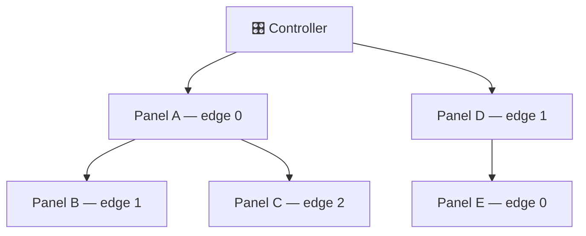
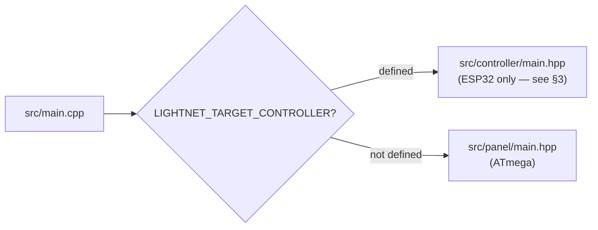
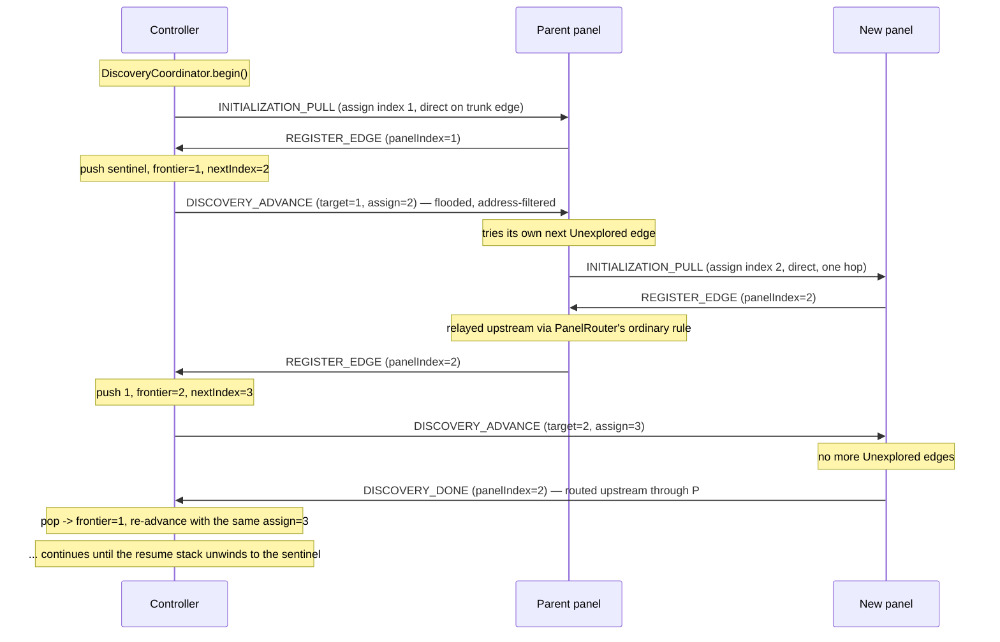
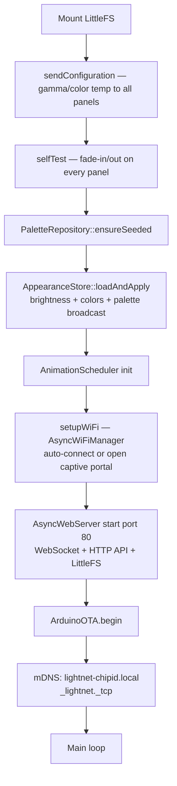

# System Architecture

Internal design reference for the Lightnet controller and panel firmware. Covers topology, library structure, I²C protocol, animation framework internals, discovery, and boot sequence.

---

## Table of Contents

1. [Physical Topology](#1-physical-topology)
2. [Two-Build Source Tree](#2-two-build-source-tree)
3. [Library Structure](#3-library-structure)
4. [Wire Protocol (Internal)](#4-wire-protocol-internal)
5. [Animation Framework Internals](#5-animation-framework-internals)
6. [Discovery Sequence](#6-discovery-sequence)
7. [Controller Boot & Startup](#7-controller-boot-startup)
8. [Concurrency: Task Model & Deferred Execution](#8-concurrency-task-model-deferred-execution)

---

## 1. Physical Topology

Panels form a **tree structure** rooted at the controller, but each panel is a **store-and-forward
repeater** rather than a node on a shared bus: it only ever talks to its own physical neighbours (up
to 3 edges today), never directly to the controller or to a panel it isn't wired to. Every panel has
a single hardware USART shared across all its edges through a `CD74HC4052` analog mux, carrying
framed `Protocol` packets — there is no separate ping/handshake phase and no shared electrical bus
anywhere in the tree (see [`docs/hardware.md`](hardware.md#topology) for the electrical rationale).


```mermaid
graph TD
  C[🎛️ Controller]
  C --> A[Panel A — edge 0]
  A --> B[Panel B — edge 1]
  A --> Pc[Panel C — edge 2]
  C --> D[Panel D — edge 1]
  D --> E[Panel E — edge 0]
```

Panels are assigned sequential indices during discovery (§6), but that index is no longer a direct
electrical address the way an I²C address was — reaching panel N means flooding a packet downstream
with N attached as an address filter (`Core/Relay/PanelRouter`), and every intermediate panel between
the controller and N relays it one hop closer. Only the panel whose own index matches acts on it;
everyone else just relays it further and ignores it locally.

---

## 2. Two-Build Source Tree

The firmware compiles to two completely different binaries from a single source tree. The flag `LIGHTNET_TARGET_CONTROLLER` (set in `platformio.ini` build flags) selects the target:


```mermaid
graph LR
  M["src/main.cpp"] --> CC{"LIGHTNET_TARGET_CONTROLLER?"}
  CC -- defined --> ESP["src/controller/main.hpp\n(ESP32 only — see §3)"]
  CC -- not defined --> ATM["src/panel/main.hpp\n(ATmega)"]
```

There is no runtime branching — the preprocessor eliminates the unused side entirely. Code that belongs to both targets lives in `lib/Lightnet/Common/`.

---

## 3. Library Structure

All firmware code lives under `lib/Lightnet/`.

### Common/ — shared by both targets

| File | Purpose |
|---|---|
| `LightnetBus` | I²C wrapper: `sendPacketAck()` / `sendPacketNack()` / `sendResponsePacket()`, ISR callbacks. Controller-only now (`#if !defined(SIM_MODE) && defined(LIGHTNET_TARGET_CONTROLLER)`) — the relay trunk replaced I²C for discovery, application traffic, `fetchState()`, and OTA; this survives only under `SIM_MODE` (sim panels only respond to `LightnetBus`-routed commands) and for the WebSocket command handlers that still call it directly (`API/websocket/WebsocketHandler.cpp`) (see §6, §7, §8.7). |
| `Protocol` | All packet structs (`__packed__`), CRC validation, `setPacketMeta()` |
| `LightnetConfig` | Cross-cutting constants in `Core/Common/LightnetConfig.hpp`: `LIGHTNET_MAX_PANELS` (100) |
| `ColorRef` | 4-byte tagged union in `Core/Common/ColorRef.hpp`: `kind=0` inline RGB, `kind=1` palette position, `kind=2` base-color slot |
| `Palette` | `GradientStop` struct (pos+RGB, 4 B) and `samplePalette()` in `Core/Common/Palette.hpp` |

### Controller/ — ESP32 only (ESP8266 retired — didn't meet the relay design's requirements)

**Panels/**

| File | Purpose |
|---|---|
| `PanelsInitializer` | Drives `ControllerDiscoveryService` over the relay trunk (`ControllerEdgeTransport`/`Serial1`) and converts the resulting `DiscoveryTreeBuilder` link list into the `Panel`/`Edge` graph below once discovery completes — the SIM_MODE build (`Sim/PanelsInitializerSim.cpp`) fabricates the same graph shape directly instead, with no wire protocol involved at all |
| `PanelsController` | Per-panel commands (color, on/off, configuration, enter-bootloader) via the shared `IPacketSink` (`ControllerRelayPacketSink` on real hardware, `ControllerPacketSink`/`LNBus` under `SIM_MODE` — main.cpp picks one at compile time). `fetchState()` stays directly on `LNBus`: the relay has no reply-routing path yet for a request that needs a synchronous response |
| `Panel` / `Edge` | In-memory data model of discovered topology — same shape regardless of which side built it |

**Animations/** (device glue — demos only)

| File | Purpose |
|---|---|
| `CompiledSweep` | One-shot linear WAVE/RIPPLE/CHASE via compile-to-PULSE (boot self-test + verification demos) |

**Scenes/** (device glue)

| File | Purpose |
|---|---|
| `SceneStore` | Scene persistence in `/data/scenes.db` (`SceneRecord` binary records via `Database`) |
| `ScenesService` | Orchestrates save / play-by-id / play-inline / one-shot / stop. Split into `prepare*` (parse/validate/persist — safe on the AsyncTCP task) and `playParsed*` (emits packets — main loop only) so HTTP handlers can defer playback (see §8) |

### Core/Controller/ — portable scene engine (ESP + native + mobile C ABI)

| File | Purpose |
|---|---|
| `ScenePlayer` | Loads and ticks multi-layer scenes; resolves palettes, fires steps |
| `SceneParser` | Parses scene JSON into `SceneLayer[]` structs |
| `AnimationScheduler` | `playOnPanels()` PREPARE+START sequence; `sendPrepareToPanel()`/`sendGroupStart()` for compiled runners; `tick()` drives any streaming demo runners |
| `RunnerCompile.hpp` | Inverts runner envelopes to a per-panel local PULSE (onset + shape) |
| `PanelSelector` / `PanelSelectorParser` | Panel targeting grammar → RPN → resolved indices |
| `TopologyIndex` / `PanelGraph` / `PanelGeometry` / `PanelField` | Topology views, geometric layout, runner directionality |

**Palettes/**

| File | Purpose |
|---|---|
| `PaletteRepository` | Wraps `PaletteStore` (`/data/palettes.db`); seeds built-ins on boot; `resolve(name)` → `GradientStop[]`; implements `IPaletteResolver` |
| `Store/PaletteStore` | Typed store over `Database<PaletteCodec>` — create / update / remove by name |

**Appearance/**

| File | Purpose |
|---|---|
| `AppearanceStore` | Storage only: owns `/config/appearance.db` (single binary `Database` record) — getters/setters + deferred persistence |
| `AppearanceService` | Behaviour facade over `AppearanceStore`: validates the palette, broadcasts brightness/base-colours/palette to panels on change and on `reapply()` |

**API/http/**

| Class | Routes | Purpose |
|---|---|---|
| `AppearanceServer` | `GET /api/appearance`, `PATCH /api/appearance` | Appearance read/write |
| `PaletteServer` | `GET/POST /api/palettes`, `GET/PUT/DELETE /api/palettes/*` | Palette CRUD |
| `SceneServer` | `GET/POST /api/scenes`, `PATCH/GET/DELETE/POST /api/scenes/*`, `/api/scenes/stop`, `/api/scenes/speed`, `/api/scenes/play`, `/api/scenes/play/one-shot` | Scene CRUD + playback |
| `AnimationServer` | `POST /api/animations/play`, `POST /api/animations/trigger` | One-shot play + reactive trigger |
| `PanelServer` | `GET /api/panels`, `GET /api/panels/edges`, `PUT /api/panels/*` | Per-panel on/color control |
| `StateServer` | `GET /api/state`, `POST /api/state/power` | Runtime power state, scene playback status, `controllerFirmware` version string |
| `MqttServer` | `GET /api/mqtt`, `PATCH /api/mqtt` | MQTT broker config + runtime discovery status (ESP32 only; see [`docs/api.md`](api.md) §2.9) |
| `ConfigurationServer` | `GET /api/configuration`, `PATCH /api/configuration` | Boot behaviour, logical root (`ConfigurationStore` + `TopologyConfigStore`) |

!!! note "Mutating endpoints defer to the main loop (§8)"
    Every handler that emits I²C packets (scene play/stop/speed, one-shot/trigger, appearance,
    per-panel on/color, power, configuration `logicalRoot`) **validates synchronously, then queues the
    packet-emitting work onto the main loop via `MainLoopQueue` and returns `202 Accepted`**.
    They are injected with a `MainLoopQueue&`. Read-only and pure filesystem/config endpoints stay
    synchronous (`200`). See [§8](#8-concurrency-task-model-deferred-execution).

**OTA/**

| File | Purpose |
|---|---|
| `RelayBootloaderClient` | Drives `RelayBootloader.cpp` over the relay trunk via `ControllerRelayPacketSink::requestReply()`. `connect()` / `writePage()` / `startApp()`. Real hardware only — no I2C wire to any panel exists, and OTA doesn't exist under `SIM_MODE` |
| `PanelFlasher` | Non-blocking OTA state machine: `ENTER_BL → WAIT_BL → FLASHING → NEXT_PANEL` |
| `FirmwareUpdateServer` | `POST /api/firmware/panels`, `GET /api/firmware/status` |
| `SerialFirmwareReceiver` | Firmware upload over 57600-baud USB serial (LNFW framing + CRC-16) |

### Panel/ — ATmega only

| File | Purpose |
|---|---|
| `LightnetPanel` | Main panel state machine; handles I²C packets, drives edge registration |
| `RGBController` | FastLED wrapper for the single WS2812 LED on PD5. `globalBrightness` multiplier on all output |
| `AnimationPlayer` | Layer compositor: `slots[MAX_ANIM_SLOTS]` composited each ~16 ms tick (blend modes + `animates` modifier targets + background base). Resolves `ColorRef` → RGB against panel's current palette + base colors |
| `BootloaderBridge` | Writes assigned index + parent edge + EEPROM boot-magic `0xB007` then software-jumps to `RelayBootloader.cpp` |

### Controller/API/websocket/ — WebSocket (controller only)

| File | Purpose |
|---|---|
| `WebsocketServer` | `AsyncWebSocket` on `/ws`; lock-free queue swap between ISR and main loop; per-client `ClientSettings` (mirroring flag) with ESP32-safe locking |
| `WebsocketHandler` | Decodes and dispatches commands: `TOGGLE`, `SET_COLOR`, `GET_PANELS_STATES`, `GET_EDGES_LIST`, `ANIMATION_TRIGGER`, `SET_MIRROR`, `PING` |
| `AppStateBroadcaster` | Watches `GET /api/state` fields; broadcasts `APP_STATE` to all WS clients on change |
| `WebsocketApi` | Binary packet structs and namespace for all commands/responses |
| `PacketMirror` | Captures outbound I²C packets; maintains a live-stream ring (flushed at ~30 fps to mirroring clients) and a persistent snapshot (unicast to a client when it enables mirroring). `capture()` **flushes inline on overflow instead of dropping** — safe only because all callers now run on the main loop (§8); `setServer()` wires the WS server for that self-flush |

### Utils/

`CircularQueue`, `MainLoopQueue` (generic "run this on the main loop" deferral queue — see §8),
`List`, `Crc` (CRC-16/IBM), `Mem`, `Macros`, `Debug` (`PRINTLN`/`PRINTKV`/`PRINTF` — no-ops at
`DEBUG=0`), `Gamma` (correction table in PROGMEM).

---

## 4. Wire Protocol (Internal)

Defined in `Common/Protocol.hpp` (structs) and `Core/Common/ProtocolMeta.hpp` (version,
`packetSizeForType()`, CRC validation). All packets use `__attribute__((__packed__))` structs and
are transport-agnostic — the same `PacketMeta`/CRC-16 framing carries them whether the physical
layer underneath is I²C or the relay's shared UART (see [`docs/hardware.md`](hardware.md)). The
relay adds one thing I²C never needed: since a UART byte stream has no out-of-band length the way
an I²C bus transaction did, `Protocol::packetSizeForType()` gives a receiver each type's fixed wire
size so `Core/Relay/PacketFramer` can recover frame boundaries from a raw byte stream.

### Versions

| Version | Branch | Change |
|---|---|---|
| **v3** | master | Original animation framework |
| **v4** | scenes | `PacketAnimationPrepare`: `colorFrom`/`colorTo` changed from `ColorRGB` (3 B) to `ColorRef` (4 B). Three new appearance packets. |
| **v5** | — | Per-panel brightness removed (animations express brightness through colour). |
| **v6** | compositing | Layer compositor. `PacketAnimationPrepare` gains `composeMode` + `composeOrder` + `startDelayMs` (25 B); `PacketAnimationControl` gains `group_id` (per-slot, 7 B); new `SET_BACKGROUND` packet. Runners are compiled to per-panel local PULSEs. |
| **v7** | relay | `FETCH_STATE`/`FETCH_ANIM_STATE` replies get their own wire types (`FETCH_STATE_REPLY`/`FETCH_ANIM_STATE_REPLY`) instead of reusing the request's — a byte-stream receiver can't otherwise size a frame from its type byte alone the way I²C's separate request/response bus phases let it. |
| **v8** | relay | Discovery control plane: `PACKET_DISCOVERY_ADVANCE`/`PACKET_DISCOVERY_DONE` (see §6). |
| **v9** | relay | `PacketPanelConfiguration`'s `colorTemperature`/`colorCorrection` changed from FastLED's `ColorTemperature`/`LEDColorCorrection` enums to raw `ColorRGB` — moves the struct into the portable core (no FastLED dependency) and lets `packetSizeForType()` size it like every other packet. |
| **v10** | relay | `PacketHeader` gains `targetPanelIndex` (0 = broadcast, else one panel) — the relay's addressing field, since flooding has no physical-bus-address equivalent; without it a flooded `FETCH_STATE` query would make every panel reply at once. `PacketDiscoveryAdvance`'s own bespoke `targetPanelIndex` payload field folds into this. Every packet grows 2 B. |
| **v11** | relay | `PacketInitializationPull`/`PacketRegisterEdge` gain `parentEdgeIndex` — the probing panel's (or controller trunk's) own edge index for the link being offered, echoed back unchanged in the reply. Lets the controller learn *both* sides of every discovered link (needed to build `PanelGraph`'s `TopoLink[]`, see §6) without a second, independently-timed upstream frame that would race the single-active-flow invariant (§4). Both structs grow 2 B. |
| **v12** | relay | Relay OTA bootloader control plane: `PACKET_BOOTLOADER_PING/PONG/WRITE_CHUNK/WRITE_ACK/START_APP` (see [`docs/ota.md`](ota.md)). An intermediate panel built before v12 can't frame/relay these new types at all (`packetSizeForType()` doesn't recognize them), so this still needs every panel between the controller and the flash target updated — even though the bootloader itself, once resident, deliberately skips `protocolVersion` validation (flashing is how a version mismatch gets resolved). |

!!! warning "Protocol compatibility"
    Panel and controller must be flashed together when upgrading across protocol versions — versions are not interchangeable.

### Packet catalogue

Not exhaustive — see `Core/Common/ProtocolTypes.hpp`'s `packetType_t` enum for the full list. `Dir`
is who *authors* a packet, not a raw address: over the relay, reaching a specific panel means
flooding downstream with that panel's index as an address filter (`PanelRouter`), not addressing it
electrically the way an I²C transaction did.

| ID | Name | Dir | Size | Notes |
|---|---|---|---|---|
| 2 | `INITIALIZATION_PULL` | C→P or P→P | 11 B | Direct, single-hop probe — never routed. Sent by whoever is currently exploring one of its own edges (the controller down its trunk, or a registered panel down its next `Unexplored` edge), carrying `parentEdgeIndex` = the sender's own edge for this link (v11); panel replies with `PacketRegisterEdge` on the same edge |
| 3 | `REGISTER_EDGE` | P→P or P→C | 13 B | Reply to a probe: `panelIndex` = the assigned index (or `0` if this edge closes a wiring loop — see §6), `edgeIndex` = the replying panel's own edge for this link, `parentEdgeIndex` = echoed unchanged from the probe (v11) — together these give the controller both sides of the link for `DiscoveryTreeBuilder` |
| 4 | `TURN_ON_OFF` | C→P | 8 B | |
| 5 | `SET_COLOR` | C→P | 10 B | |
| 10 | `FETCH_STATE` | C→P | 7 B | Meta-only request |
| 11 | `PANEL_CONFIGURATION` | C→P | 14 B | Gamma correction + color temp/correction tint (raw RGB, v9) |
| 12 | `ANIMATION_PREPARE` | C→P | 28 B | Unicast; buffers a layer (incl. `composeMode`/`composeOrder`/`startDelayMs`), arms for group start |
| 13 | `ANIMATION_START` | Flood | 9 B | Fires all panels with matching group_id |
| 14 | `ANIMATION_CONTROL` | C→P | 9 B | STOP / PAUSE / RESUME / CLEAR_QUEUE; `group_id`=0 → all slots |
| 15 | `FETCH_ANIM_STATE` | C→P | 7 B | Meta-only request |
| 16 | `ANIMATION_UPDATE_PARAMS` | Flood | 12 B | Trigger / brightness-mult / speed-scale |
| 17 | `SET_PALETTE` | C→P or Flood | 72 B | 16-stop gradient; flood = all panels |
| 18 | `SET_BASE_COLORS` | C→P or Flood | 16 B | 3 × RGB base colors |
| 19 | `SET_GLOBAL_BRIGHTNESS` | Flood | 8 B | 0–255 multiplier |
| 20 | `SET_BACKGROUND` | C→P or Flood | 10 B | Scene compositor base colour (sent once at scene start) |
| 21 | `FETCH_STATE_REPLY` | P→C | 13 B | Panel state, in reply to `FETCH_STATE` |
| 22 | `FETCH_ANIM_STATE_REPLY` | P→C | 14 B | Animation status, in reply to `FETCH_ANIM_STATE` |
| 23 | `DISCOVERY_ADVANCE` | C→P | 9 B | Flooded; target now carried in `PacketHeader.targetPanelIndex` (v10) — see §6 |
| 24 | `DISCOVERY_DONE` | P→C | 9 B | Routed upstream — see §6 |
| 200 | `RESET_DEVICE` | C→P | 7 B | WDT reset |
| 201 | `ENTER_BOOTLOADER` | C→P | 8 B | Token must be `0xB0` |
| 202 | `BOOTLOADER_PING` | C→bootloader | 7 B | Meta-only; presence check once a panel is resident in `RelayBootloader.cpp` (v12) |
| 203 | `BOOTLOADER_PONG` | bootloader→C | 12 B | Bootloader version + flash page size + `BOOTLOADER_START` |
| 204 | `BOOTLOADER_WRITE_CHUNK` | C→bootloader | 76 B | 64 B of flash data + its own CRC-16 (`headerCrc` covers only `PacketHeader`, not payload) — two chunks per 128 B page |
| 205 | `BOOTLOADER_WRITE_ACK` | bootloader→C | 10 B | Per-chunk result: ok / bad CRC / bad address |
| 206 | `BOOTLOADER_START_APP` | C→bootloader | 7 B | Meta-only; commits any pending page then jumps to the application |

Every packet above carries `PacketHeader.targetPanelIndex` (v10): `0` = broadcast/flood, any other
value = one specific panel. `PanelRouter` still floods every downstream packet unconditionally
regardless of this field (§1/§3's redundant-but-simple philosophy, not a routing table); the target
is consulted only by the receiving panel's own dispatch, as a single type-independent "is this for
me" gate before the type switch below.

### Flood (was: General Call)

I²C address `0x00` used to broadcast to all panels in one bus transaction. Over the relay there is
no single electrical broadcast — the same effect comes from `PanelRouter`'s ordinary flood rule
(downstream to every connected edge except the one a packet arrived on), which every panel already
does for any packet, addressed or not. Used for:

- `ANIMATION_START` — fires queued animations in lockstep
- `ANIMATION_UPDATE_PARAMS` — reactive triggers, speed changes
- `SET_PALETTE` / `SET_BASE_COLORS` / `SET_GLOBAL_BRIGHTNESS`

!!! note "Duplicate guard — an I²C-era workaround, not carried over"
    On the old shared bus, START/UPDATE_PARAMS packets were sent **twice** (300 µs apart) with a
    `seq_id` duplicate guard, since a General Call transaction had no per-listener acknowledgement to
    detect a panel that missed it. The relay's store-and-forward hops are individually CRC-validated
    before being repeated (`PacketFramer`), so a corrupted frame is dropped at the hop it corrupts on
    rather than silently reaching some panels and not others — the failure mode the duplicate send was
    guarding against. Unvalidated on real hardware yet, but there's no longer a structural reason to
    send twice.

---

## 5. Animation Framework Internals

### AnimationPlayer (panel side) — layer compositor, shared with mobile

`lib/Lightnet/Core/Panel/AnimationPlayer.{hpp,cpp}` (+ its pure deps in `Core/Common/`:
`AnimationTypes`, `ColorRef`, `Palette`, `LightnetConfig`, `ProtocolTypes`, and
`Core/Panel/ColorCompose.hpp`) is **portable, host-compilable C++** — no
Arduino/FastLED, time passed as `uint16_t now`, output pulled via `currentColor()`/`takeDirty()`.
It is the **single implementation** of panel-local animation math, compiled into:

- the **Panel** firmware (`LightnetPanel`),
- the **Controller**'s `SIM_MODE` virtual panels (`SimPanel`),
- native unit tests (`test/test_panel_anim`),
- and the **mobile app**, via `lib/Lightnet/Core/CApi` (a thin C ABI) — Android over JNI/NDK,
  iOS over Kotlin/Native cinterop. The mobile `PanelAnimationPlayer` is a thin Kotlin wrapper that
  feeds raw mirrored packet bytes to the native core and only owns mobile-specific clock-domain
  translation (controller millis ↔ mobile monotonic clock). See `lib/Lightnet/Core/README.md` and
  `lib/Lightnet/Core/CApi/README.md`.

### AnimationPlayer (panel side) — layer compositor

- `slots[MAX_ANIM_SLOTS]` (12) — each an independent layer keyed by `group_id`, with its running
  step + a 1-deep pending step (PREPARE buffers `pending`; START activates it).
- `tick()` gated at 16 ms (60 fps), integer math only. Each tick resolves every started slot to one
  contribution (source colour or modifier value). **Non-looping** layers honour `startDelayMs`
  (transparent before onset); **looping** layers (`FLAG_LOOP`) treat `startDelayMs` as an initial
  phase offset so they start immediately and re-fire/sync seamlessly. After onset, the layer
  composites until finish→hold (or repeats if looping), then `ColorCompose::foldLayers()` sorts by
  `composeOrder` and folds onto the **background base** — one write to the LED.
- Source layers blend via `composeMode`; modifier layers (`animates != TARGET_COLOR`) transform
  the accumulator (brightness = RGB multiply; saturation/hue = integer HSV). Finished non-loop
  slots hold their last value.
- `PACKET_SET_BACKGROUND` sets the compositor base (default black; idle panels display it).
- Progress interpolation: `progress_q8 = (elapsed * 256) / durationMs` (q8 fixed-point). The pure
  compose/HSV/fold math lives in `Core/Panel/ColorCompose.hpp` (natively tested, shared with mobile
  via `Core/CApi`).
- `resolveColorRef()` called every tick — palette/colour changes take effect next frame with no re-prepare.

### AnimationScheduler (controller side)

- `playOnPanels()`: unicast PREPARE to each target panel (3 retries each), then General Call START twice
- `tick()`: 60 fps frame gate; ticks all active runners, deletes finished ones
- Per-panel `AnimationRecord` in-memory state — avoids polling panels for status queries

### Controller runners — compiled to per-panel local pulses (v6)

As of v6, `ScenePlayer::fireStep` no longer streams a runner: it **compiles** the sweep into one
local PULSE per panel via `Animations/RunnerCompile.hpp` (a closed-form inversion of the
`RunnerMath` envelope), each with its own `startDelayMs` (onset) and pulse shape, then fires one
general-call START. The panels then run the sweep autonomously — **zero per-frame `SET_COLOR`** — and
a runner composites like any other layer (default `max` blend). This removes the per-frame mirror
traffic that previously grew with panel count.

| Runner | Compiled pulse |
|---|---|
| `WAVE` | triangular PULSE, onset `dur·c/(maxCoord+w)`, window `dur·w/(maxCoord+w)` |
| `RIPPLE` | band PULSE from the panel's `[near,far]` radial extent |
| `CHASE` | near-square PULSE, onset `dur·c/(maxCoord+1)`, window `dur/(maxCoord+1)` |
| `WHEEL` | rotating-blade PULSE from the panel's geometric bearing; always `FLAG_LOOP`, `period = duration/lines` |
| `BOUNCE` | a `WAVE` band whose **peak** reflects at the field edges (centre sweeps `[0,maxCoord]`); `reverse` is XOR'd with a per-layer toggle that flips on every re-fire — forward, then back, forever |

`"repeat": true` plays WAVE/RIPPLE/CHASE as a continuous train instead of a single pass: the same
`compile*` geometry feeds `compileRepeating()`, which **swaps `colorFrom`/`colorTo`** (lit↔dark) so
the rise→hold→fall envelope reads departing→dark-hold→approaching with `FLAG_LOOP` — true dark gaps
using only the existing PULSE/loop mechanism. WHEEL always uses this engine (`compileWheel` via
`compileRepeatingAsym`). `SCENE_SCHEMA_VERSION` is 8. Boot self-test and verification demos use the same compile path via
`CompiledSweep` (list-order coordinates).

### Controller runners — RAIN / SPARKLE particle spawners (v7)

RAIN and SPARKLE are **not** compiled — they are stochastic particle spawners. The compiled-pulse
model gives "seamless" only by *repeating forever*; a genuinely random, non-repeating effect
requires drops that **finish on their own** rather than being overwritten. So `ScenePlayer` services
these over the step window (`serviceSpawner()` in `tick()`): every `1000/waves` ms it launches one
**drop** — a self-finishing one-shot PULSE — on a pooled `group_id`.

| Aspect | Detail |
|---|---|
| **Pattern** | SPARKLE = one random panel (instant-on + `width` fade); RAIN = a random source→leaf path (`spawnBuildPath`), head cascading via staggered `startDelayMs`, tail fading over `width` rings, `speed` = fall-time |
| **Knobs** | `duration` = play **window** (soft — in-flight drops finish); `waves` = spawn **rate** (per second); `width`/`speed` per above; full `animates` set + `colorFrom`→`colorTo` |
| **Group pool** | each drop takes one `group_id` (one slot per touched panel) from a per-layer pool reserved **above** all normal layer groups (`allocSpawnPools`); the round-robin cursor **persists** across the window re-fire so new drops use fresh ids while old ones drain |
| **Slot reaping** | drop pulses set **`FLAG_REAP_ON_DONE`** (a new, backward-compatible AnimationFlags bit — no I²C protocol bump); the panel frees the slot the instant the one-shot finishes (`AnimationPlayer`), so panels never clog and a recycled broadcast START can't re-fire a drained drop. **All panels must be re-flashed** with this firmware — older panels ignore the flag and would clog. |

Pure helpers (`Animations/RunnerSpawn.hpp`: PRNG, rate accumulator, pool, path, drop timing) are
natively tested in `test_runner_spawn`; the stateful real-time behaviour is verified on sim/device
(`tools/api-shell/mirror-dump.js`).

### Bandwidth budget

| Scenario | I²C cost |
|---|---|
| N panels, all panel-local (BREATHE etc.) | **0 µs/frame** during animation |
| 30 panels, REACTIVE, 120 BPM | **~140 µs per beat** (0 µs between beats) |
| N panels, WAVE/RIPPLE/CHASE (compiled PULSE) | **0 µs/frame** during sweep (one PREPARE burst per pass) |
| Setup: PREPARE × 30 panels + 2 General Calls | **~6.2 ms** one-time |

---

## 6. Discovery Sequence

Implemented by `Core/Relay/DiscoveryCoordinator` (controller) and `Core/Relay/PanelDiscoveryDriver`
(panel) — both pure/portable and natively tested (`test_discovery_coordinator`,
`test_panel_discovery_driver`, and `test_discovery_end_to_end`, which proves the whole protocol
against a real multi-node fabric with a deliberate wiring loop, not just each piece in isolation).
Runs on each controller boot before WiFi.

The old ping-handshake model (a GPIO pulse per edge, then a flat I²C pull address every panel could
be reached at directly) relied on the controller and panels sharing one electrical bus — see
[`docs/hardware.md`](hardware.md#topology). Over the relay there's no direct electrical path to a
panel more than one hop away, so discovery is now a **controller-driven depth-first walk**: the
controller keeps exactly one panel "active" at a time and steps it through its own edges one at a
time, descending into any new child immediately (depth-first) and backtracking once a subtree is
exhausted.

### Depth-first walk


```mermaid
sequenceDiagram
  participant C as Controller
  participant P as Parent panel
  participant N as New panel

  Note over C: DiscoveryCoordinator.begin()
  C->>P: INITIALIZATION_PULL (assign index 1, direct on trunk edge)
  P->>C: REGISTER_EDGE (panelIndex=1)
  Note over C: push sentinel, frontier=1, nextIndex=2
  C->>P: DISCOVERY_ADVANCE (target=1, assign=2) — flooded, address-filtered
  Note over P: tries its own next Unexplored edge
  P->>N: INITIALIZATION_PULL (assign index 2, direct, one hop)
  N->>P: REGISTER_EDGE (panelIndex=2)
  Note over P: relayed upstream via PanelRouter's ordinary rule
  P->>C: REGISTER_EDGE (panelIndex=2)
  Note over C: push 1, frontier=2, nextIndex=3
  C->>N: DISCOVERY_ADVANCE (target=2, assign=3)
  Note over N: no more Unexplored edges
  N->>C: DISCOVERY_DONE (panelIndex=2) — routed upstream through P
  Note over C: pop -> frontier=1, re-advance with the same assign=3
  Note over C: ... continues until the resume stack unwinds to the sentinel
```

Every hop except the very first `INITIALIZATION_PULL`/`REGISTER_EDGE` exchange (a direct,
single-hop probe onto an edge that isn't in the topology yet, so no router rule could know how to
forward it) travels through completely unmodified `PanelRouter` flood/route rules —
`DISCOVERY_ADVANCE` floods downstream like any other packet and is address-filtered by the target's
own index; `DISCOVERY_DONE` and an accepted `REGISTER_EDGE` reply route upstream to the parent like
any other reply.

### Loop rejection

A panel that already has a parent + index refuses a second one: if `INITIALIZATION_PULL` arrives on
any edge other than its established parent edge (`Core/Relay/PanelDiscovery::onParentOffer()`), it
replies with `panelIndex=0` (never a real assignment — indices start at 1) instead of accepting. The
prober marks that edge `NotConnected` and moves on to its next edge, no controller round-trip needed.
Since packets carry no hop-count/TTL/visited list, this discovery-time rejection is the **only**
thing that guarantees the discovered topology is a genuine, cycle-free spanning tree — which is in
turn what guarantees an ordinary flood (`ANIMATION_START` etc.) terminates instead of circulating
forever through a physically-wired loop.

### Full discovery flow

1. Controller: `DiscoveryCoordinator::begin()` sends `INITIALIZATION_PULL{panelIndex=1}` directly on
   its single trunk edge.
2. The directly-wired panel accepts, becomes panel 1, replies `REGISTER_EDGE`. The controller pushes
   the sentinel frontier (`0`) onto its resume stack, sets frontier `= 1`, and sends
   `DISCOVERY_ADVANCE{target=1, assign=2}`.
3. Whichever panel matches `target` (found via the ordinary flood — every panel relays it regardless
   of the target field; only the addressed one acts) tries its next `Unexplored` edge, skipping its
   own parent edge: probes it directly, and either gets an accept (marks the edge `Connected`, then
   **stops** — no further edge is tried until the controller comes back), a reject/timeout (marks
   `NotConnected`, immediately tries the next edge, no controller round-trip), or runs out of edges
   (sends `DISCOVERY_DONE` upstream).
4. On an accepted registration, the controller pushes the current frontier, descends into the new
   panel, and repeats step 3 — this is what makes the walk depth-first rather than breadth-first.
5. On `DISCOVERY_DONE`, the controller pops its resume stack and re-`ADVANCE`s the popped panel with
   the same pending index (it was never consumed) so it tries its own remaining edges. Popping back
   to the sentinel means the whole tree is resolved.

### Topology capture — `DiscoveryTreeBuilder`

`DiscoveryCoordinator` itself only tracks DFS *sequencing* (the frontier + resume stack) — it has no
notion of the discovered tree's shape. `Core/Relay/DiscoveryTreeBuilder` (pure, natively tested) is
fed one `(parentIndex, parentEdge, childIndex, childEdge)` tuple per accepted registration (the
parent index comes from the coordinator's own frontier; both edge indices come from the `v11`
`parentEdgeIndex`/`edgeIndex` fields on the `REGISTER_EDGE` reply) and accumulates the same
`indices[]`/`edgeCounts[]`/`TopoLink[]` shape `PanelGraph::build()` consumes. `PanelsInitializer`
(the real, non-`SIM_MODE` device glue) drives `ControllerDiscoveryService` — which owns both the
coordinator and the tree builder — and, once discovery completes, converts the accumulated links
into the `Panel`/`Edge` list `getPanels()` returns, the same conversion `Sim/PanelsInitializerSim.cpp`
already does directly (fabricating a random tree with no wire protocol at all) — so every consumer
of `getPanels()` (`PanelsTopologyProvider`, `PanelFlasher`, demos, `MqttService`) is unaffected by
which side actually built the tree.

---

## 7. Controller Boot & Startup

Sequence after `LNPanelsInitializer.isFinished() == true`:


```mermaid
flowchart TD
  A[Mount LittleFS] --> B[sendConfiguration — gamma/color temp to all panels]
  B --> C[selfTest — fade-in/out on every panel]
  C --> D[PaletteRepository::ensureSeeded]
  D --> E[AppearanceStore::loadAndApply\nbrightness + colors + palette broadcast]
  E --> F[AnimationScheduler init]
  F --> G[setupWiFi — AsyncWiFiManager\nauto-connect or open captive portal]
  G --> H[AsyncWebServer start port 80\nWebSocket + HTTP API + LittleFS]
  H --> I[ArduinoOTA.begin]
  I --> J[mDNS: lightnet-chipid.local\n_lightnet._tcp]
  J --> K[Main loop]
```

!!! info "LittleFS mounted before WiFi"
    `Fs::begin()` is hoisted before WiFi so `PaletteRepository` and `AppearanceStore` can read `/data/palettes.db` and `/config/` before the captive-portal blocks (which can take up to 120 s on first boot).

Main loop (`case 1`), when no panel flash is in progress:
```cpp
ArduinoOTA.handle();
serialFwReceiver->run();
panelFlasher->run();

websocketHandler->handleIncommingMessages();        // drain WS commands   → main loop
mainLoopQueue->drain();                              // drain HTTP-deferred work → main loop (§8)
if (appStateStore->isOn()) scenePlayer->tick(millis());    // multi-layer scene playback
appearance->tick(millis()); configStore->tick(millis()); appStateStore->tick(millis());
serviceMirror();                                    // ≤30 fps flush of the mirror ring
```

The ordering matters — see [§8 Main-loop service order](#main-loop-service-order).

---

## 8. Concurrency: Task Model & Deferred Execution

### 8.1 Two execution contexts

The controller firmware runs on **two concurrent tasks**:

| Task | What runs on it | Examples |
|---|---|---|
| **Main loop** (Arduino `loop()`) | The `case 1` body: scene/animation ticks, mirror flush, queue draining | `scenePlayer->tick()`, `serviceMirror()` |
| **AsyncTCP task** | All `AsyncWebServer` / `AsyncWebSocket` callbacks — HTTP route handlers and WS event/message callbacks | `SceneServer::handlePostPlayScene()`, `WebsocketServer::onMessage()` |

These are separate FreeRTOS tasks, usually on different cores, preemptively scheduled — the two
tasks run concurrently and share no implicit synchronization.

### 8.2 The hazard: outbound packets must be single-task

Every outbound I²C packet is captured by `PacketMirror::capture()` (registered via
`LNBus.setOnPacketSent()`). `capture()` appends to a single shared ring buffer **with no locks** — it
is written assuming exactly one caller. But `LNBus.sendPacket()` is reached from **both** tasks:

- **Main loop** — `scenePlayer->tick()` emits step PREPARE/START packets and services spawners;
  step PREPARE/START packets.
- **AsyncTCP** — a synchronous HTTP handler such as `/api/scenes/play/one-shot` calls `loadAndPlay()`, which
  emits a burst of ~300 PREPARE/START packets **inline on the AsyncTCP task**.

Left uncoordinated, `capture()` on the AsyncTCP task races `PacketMirror::flushTo()` on the main loop
over the same buffer — a data race. The same AsyncTCP handlers also mutate `ScenePlayer` state that
the main loop ticks. The invariant that removes the whole class of hazard:

> **All I²C packet emission — and the `ScenePlayer` state it touches — happens on the main-loop task.**

WebSocket commands already obeyed this (see [§8.6](#86-ws-command-queue-sibling-mechanism)). HTTP
handlers did not; `MainLoopQueue` brings them in line.

### 8.3 MainLoopQueue — generic deferred execution

`lib/Lightnet/Utils/MainLoopQueue.hpp` is a generic *"run this on the main loop"* queue. Any task
`post()`s a unit of work; the main loop `drain()`s and runs it.

```
 AsyncTCP task                         main-loop task
 ─────────────                         ──────────────
 post(fn, args, len)                   drain():
   under lock:                           loop:
     ring.push([fn][args]) ──▶ SpscByteQueue ──▶ under lock: ring.pop(blob)
                                                  fn(blob+ , len)   ◀── runs OUTSIDE the lock
```

- **Record format** — a function pointer (`TaskFn = void(*)(const uint8_t*, uint16_t)`) followed by
  a small POD argument blob (≤ `MAX_ARGS` = 64 B). Each endpoint supplies a **captureless lambda**
  (which decays to a `TaskFn`) plus a POD args struct, so there is **no central dispatch switch** —
  work stays defined at the call site and each server owns its own execute function.
- **Storage** is a `SpscByteQueue` (the codebase's lock-free byte-record ring). Both `push` and `pop`
  are wrapped in the **same critical section** `WebsocketServer` uses (`portENTER_CRITICAL`). That
  supplies the memory barrier a multi-core ESP32 needs — `SpscByteQueue` alone is only
  lock-free-safe on a single in-order core — and serializes producer vs consumer, so it is robust
  even if work is posted from the main loop itself.
- **The task `fn()` runs outside the lock** — its record is copied out of the ring under the lock
  first — so a slow or packet-emitting task never blocks the producer.
- **Args are copied by value** into the ring, so they must be self-contained POD with no pointers
  into request-scoped memory. To defer something large (e.g. a ~2.5 KB parsed scene), the handler
  heap-allocates it and passes only the pointer in the args; the task frees it.
- **Overflow is honest** — a full queue makes `post()` return `false`, and the HTTP handler surfaces
  that as `503 busy` rather than dropping the request silently.

Covered by the native suite `test/test_main_loop_queue`.

### 8.4 HTTP handler pattern: validate sync, execute deferred

Every mutating endpoint that emits packets follows one shape:

```cpp
void Server::handleX(req, body, len) {
    // 1. Validate synchronously (pure — no packets): parse, ranges, names, appState.isOn().
    //    Failures return immediately (4xx).
    // 2. Capture validated inputs into a POD args struct (or heap-own a large payload).
    struct Args { Server* self; /* small scalars or a heap pointer */ } args { this, ... };
    // 3. Queue the packet-emitting work; report the outcome.
    bool ok = queue.post(+[](const uint8_t* a, uint16_t) {
        Args x; memcpy(&x, a, sizeof x);
        x.self->service.doIt(...);          // runs on the main loop; frees any heap payload
    }, &args, sizeof args);
    if (!ok) { Http::sendError(req, 503, "busy"); return; }
    Http::sendAccepted(req);                // 202
}
```

The HTTP success code therefore changes meaning: **`202 Accepted` = "validated and queued"**; the
effect lands on the next main-loop tick (sub-millisecond later). Validation failures stay synchronous
(`4xx`); a full queue is `503`. Read-only endpoints and pure filesystem/config mutations stay fully
synchronous and return `200`.

```mermaid
sequenceDiagram
  participant Cl as Client
  participant TCP as AsyncTCP task
  participant Q as MainLoopQueue
  participant Loop as Main loop
  participant Bus as LNBus → PacketMirror

  Cl->>TCP: POST /api/scenes/play/one-shot
  TCP->>TCP: parse + validate (pure, no packets)
  TCP->>Q: post(playParsed, parsed*)
  TCP-->>Cl: 202 Accepted
  Note over Loop: next tick
  Loop->>Q: drain()
  Q->>Loop: playParsed(parsed*) (frees parsed*)
  Loop->>Bus: PREPARE × N + START — capture() on main loop
  Loop->>Loop: serviceMirror() → flush ring to WS clients
```

`ScenesService` is split to support this: `prepareInline()` / `prepareByName()` /
`prepareOneShot()` parse + persist (pure, safe on AsyncTCP, return a heap-ownable result), while
`playParsed()` / `playParsedOneShot()` emit packets and are called from the queued task on the main
loop. The legacy `playScene*` / `playOneShot` methods remain for callers that already run on the main
loop (the demos).

**What defers vs what stays synchronous** — the boundary is exactly "does this handler reach
`capture()` or mutate `ScenePlayer`?":

| Deferred → `202` | Reason |
|---|---|
| `POST /api/scenes/play`, `…/play/one-shot`, `…/:name/play`, `…/stop`, `…/speed` | PREPARE/START packets, `ScenePlayer` state |
| `POST /api/animations/play`, `…/trigger` | PREPARE/START, reactive-trigger packets |
| `PATCH /api/appearance` | brightness / base-colors / palette broadcasts |
| `POST /api/state/power` | per-panel on/off, scene stop/resume |
| `PUT /api/panels/:addr/on`, `…/color` | per-panel packets |
| `PATCH /api/configuration` (`logicalRoot`) | `ScenePlayer::setLogicalRoot` re-aims a playing scene |

| Synchronous → `200` | Reason |
|---|---|
| All other `GET`s | read-only |
| `POST /api/scenes`, `PATCH /api/scenes/:id`, `DELETE /api/scenes/:id` | database only |
| `POST /api/palettes`, `PUT /api/palettes/:name`, `DELETE /api/palettes/:name` | filesystem only |
| `PATCH /api/configuration` (without `logicalRoot`) | config store only — no packets, no `ScenePlayer` |

`GET /api/panels` is the one `GET` that isn't synchronous — see §8.7.

### 8.5 PacketMirror flush-on-overflow

With `capture()` now guaranteed single-task, the mirror's live ring no longer has to hold an entire
scene-start burst. When an append would overflow, `capture()` **flushes inline** (`flushTo()`) and
then appends, so **no PREPARE/START packet is ever dropped**, and the ring can stay small (6 KB on
ESP32, freeing scarce DRAM). This inline flush is safe **only because the [§8.2 invariant]
(#82-the-hazard-outbound-packets-must-be-single-task) holds**: `flushTo()` touches the WS client list
and calls `socket->binary()`, which must not race the periodic `serviceMirror()` flush — and now
cannot, since both run on the main loop. A `WebsocketServer*` is wired into `PacketMirror` via
`setServer()` at boot to enable the self-flush; before it is set, `capture()` falls back to dropping.

### 8.6 WS command queue (sibling mechanism)

`WebsocketServer` has carried the same idea for **inbound WebSocket commands** since before
`MainLoopQueue`: a double-buffered `CircularQueue` pair (`cmdQueue` / `executionQueue`). `onMessage()`
(AsyncTCP) enqueues under the critical section; `WebsocketHandler::handleIncommingMessages()`
(main loop) swaps the two buffers under the lock and drains, so the command handlers (`cmdSetColor`,
`cmdAnimationTrigger`, …) execute on the main loop. `MainLoopQueue` generalizes the same
producer/consumer discipline to arbitrary function-pointer work for the HTTP layer.

### Main-loop service order

```cpp
// case 1, when no panel flash is in progress:
websocketHandler->handleIncommingMessages();        // 1. drain WS commands      → main loop
mainLoopQueue->drain();                              // 2. drain HTTP-deferred work → main loop
if (appStateStore->isOn()) scenePlayer->tick(millis());
appearance->tick(millis()); configStore->tick(millis()); appStateStore->tick(millis());
serviceMirror();                                    // 3. ≤30 fps flush of the mirror ring
```

Draining HTTP work **before** the ticks means a scene queued this iteration is played and then ticked
in the same pass. `serviceMirror()` runs **last** so any packets emitted by the drained work (or by an
inline overflow flush during it) reach mirroring clients in the same iteration.

### 8.7 Request/reply over the relay trunk (`ControllerRelayPacketSink`)

Real (non-SIM) hardware has no I²C wire to any panel — `fetchState()`, turn-on/off and panel-
configuration acks, and OTA all now go over the relay trunk, and all three need a genuine
request/reply round trip that plain `IPacketSink::send()` doesn't offer (fire-and-forget only).
`ControllerRelayPacketSink` (already the `IPacketSink` implementation, already holding the trunk
transport) grows two extra, non-virtual capabilities for this rather than a separate class:

- **`send(wantAck=true)`** blocks (bounded by `ACK_TIMEOUT_MS`) for a `PACKET_ACK` reply after
  sending — `PanelsController::turnOnOff()`/`sendConfiguration()` needed **no changes at all**,
  since they already called `sink.send(address, ..., true)`; only the sink's own behavior changed.
- **`requestReply(targetPanelIndex, request, expectedReplyType, replyBuffer, timeoutMs)`** is the
  same machinery exposed for callers that need the reply's *payload*, not just a bare ack —
  `PanelsController::fetchState()` (`PACKET_FETCH_STATE_REPLY`) and `RelayBootloaderClient`
  (`PACKET_BOOTLOADER_PONG`/`WRITE_ACK`) both use it directly.

Both flush any stray buffered bytes immediately before sending, then poll the trunk transport
(with `yield()` each iteration, so blocking doesn't starve WiFi/TCP or trip the task watchdog)
through a private `PacketFramer`, matching on the frame's type. There is no correlation id on any
reply (`PACKET_ACK` is meta-only), so this relies on the relay's own single-active-flow invariant
(§4) — the controller only ever waits for one reply at a time by construction — with
flush-before-send as the guard against a stale, already-timed-out reply confusing the next call.
`requestReply()`'s own send deliberately does not go through the `onPacketSentCallback` mirror
hook — queries and OTA control traffic aren't scene state changes, so there's nothing to preview.

The panel side answers with the ordinary upstream routing rule (§6) — `LightnetPanel::sendAck()`/
`handleFetchState()` call `sendOnEdge(discovery.parentEdge(), ...)` directly, one hop, and every
ancestor's unmodified `PanelRouter` carries the reply the rest of the way, exactly like
`PACKET_DISCOVERY_DONE`. No `PanelRouter`/`PanelFrameDispatcher` changes were needed.

**`GET /api/panels` is deferred, not synchronous** (§8.4's table): `fetchState()` now costs a real
relay round trip per panel instead of a sub-millisecond I²C transaction, so `PanelServer::
handleGetPanels()` posts the whole per-panel loop (build the response, then `Http::sendOkStream()`)
to `MainLoopQueue` instead of running it on the AsyncTCP task — the same deferral mechanism §8.3
describes, just used to defer a *read* that still returns its real payload once computed, rather
than to acknowledge a write immediately and let it land later. Worst case (every panel
unreachable) still blocks the main loop for `panelCount × ACK_TIMEOUT_MS` — the relay's
single-active-flow design means no two fetches can ever be in flight at once, so this can't be
parallelized away; an accepted, flagged cost of the transport, not an implementation shortcut.

Also unaffected by this: `Protocol::isVersionExemptType()` (`PACKET_RESET_DEVICE`/
`PACKET_ENTER_BOOTLOADER`, checked inside `validatePacket()` itself) lets a version-mismatched
panel still be reset or told to enter its bootloader over the relay — the one case where a frame
must complete despite `header.protocolVersion` not matching this build's `Protocol::VERSION`,
without weakening that check for any other packet type.
