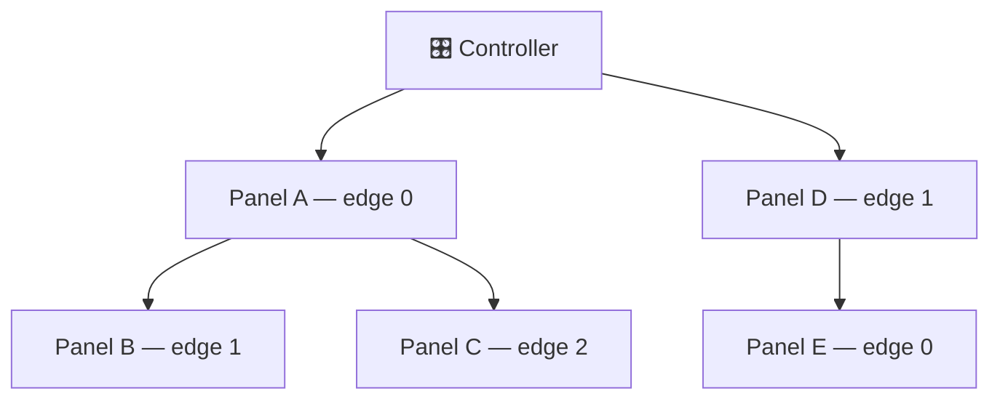

# Hardware Reference

The physical side of Lightnet — topology, pin assignments, fuses. For wiring schematics and a parts list, see the (future) hardware design files; this page covers what the firmware expects to see.

## Topology

Panels form a **tree** rooted at the controller. Each panel exposes up to 5 edges (physical connectors); each edge carries power and a single-wire ping line. On boot the controller pings each edge over GPIO, triggering a PCINT on the receiving ATmega. After discovery completes, all communication runs over **I²C** (`LightnetBus`) carrying structured `Protocol` packets, addressed by the per-panel index assigned during discovery.



The firmware caps a single controller at **100 panels** on ESP32 (`LIGHTNET_MAX_PANELS` in `lib/Lightnet/Core/Common/LightnetConfig.hpp`; **32 on ESP8266** to fit heap/stack budgets). The I²C 7-bit address space allows up to 254 in theory; the cap leaves headroom in SRAM and on the bus.

---

## Pin assignments

=== "Controller"

    | Signal | ESP8266 | ESP32 |
    |---|---|---|
    | Edge ping out | GPIO 13 | GPIO 12 |
    | Edge interrupt in | GPIO 12 | GPIO 13 |
    | Status LED (active low) | GPIO 2 | GPIO 2 |
    | I²C SDA | GPIO 4 | GPIO 4 |
    | I²C SCL | GPIO 5 | GPIO 5 |
    | Panel power enable | GPIO 14 | GPIO 21 |

    Defaults in `src/controller/config.hpp` (override in `src/controller.config.hpp`).

=== "Panel (ATmega)"

    | Signal | Arduino pin | AVR port |
    |---|---|---|
    | Edge 0 | Pin 9 | PB1 / PCINT1 |
    | Edge 1 | Pin 10 | PB2 / PCINT2 |
    | Edge 2 | Pin 11 | PB3 / PCINT3 |
    | LED data | — | PD5 |
    | I²C SDA | — | PC4 |
    | I²C SCL | — | PC5 |

---

## Panel SRAM budget & `MAX_ANIM_SLOTS`

The ATmega328P/PB has **2048 B SRAM total**, shared statically between everything below — there
is no separate heap budget worth relying on. `MAX_ANIM_SLOTS`
(`lib/Lightnet/Core/Common/AnimationTypes.hpp`) is the one constant most likely to push the panel
over that limit, because it's the only one that scales with a number the firmware author picks
freely.

This section deliberately avoids stating what `MAX_ANIM_SLOTS` is currently set to — that value
changes independently of this doc and goes stale immediately. Always get the real numbers by
building and reading the linker's report:

```
pio run -e panel_atmega328p
```

The `RAM: [...] NN.N% (used X bytes from 2048 bytes)` line in the build output is ground truth;
treat the numbers below as a model for *reasoning about* the budget, not a substitute for that
check.

### What's eating panel RAM

| Consumer | Size | Notes |
|---|---|---|
| Wire/TWI buffers (`TWI_BUFFER_SIZE=80` × 4) | 320 B | `twi_rxBuffer`, `twi_txBuffer`, `TwoWire::rxBuffer`, `TwoWire::txBuffer`. Must be ≥ `Protocol::MAX_PACKET_SIZE` (80) — see above. |
| RX packet ring (`RX_QUEUE_BYTES=80`, `SpscByteQueue`) | 80 B | Single lock-free ring (`.bss`). `handleIncomingPackets()` also uses an 80 B stack scratch buffer while draining it — but that's reused stack space, not a second standing allocation. |
| `AnimationPlayer` — `MAX_ANIM_SLOTS × ~53 B` | scales with the constant | Each `Slot` holds two `AnimationState` (`cur` + `pending`, 23 B each) plus ~7 B of flags/timing/reactive fields. This is the **only per-slot cost** and the main lever for raising `MAX_ANIM_SLOTS`. `outColor`/`outValue` are *not* stored per slot — they're computed and consumed within a single `composite()` pass, so they live as locals instead of growing `.bss` per slot. |
| `AnimationPlayer` — palette + base colours | 73 B | `palette[PALETTE_STOPS=16]` (64 B) + `baseColors[BASE_COLORS_COUNT=3]` (9 B). Fixed, independent of slot count. |
| `LNPanel` other fields | ~30 B | Address, flags, config, misc bookkeeping. |
| 3 × `LightnetPanelEdge` + `LightnetPinger` | ~100 B | Per-edge state for the 3 physical connectors plus ping-pulse tracking (`LightnetPinger::StateEntry` is packed to 3 B/entry). |
| Arduino Serial ring buffers (`SERIAL_RX=2` + `SERIAL_TX=32`) | ~34 B | Reduced from MiniCore defaults (64 B RX is overkill for 57600-baud debug output). |
| **Fixed total** (above, excluding the `MAX_ANIM_SLOTS` line) | **roughly 650-700 B** | Get the exact figure for your build from `avr-size` / the `pio run` RAM line, not this table. |

### Sizing `MAX_ANIM_SLOTS`: call-stack headroom, not just `.bss`

Raising `MAX_ANIM_SLOTS` grows `AnimationPlayer`'s static `.bss` (it's a member of the global
`LNPanel`), which squeezes the gap between `.bss`/heap and the stack pointer growing down from
the top of SRAM. **The static `.bss` percentage from `pio run` is necessary but not sufficient**
— AVR ISRs share the main call stack, and the deepest call chain in the firmware is usually
**discovery** (the boot-time I²C addressing/registration sequence), not normal animation
playback. A panel can pass a static-RAM check with room to spare and still fail discovery if the
real bottleneck is stack depth at that specific code path.

Concretely, `AnimationPlayer::composite()` puts a transient `CompositeLayer
contrib[MAX_ANIM_SLOTS]` array on the call stack every frame — call-stack pressure that scales
with the same constant, on top of whatever the I²C ISR + FastLED's interrupt-driven output need.
`LightnetBus::onReceive()` previously made this worse by allocating its receive buffer as a
variable-length array on the stack inside the I²C ISR callback (now fixed — it uses a fixed-size
`Protocol::MAX_PACKET_SIZE` buffer instead, clamped defensively) — that pattern is exactly the
kind of stack consumer that can make a panel fail discovery well below the ceiling a pure `.bss`
calculation would suggest.

**Practical guidance:**
- Don't just check the static RAM percentage after changing `MAX_ANIM_SLOTS` — flash a panel and
  confirm it actually completes discovery, since that's the highest-stack-watermark path.
- If a panel starts crashing mid-init, dropping I²C packets, or printing garbage on serial after
  raising `MAX_ANIM_SLOTS`, that's stack-corruption-by-overrun — lower it back down (or check
  `TWI_BUFFER_SIZE` / `RX_QUEUE_BYTES`, the other two static-budget knobs, and watch for any new
  stack-resident buffers in the ISR call paths).
- There's no on-device free-stack instrumentation in this codebase yet (no `freeRam()` /
  stack-painting helper) — worth adding if this needs revisiting again.

### Ruled out: shared `pending` buffer

`Slot::pending` is a second full `AnimationState` used only transiently while a transition is
staged for the *next* step. Sharing **one** `pending` buffer across all slots at the player level
would cut its per-slot cost — but multiple groups (layers) can legitimately be mid-PREPARE
concurrently before a synced general-call START, so a single shared buffer would corrupt
concurrent staged transitions. Not viable; per-slot `pending` stays.

---

- [Build & Flash](getting-started.md) — Fuse values, bootloader install, and all flash commands
- [Architecture](architecture.md) — Software structure and the internal I²C protocol
- [OTA & Updates](ota.md) — Panel OTA via twiboot
