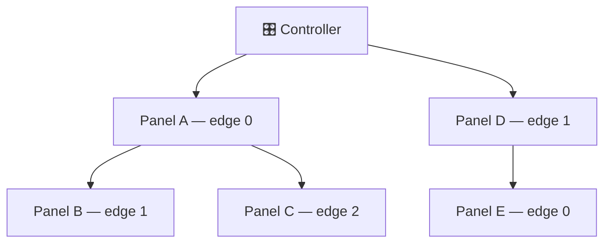

# Hardware Reference

The physical side of Lightnet — topology, pin assignments, fuses. For wiring schematics and a parts list, see the (future) hardware design files; this page covers what the firmware expects to see.

## Topology

Panels form a **tree** rooted at the controller. Each panel exposes up to 3 edges (physical connectors); each edge carries power and a single-wire ping line. On boot the controller pings each edge over GPIO, triggering a PCINT on the receiving ATmega. After discovery completes, all communication runs over **I²C** (`LightnetBus`) carrying structured `Protocol` packets, addressed by the per-panel index assigned during discovery.



The firmware caps a single controller at **100 panels** (`LIGHTNET_MAX_PANELS` in `LightnetConfig.hpp`). The I²C 7-bit address space allows up to 254 in theory; the cap leaves headroom in SRAM and on the bus.

---

## Pin assignments

=== "Controller"

    | Signal | ESP8266 | ESP32 |
    |---|---|---|
    | Edge ping out | GPIO 13 | GPIO 12 |
    | Edge interrupt in | GPIO 12 | GPIO 13 |
    | Status LED (active low) | GPIO 2 | GPIO 2 |
    | I²C SDA | GPIO 4 | GPIO 4 |
    | I²C SCL | GPIO 5 | GPIO 5 |
    | Panel power enable | GPIO 14 | GPIO 21 |

    Defined in `src/controller/main.cpp`.

=== "Panel (ATmega)"

    | Signal | Arduino pin | AVR port |
    |---|---|---|
    | Edge 0 | Pin 9 | PB1 / PCINT1 |
    | Edge 1 | Pin 10 | PB2 / PCINT2 |
    | Edge 2 | Pin 11 | PB3 / PCINT3 |
    | LED data | — | PD5 |
    | I²C SDA | — | PC4 |
    | I²C SCL | — | PC5 |

---

## Panel SRAM budget & `MAX_ANIM_SLOTS`

The ATmega328P/PB has **2048 B SRAM total**, shared statically between everything below — there
is no separate heap budget worth relying on. `MAX_ANIM_SLOTS`
(`lib/Lightnet/Core/Anim/AnimationTypes.hpp`) is the one constant most likely to push the panel
over that limit, because it's the only one that scales with a number the firmware author picks
freely.

### What's eating panel RAM

| Consumer | Size | Notes |
|---|---|---|
| Wire/TWI buffers (`TWI_BUFFER_SIZE=80` × 4) | 320 B | `twi_rxBuffer`, `twi_txBuffer`, `TwoWire::rxBuffer`, `TwoWire::txBuffer`. Must be ≥ `Protocol::MAX_PACKET_SIZE` (80) — see above. |
| RX packet ring (`RX_QUEUE_BYTES=80`, `SpscByteQueue`) | 80 B | Single lock-free ring (`.bss`). `handleIncomingPackets()` also uses an 80 B stack scratch buffer while draining it — but that's reused stack space, not a second standing allocation. The old double-buffered `CircularQueue` pair permanently held **both** buffers (plus heap/object overhead, ~190 B) for the program's lifetime. |
| `AnimationPlayer` — `MAX_ANIM_SLOTS × 55 B` | 990 B at 18 slots | Each `Slot` is 55 B: two `AnimationState` (`cur` + `pending`, 22 B each) + ~11 B of flags/timing/reactive fields. This is the **only per-slot cost** and the main lever. |
| `AnimationPlayer` — palette + base colours | 73 B | `palette[PALETTE_STOPS=16]` (64 B) + `baseColors[BASE_COLORS_COUNT=3]` (9 B). Fixed, independent of slot count. |
| `LNPanel` other fields | ~30 B | Address, flags, config, misc bookkeeping. |
| 3 × `LightnetPanelEdge` + `LightnetPinger` | ~125 B | Per-edge state for the 3 physical connectors plus ping-pulse tracking. |
| Arduino Serial ring buffers (`SERIAL_RX=2` + `SERIAL_TX=32`) | ~34 B | Reduced from MiniCore defaults (64 B RX is overkill for 57600-baud debug output). |
| **Static total** (above) | **~1652 B** | |
| Free for stack growth / runtime dynamic state | **remainder** | See below. |

### Current measurement

At `MAX_ANIM_SLOTS = 18` (`pio run -e panel_atmega328p`):

```
RAM:   [========  ]  83.0% (used 1700 bytes from 2048 bytes)
Flash: [=====     ]  51.4% (used 16844 bytes from 32768 bytes)
```

**348 B free** for stack and any remaining heap use. Flash is not a constraint (51.4%).

### Sizing `MAX_ANIM_SLOTS`

Marginal cost is **55 B per slot**, confirmed empirically (14→24 slots: +550 B = 55 B/slot).
From the 18-slot baseline above:

- **Hard ceiling** (0 B free, unsafe): 18 + ⌊348 / 55⌋ = **24 slots**. Don't do this — leaves
  nothing for the call stack, which on AVR with FastLED's interrupt-driven output and nested
  I²C ISR handling needs real headroom.
- **Practical safe range**: keep ≥150–200 B free for stack. That's 18 + ⌊(348−175)/55⌋ ≈
  **21 slots** as a hard upper bound. **18 is the current default** (348 B / 17.0% free) — within
  the safe range, but note that `composite()` also puts a transient `7 × MAX_ANIM_SLOTS` B array
  on the stack each frame (126 B at 18), so the effective per-frame headroom is tighter than the
  static free figure suggests. Going above 18 is not recommended without an on-device free-stack
  measurement.

If a panel starts crashing mid-init, dropping I²C packets, or printing garbage on serial after
raising `MAX_ANIM_SLOTS`, that's stack-corruption-by-overrun — lower it back down (or also check
`TWI_BUFFER_SIZE` / `RX_QUEUE_BYTES`, the other two static-budget knobs).

### Future option: shared `pending` buffer

`Slot::pending` is a second full `AnimationState` (22 B) used only transiently, while a
transition is being staged for the *next* step. If `AnimationPlayer` held **one** shared
`pending` buffer at the player level (used one slot at a time during step transitions) instead of
one per slot, marginal cost would drop from 55 B/slot to ~33 B/slot — nearly doubling the slot
count for the same RAM. Not implemented; would need care around concurrent multi-slot
transitions (e.g. group-synced steps firing on the same tick).

---

- [Build & Flash](getting-started.md) — Fuse values, bootloader install, and all flash commands
- [Architecture](architecture.md) — Software structure and the internal I²C protocol
- [OTA & Updates](ota.md) — Panel OTA via twiboot
