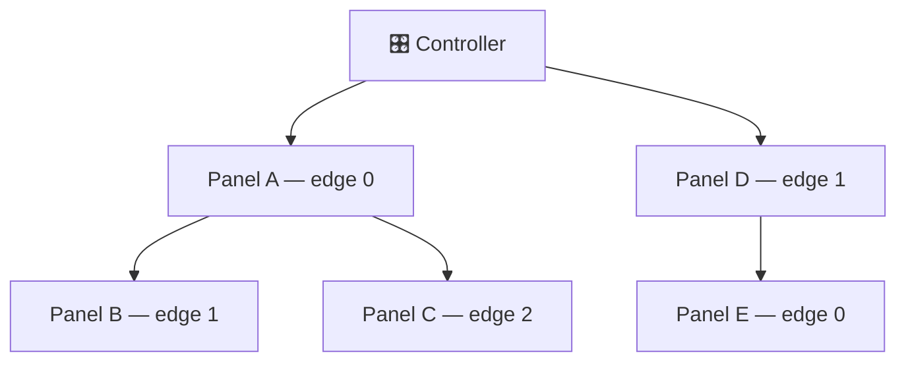

# Hardware Reference

The physical side of Lightnet — topology, pin assignments, fuses. For wiring schematics and a parts list, see the (future) hardware design files; this page covers what the firmware expects to see.

## Topology

Panels form a **tree** rooted at the controller. Each panel exposes up to 3 edges (physical connectors); each edge carries power and a single-wire ping line. On boot the controller pings each edge over GPIO, triggering a PCINT on the receiving ATmega. After discovery completes, all communication runs over **I²C** (`LightnetBus`) carrying structured `Protocol` packets, addressed by the per-panel index assigned during discovery.

The firmware caps a single controller at **100 panels** (`LIGHTNET_MAX_PANELS` in `LightnetConfig.hpp`). The I²C 7-bit address space allows up to 254 in theory; the cap leaves headroom in SRAM and on the bus.

---

## Pin assignments

=== "Controller"

    | Signal | ESP8266 | ESP32 |
    |---|---|---|
    | Edge ping out | GPIO 13 | GPIO 12 |
    | Edge interrupt in | GPIO 12 | GPIO 13 |
    | Status LED (active low) | GPIO 2 | GPIO 2 |
    | I²C SDA | GPIO 4 | GPIO 4 |
    | I²C SCL | GPIO 5 | GPIO 5 |
    | Panel power enable | GPIO 14 | GPIO 21 |

    Defined in `src/controller/main.cpp`.

=== "Panel (ATmega)"

    | Signal | Arduino pin | AVR port |
    |---|---|---|
    | Edge 0 | Pin 9 | PB1 / PCINT1 |
    | Edge 1 | Pin 10 | PB2 / PCINT2 |
    | Edge 2 | Pin 11 | PB3 / PCINT3 |
    | LED data | — | PD5 |
    | I²C SDA | — | PC4 |
    | I²C SCL | — | PC5 |

---

- [Build & Flash](getting-started.md) — Fuse values, bootloader install, and all flash commands
- [Architecture](architecture.md) — Software structure and the internal I²C protocol
- [OTA & Updates](ota.md) — Panel OTA via twiboot
