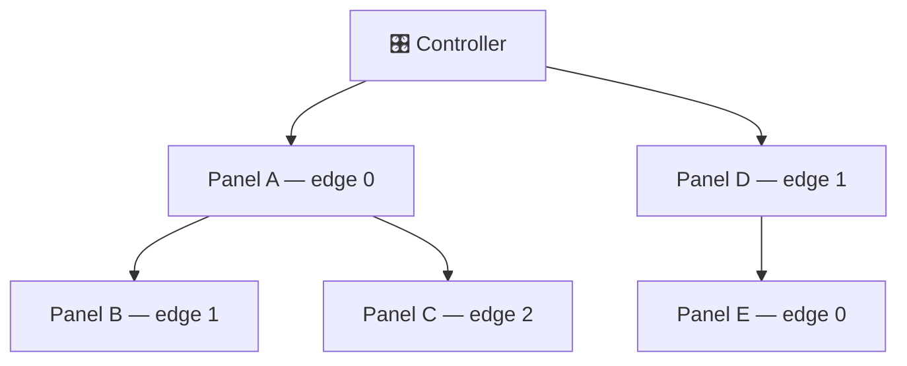

# Hardware Reference

The physical side of Lightnet — topology, pin assignments, fuses. For wiring schematics and a parts list, see the (future) hardware design files; this page covers what the firmware expects to see.

## Topology

Panels form a **tree** rooted at the controller, but unlike a shared bus, each panel is a
**store-and-forward repeater**: it only ever talks to its own physical neighbours (up to 3 edges
today), never directly to the controller or to a panel it isn't wired to. A single hardware USART
per panel, shared across all its edges through a `CD74HC4052` analog mux, carries framed `Protocol`
packets — there is no separate ping/handshake phase and no shared electrical bus anywhere in the
tree.


```mermaid
graph TD
  C[🎛️ Controller]
  C --> A[Panel A — edge 0]
  A --> B[Panel B — edge 1]
  A --> Pc[Panel C — edge 2]
  C --> D[Panel D — edge 1]
  D --> E[Panel E — edge 0]
```

On boot, the controller and each panel run a **depth-first discovery walk**
(`Core/Relay/DiscoveryCoordinator` on the controller, `Core/Relay/PanelDiscoveryDriver` on each
panel): the controller hands out sequential panel indices one at a time, always descending into a
newly-found child before trying the next sibling edge, backtracking once a subtree is exhausted. A
panel that tries to register a second time via a different edge — closing a physical wiring loop —
is rejected, so the discovered topology is guaranteed to be a genuine spanning tree. See
[Architecture §6](architecture.md#6-discovery-sequence) for the full sequence.

Once discovered, ordinary traffic (`Core/Relay/PanelRouter`) floods downstream to every connected
edge except the one it arrived on, and routes upstream to the parent edge only — "send to panel N"
is a routing decision resolved by flooding with an address filter, not a direct electrical address
the way flat I²C addressing allowed.

The firmware caps a single controller at **100 panels** (`LIGHTNET_MAX_PANELS` in
`lib/Lightnet/Core/Common/LightnetConfig.hpp`) — a purely **SRAM** limit, comfortable on any
ESP32-class controller. See [Why point-to-point instead of a shared bus](#why-point-to-point-instead-of-a-shared-bus)
for why panel count is no longer also bounded by anything electrical the way it was on the old
shared-I²C-bus design.

!!! note "ESP8266 controller targets are retired"
    ESP8266 doesn't meet the relay design's requirements: no spare hardware UART for the trunk,
    and RAM was already tight. Controller targets are ESP32-class only — see `platformio.ini`.

---

## Pin assignments

=== "Panel (ATmega328PB)"

    | Signal | AVR pin | Role |
    |---|---|---|
    | Shared TX | PD1 (TXD0) | Hardware USART0 TX, fanned out to 3× `EM74LVC1G125GW` tri-state buffers |
    | Shared RX | PD0 (RXD0) | Hardware USART0 RX, fed from the `CD74HC4052` mux common (`1Z`) |
    | Edge 0 / 1 / 2 TX enable | PD2 / PD3 / PD4 | `PE1`/`PE2`/`PE3` — gates which edge the shared TX drives |
    | Mux select | PC3 / PC2 | `S0`/`S1` on the `CD74HC4052` — chooses which edge's RX the shared USART reads |
    | Edge 0 / 1 / 2 wake | PB1 / PB2 / PB3 | PCINT — "which edge is signalling," drives the mux select; not the data-sample path |
    | LED clock / data | PC4 / PC5 | `LED_SCK`/`LED_MOSI` — clocked protocol (APA102/SK9822-style), no NRZ timing |

    Matches [`docs/hardware/schematics/Panel.png`](hardware/schematics/Panel.png). Only USART0 is
    used; USART1 is unused/spare.

=== "Controller"

    | Signal | ESP32 | S2 Mini |
    |---|---|---|
    | Status LED (active low) | GPIO 2 | GPIO 15 |
    | Panel power enable | GPIO 21 | GPIO 7 |
    | Trunk RX (`Serial1`) | GPIO 12 | GPIO 11 |
    | Trunk TX (`Serial1`) | GPIO 13 | GPIO 9 |

    Defaults in `src/controller/config.hpp` (`CONTROLLER_TRUNK_RX_PIN`/`CONTROLLER_TRUNK_TX_PIN`;
    override in `src/controller.config.hpp`). The trunk TX/RX pair (`PTX`/`PRX` on
    [`docs/hardware/schematics/Controller.png`](hardware/schematics/Controller.png)) feeds `Serial1`.
    `Controller/Relay/ControllerEdgeTransport` (`LNTrunkTransport`, the shared global instance) takes
    an already-configured `HardwareSerial&`, so pin routing itself is `PanelsInitializer::start()`'s
    call to `Serial1.begin(baud, SERIAL_8N1, rxPin, txPin)`, not baked into the transport class. Not
    yet bench-validated — no boards exist yet.

---

## Why point-to-point instead of a shared bus

Panels used to share a real electrical bus — a buffered, 12 V I²C bus daisy-chained across every
panel — and the number of panels that bus could support was capped by its total capacitance. That
whole electrical concern no longer applies: every inter-panel wire is now an independent
point-to-point hop (~30 cm), carrying one hardware USART's TX/RX through the mux described above.
No cable segment is ever longer than one inter-panel run, no matter how large or branchy the tree
becomes — a hop that short has no meaningful reflection risk, so there is no cumulative shared-bus
electrical limit left to budget for.

What scales with tree size instead is **hop count (depth)** — a latency question, not a
signal-integrity one: every packet is store-and-forward, so each hop's transit time adds up across
depth. Multi-layer scene restarts have a real end-to-end latency budget that this transport has to
hold at the worst-case topology depth; the current design has little slack in that budget and is
unvalidated until measured on real hardware across a real chain of panels — treat any specific
number as a working estimate, not a settled figure, until then.

`LIGHTNET_MAX_PANELS` (100 on ESP32, 32 on ESP8266) is purely an SRAM limit again, for the same
reason it always was for the controller's own in-memory topology structures — nothing electrical
bounds panel count on this transport the way I²C bus capacitance used to.

---

## Panel SRAM budget & `MAX_ANIM_SLOTS`

The ATmega328P/PB has **2048 B SRAM total**, shared statically between everything below — there
is no separate heap budget worth relying on. `MAX_ANIM_SLOTS`
(`lib/Lightnet/Core/Common/AnimationTypes.hpp`) is the one constant most likely to push the panel
over that limit, because it's the only one that scales with a number the firmware author picks
freely.

This section deliberately avoids stating what `MAX_ANIM_SLOTS` is currently set to — that value
changes independently of this doc and goes stale immediately. Always get the real numbers by
building and reading the linker's report:

```
pio run -e panel_atmega328p
```

The `RAM: [...] NN.N% (used X bytes from 2048 bytes)` line in the build output is ground truth;
treat the numbers below as a model for *reasoning about* the budget, not a substitute for that
check.

### What's eating panel RAM

| Consumer | Size | Notes |
|---|---|---|
| `AnimationPlayer` — `MAX_ANIM_SLOTS × ~53 B` | scales with the constant | Each `Slot` holds two `AnimationState` (`cur` + `pending`, 23 B each) plus ~7 B of flags/timing/reactive fields. This is the **only per-slot cost** and the main lever for raising `MAX_ANIM_SLOTS`. `outColor`/`outValue` are *not* stored per slot — they're computed and consumed within a single `composite()` pass, so they live as locals instead of growing `.bss` per slot. |
| `AnimationPlayer` — palette + base colours | 73 B | `palette[PALETTE_STOPS=16]` (64 B) + `baseColors[BASE_COLORS_COUNT=3]` (9 B). Fixed, independent of slot count. |
| `Core/Relay/EdgeFrameReceiver` | ~88 B | Owns one `PacketFramer` (an 80 B frame buffer + 2 B of framing state) plus its own edge-claim/timeout bookkeeping (~6 B). Tags a completed frame with the edge it arrived on — see `docs/architecture.md` §6. |
| `Panel/EdgeUartTransport` | ~22 B | A 16-byte `ByteRing` (RX) plus the `transmitting` self-echo-mask flag and mux/edge-enable state. |
| `Core/Relay/PanelDiscovery` + `PanelDiscoveryDriver` | ~23 B | Per-edge topology state (parent/edge-link-state array, ~9 B) plus the driver's own assigned-index/probe-timeout bookkeeping (~14 B). |
| `Core/Relay/PanelRouter` + `PanelFrameDispatcher` | ~8 B | Both hold only references into the objects above — no owned buffers. |
| `LNPanel` other fields | ~30 B | Flags, config, misc bookkeeping. |
| **Fixed total** (above, excluding the `MAX_ANIM_SLOTS` line) | **roughly 240-250 B** | A reasoning model, not ground truth — get the exact figure for your build from `avr-size` / the `pio run` RAM line. |

### Sizing `MAX_ANIM_SLOTS`: call-stack headroom, not just `.bss`

Raising `MAX_ANIM_SLOTS` grows `AnimationPlayer`'s static `.bss` (it's a member of the global
`LNPanel`), which squeezes the gap between `.bss`/heap and the stack pointer growing down from
the top of SRAM. **The static `.bss` percentage from `pio run` is necessary but not sufficient**
— AVR ISRs share the main call stack, and the deepest call chain in the firmware is usually
**discovery** (the relay's depth-first walk, driven from `LightnetPanel::tick()` via
`pollWake()`/`pollBytes()` — see `docs/architecture.md` §6), not normal animation playback. A
panel can pass a static-RAM check with room to spare and still fail discovery if the real
bottleneck is stack depth at that specific code path.

Concretely, `AnimationPlayer::composite()` puts a transient `CompositeLayer
contrib[MAX_ANIM_SLOTS]` array on the call stack every frame — call-stack pressure that scales
with the same constant, on top of whatever the USART RX ISR and `ClockedLed`'s bit-banged output
need. `PacketFramer` (the relay's frame-boundary recovery) already uses a fixed-size
`Protocol::MAX_PACKET_SIZE` buffer as a member, not a stack-resident variable-length array — but
any *future* stack-resident buffer added to the RX/discovery call path is exactly the kind of
consumer that can make a panel fail discovery well below the ceiling a pure `.bss` calculation
would suggest.

**Practical guidance:**
- Don't just check the static RAM percentage after changing `MAX_ANIM_SLOTS` — flash a panel and
  confirm it actually completes discovery, since that's the highest-stack-watermark path.
- If a panel starts crashing mid-init, dropping relay frames, or misbehaving after raising
  `MAX_ANIM_SLOTS`, that's stack-corruption-by-overrun — lower it back down and watch for any new
  stack-resident buffers added to the ISR/discovery call paths.
- There's no on-device free-stack instrumentation in this codebase yet (no `freeRam()` /
  stack-painting helper) — worth adding if this needs revisiting again.

### Ruled out: shared `pending` buffer

`Slot::pending` is a second full `AnimationState` used only transiently while a transition is
staged for the *next* step. Sharing **one** `pending` buffer across all slots at the player level
would cut its per-slot cost — but multiple groups (layers) can legitimately be mid-PREPARE
concurrently before a synced general-call START, so a single shared buffer would corrupt
concurrent staged transitions. Not viable; per-slot `pending` stays.

---

- [Build & Flash](getting-started.md) — Fuse values, bootloader install, and all flash commands
- [Architecture](architecture.md) — Software structure and the internal wire protocol
- [OTA & Updates](ota.md) — Panel OTA over the relay
