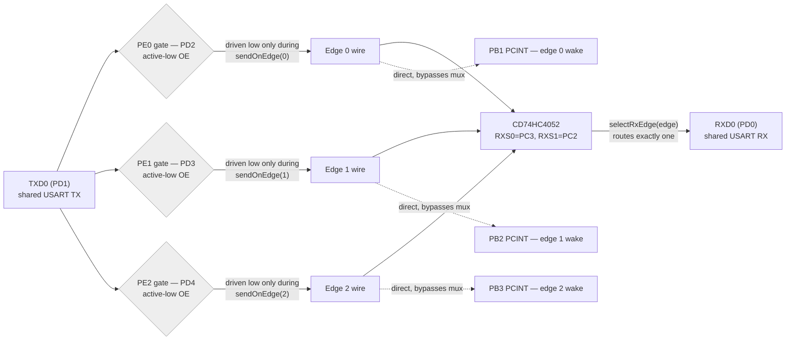
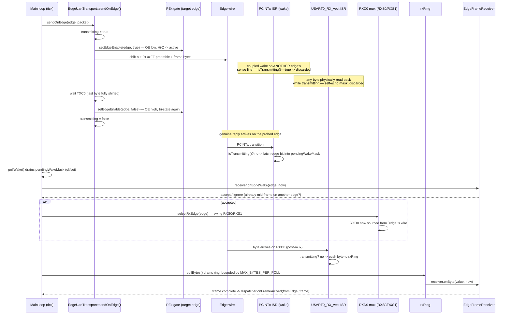

# Panel relay UART: TX gating, RX mux, and wake path

Shared USART0 (`TXD0`=PD1, `RXD0`=PD0) fans out to 3 edges through two independent, asymmetric
paths: TX is gated per-edge by tri-state buffers (`PEx`), RX is time-multiplexed by a
CD74HC4052 mux (`S0`/`S1`, called `RXSx` here). Wake sensing bypasses the mux entirely — each
edge has its own direct PCINT line. Source: `lib/Lightnet/Panel/EdgeUartTransport.cpp/.hpp`,
`lib/Lightnet/Panel/LightnetPanel.cpp`.

## 1. Physical signal topology

Idle state: all three `PEx` gates deasserted (OE high → Hi-Z, nothing driving any edge wire);
`RXSx` sits parked on whichever edge was last claimed. Only one `PEx` is ever asserted at a
time, only for the duration of one `sendOnEdge()` call — this is the "single-active-flow"
invariant the whole design leans on.

## 2. TX → wake → mux-reselect → frame sequence

## Gating rules at a glance

| Signal | Asserted when | Purpose |
|---|---|---|
| `PEx` (PD2/3/4, active-low) | Only for the exact duration of `sendOnEdge(edge)` on that edge | Puts this panel's TX onto exactly one wire; every other edge stays Hi-Z |
| `transmitting` flag | Same window as the asserted `PEx` | Masks `onRxByte()` (self-echo) and `onEdgeWakeIsr()` (crosstalk-coupled phantom wake on a neighbouring sense line) for that whole window |
| `RXSx` (PC3/PC2, mux select) | Whatever `selectRxEdge()` last set | Chooses which edge's wire feeds the single shared `RXD0` — only that edge's incoming bytes are visible to the USART RX path at all |
| `pendingWakeMask` | Edge bits set by PCINT transitions not masked by `transmitting` | Per-edge latch, main-loop-only consumer (`pollWake()`), so mux reselection never races the ISRs |

`pollProbeClaim()` (`LightnetPanel.cpp`) re-parks `RXSx` on `driver.probingEdge()` every tick
while a probe is outstanding, independent of the wake path — a probe reply's edge is already
known from protocol rules, so it doesn't have to depend on a PCINT wake surviving crosstalk.
