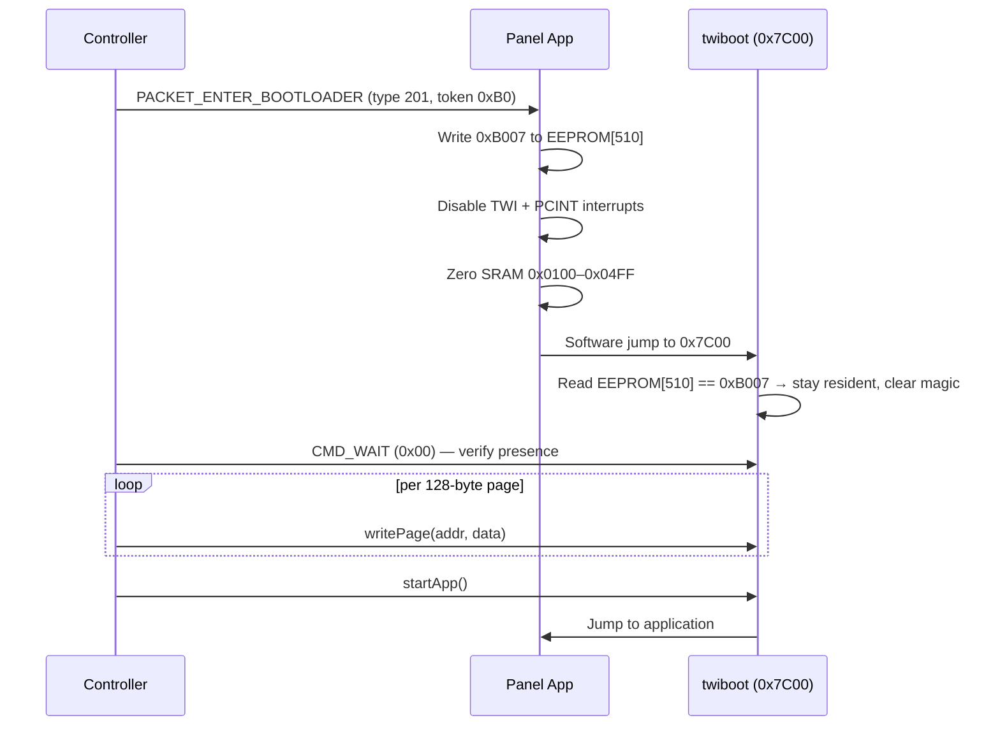
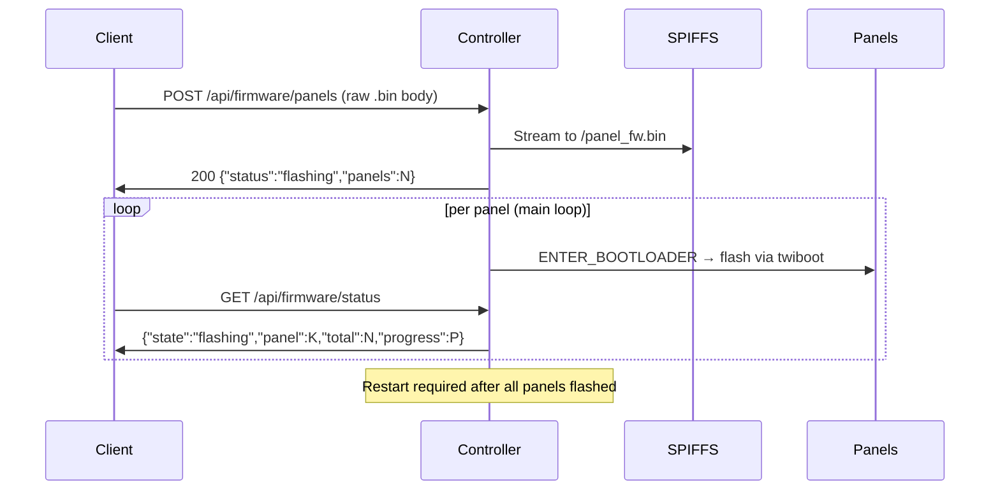

# OTA & Firmware Updates

Three update paths: panel OTA via the twiboot bootloader (I²C, triggered from the controller), serial firmware upload, and controller self-update over ArduinoOTA.

## Panel OTA (twiboot)

Panels use a custom fork of [`orempel/twiboot`](https://github.com/orempel/twiboot) maintained in the firmware repo as the `twiboot/` git submodule. The upstream repo was tried but produced SRAM-initialisation issues on software jump entry and WDT bootloops on hardware reset — the fork addresses both.

### Getting the bootloader

**Option 1: Use precompiled hex (fastest)**
```bash
# Flash precompiled bootloader directly
avrdude -c usbasp -p m328pb -U flash:w:twiboot/pre-compiled_bootloaders/pre-compiled_atmega328pb_16mhz_twiboot.hex:i
```

Available precompiled files are in `twiboot/pre-compiled_bootloaders/`.

**Option 2: Compile from source**
```bash
# Build bootloader environments via PlatformIO
pio run -e atmega328pb_bootloader
pio run -e atmega328p_bootloader

# Hex file is in `.pio/build/atmega328pb_bootloader/firmware.hex`
```

- Lives in the **4 KB boot section** at `0x7C00` (ATmega328PB/P)
- TWI address: `0x29` (compiled in via `-DTWI_ADDRESS=0x29`)
- Stays in bootloader only when EEPROM byte 510 contains `0xB007` (cleared after first read)

### Entry sequence



### Writing firmware (controller side)

`TwibootClient` uses raw `Wire` (bypasses `LNBus`):

```cpp
twibootClient->connect(panelAddress);       // sends CMD_WAIT (0x00) to verify presence
twibootClient->writePage(addr, data, 128);  // 2 × 64-byte chunks
twibootClient->startApp();
```

`PanelFlasher` reads `/panel_fw.bin` from SPIFFS 128 bytes at a time — the full binary is never buffered in RAM.

### HTTP upload flow



!!! warning "Controller restart required"
    After all panels are flashed, **restart the controller** so `PanelsInitializer` can re-run discovery with the new panel firmware.

---

## Serial Firmware Upload (PC → Controller)

`SerialFirmwareReceiver` listens on the existing 57600-baud Serial port. This allows updating panels without WiFi.

### Frame format

| Offset | Size | Field | Description |
|---|---|---|---|
| 0 | 4 B | Magic | ASCII `LNFW` — identifies a Lightnet firmware frame |
| 4 | 4 B | Size | Payload length in bytes, little-endian |
| 8 | N B | Data | Raw firmware `.bin` |
| 8+N | 2 B | CRC-16 | CRC-16 of the data bytes, little-endian |

Controller replies:

- `READY\n` — after the header is received
- `OK\n` — after CRC validates and binary is saved to SPIFFS
- `ERR:<message>\n` — on any failure

### Usage

```bash
pip install pyserial
python tools/flash_panels_serial.py <port> <firmware.bin>
```

Once the binary is saved the controller starts flashing panels exactly as with the HTTP upload path.

---

## Controller Self-Update (ArduinoOTA)

`ArduinoOTA` is initialised after WiFi connects. Standard ports: 8266 (ESP8266), 3232 (ESP32). No password — intended for a trusted local network.

```bash
# Upload directly over WiFi
pio run -e controller_esp32 --target upload --upload-port lightnet-XXXX.local
```

The hostname matches the mDNS name (`lightnet-<chipid>`). The `.local` suffix requires mDNS to be working on the network (standard on most OS setups).

---

## Build Post-Processing

!!! info "Automatic `.bin` generation"
    The post-build script `tools/generate_bin.py` automatically produces both `.hex` and `.bin` for all panel environments. Upload the `.bin` via `POST /api/firmware/panels` — no manual conversion needed.

---

- [API Reference](api.md) — Firmware update endpoints (`/api/firmware/panels`, `/api/firmware/status`)
- [Build & Flash](getting-started.md) — Build commands and initial flashing
- [Troubleshooting](troubleshooting.md) — OTA failure recovery
