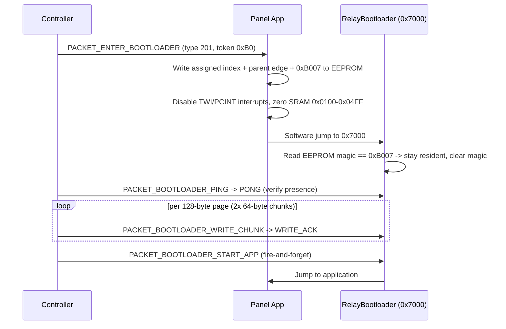
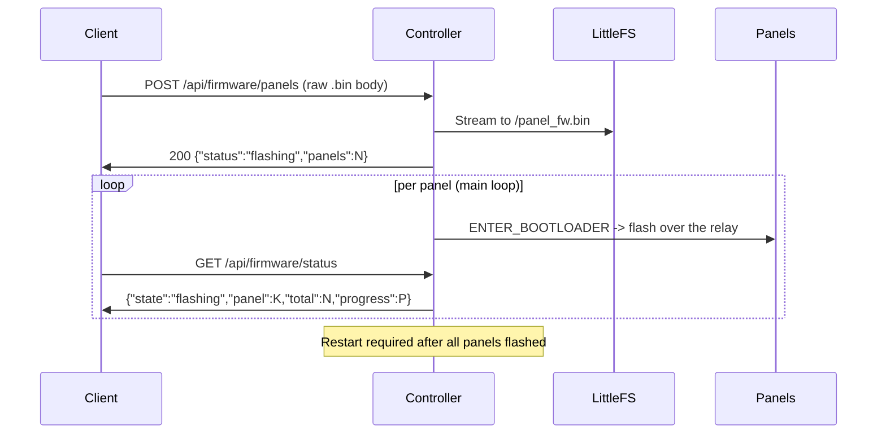

# OTA & Firmware Updates

Three update paths: panel OTA over the relay trunk (triggered from the controller), serial firmware upload, and controller self-update over ArduinoOTA. Real (non-SIM) controller hardware only — there is no I²C wire to any panel to flash over, and sim panels don't implement a bootloader protocol, so OTA doesn't exist under `SIM_MODE`.

## Panel OTA (relay)

Panels run a from-scratch bootloader speaking the relay's own `PacketMeta`/CRC-16 framing:
[`lib/Lightnet/Panel/bootloader/RelayBootloader.cpp`](https://github.com/przemczan/lightnet-firmware/blob/master/lib/Lightnet/Panel/bootloader/RelayBootloader.cpp),
driven from the controller side by
[`RelayBootloaderClient`](https://github.com/przemczan/lightnet-firmware/blob/master/lib/Lightnet/Controller/OTA/RelayBootloaderClient.cpp).

!!! warning "No read-back verify"
    There is no post-write flash read-back verification — each chunk's own CRC-16 over
    address+length+data (checked before anything reaches `boot_page_fill()`) is the integrity
    guarantee instead; see `RelayBootloaderClient`'s class comment for why a read-back pass
    would need its own new packet type.

### Getting the bootloader

```bash
# Build + burn (one-time, per panel)
pio run -e atmega328pb_bootloader -t fuses    # set fuses (see getting-started.md)
pio run -e atmega328pb_bootloader -t upload   # burn via USBasp

# Hex file is in `.pio/build/atmega328pb_bootloader/firmware.hex`
```

- Lives in the **4 KB boot section** at `0x7000` (ATmega328PB/P)
- Stays resident only when EEPROM byte 510 contains `0xB007` (cleared once read)
- Listens/replies on the one edge that leads back toward the controller — persisted to EEPROM
  by `BootloaderBridge::prepareAndReset()` immediately before the jump, alongside this panel's
  own assigned index (for filtering)

### Entry sequence


```mermaid
sequenceDiagram
  participant C as Controller
  participant P as Panel App
  participant BL as RelayBootloader (0x7000)

  C->>P: PACKET_ENTER_BOOTLOADER (type 201, token 0xB0)
  P->>P: Write assigned index + parent edge + 0xB007 to EEPROM
  P->>P: Disable TWI/PCINT interrupts, zero SRAM 0x0100-0x04FF
  P->>BL: Software jump to 0x7000
  BL->>BL: Read EEPROM magic == 0xB007 -> stay resident, clear magic
  C->>BL: PACKET_BOOTLOADER_PING -> PONG (verify presence)
  loop per 128-byte page (2x 64-byte chunks)
    C->>BL: PACKET_BOOTLOADER_WRITE_CHUNK -> WRITE_ACK
  end
  C->>BL: PACKET_BOOTLOADER_START_APP (fire-and-forget)
  BL->>P: Jump to application
```

Design: only one panel is ever resident in its bootloader at a
time, and every other panel keeps running its normal application — full `PanelDiscovery`/
`PanelRouter`, already discovered and connected. So OTA traffic reaches the target exactly like
any other addressed setup packet already does — flooded downstream through unmodified
intermediate panels, filtered by `targetPanelIndex` at the destination — with **no `PanelRouter`
changes needed anywhere**. The bootloader itself does no relaying, which is also why its own
children are transiently unreachable for the duration of the flash — an accepted cost, not a bug
(see the warning below about the controller restart).

New wire packets (`Core/Common/ProtocolTypes.hpp`, protocol v12): `PACKET_BOOTLOADER_PING`/`PONG`
(presence + chip info), `PACKET_BOOTLOADER_WRITE_CHUNK`/`WRITE_ACK` (64-byte chunks — two per
128-byte flash page, carrying their own CRC-16 over address+length+data since `headerCrc` covers
only `PacketHeader`, not payload — a corrupted target address must never land a valid chunk on
the wrong flash page), `PACKET_BOOTLOADER_START_APP`. These are a deliberately frozen contract:
the resident bootloader does not validate `protocolVersion` (flashing is how a version mismatch
gets resolved), via `PacketFramer`'s `validateProtocolVersion` constructor parameter. The
contract's own semantics are versioned separately as `Protocol::BOOTLOADER_PROTOCOL_VERSION`
(currently 2), echoed in every `PONG` and required verbatim by `RelayBootloaderClient::connect()`
— a panel whose resident bootloader reports an older version refuses to flash with a clear log
line and needs its bootloader re-burned over ISP first.

### How the controller drives it

`ControllerRelayPacketSink::requestReply()` — the same "send a unicast, block for a matching reply
routed back up the trunk" primitive `PanelsController::fetchState()` uses (see
[Architecture §8.7](architecture.md)) — sends `PACKET_BOOTLOADER_PING`
and `PACKET_BOOTLOADER_WRITE_CHUNK` and waits for `PONG`/`WRITE_ACK`. `PACKET_BOOTLOADER_START_APP`
is fire-and-forget: the panel commits its last page and jumps to the application immediately, so
no reply is ever coming. `PanelFlasher`'s `WAIT_BL`/`FLASHING` states call this through
`RelayBootloaderClient`, going straight from the last page's `WRITE_ACK` to `startApp()` — no
read-back verify pass.

`PanelFlasher` reads `/panel_fw.bin` from LittleFS 128 bytes at a time — the full binary is never
buffered in RAM.

### Flashing order and reboot safety

Two complementary safeguards protect a campaign from a controller reboot partway through, which
otherwise risks a not-yet-flashed panel becoming permanently unreachable.

**1. Discovery's own control plane is version-exempt.** `Protocol::isVersionExemptType()` covers
`PACKET_INITIALIZATION_PULL`/`PACKET_REGISTER_EDGE`/`PACKET_DISCOVERY_ADVANCE`/
`PACKET_DISCOVERY_DONE` alongside `PACKET_RESET_DEVICE`/`PACKET_ENTER_BOOTLOADER` — all six survive
a `header.protocolVersion` mismatch (`validatePacket()` consults this unconditionally, even though
every normal RX path validates the version by default). Without this, a controller reboot that
re-runs discovery at a newer `protocolVersion` than a not-yet-flashed panel is still running would
never even find that panel — a version-mismatched panel would look identical to an empty, unwired
port, drop out of `getPanels()`, and become unreachable for `ENTER_BOOTLOADER` with no way back in.

This only helps when the version bump doesn't change the *shape* of these structs themselves (true
for a bump like v12, which only added unrelated packet types elsewhere). A bump that changes
`PacketHeader` or the discovery structs' own layout (as v10/v11 did) isn't saved by this — an old
panel's `packetSizeForType()`/field offsets would misparse the new layout regardless of the
version-check bypass. That residual risk is exactly what the second safeguard covers.

**2. `PanelFlasher` flashes leaves first, root last** — `currentPanelAddress()` walks the
discovered panel list back to front. `getPanels()` is ordered by discovery (pre-order DFS: a panel
is always discovered before any of its descendants — a child can only be found by probing through
an already-registered parent), so walking it in reverse visits every panel *after* all of its own
descendants, and the root last of all. This keeps the controller and every *not-yet-flashed* panel
on the *same* `protocolVersion` throughout almost the entire campaign, since the controller isn't
updated until the very end — so a mid-campaign reboot's rediscovery never even needs the
version-exemption above to reach the panels still waiting to be flashed, which is what makes this
safe even for a struct-shape-changing bump. The reverse order (root-first, discovery order — not
what this code does) would instead update the controller and root-ward panels first, so a reboot's
rediscovery runs at a version only the *already-flashed* prefix shares — safe for a same-shape
bump thanks to safeguard 1, but with no protection left for a shape-changing one.

Ordinary application traffic (animations, scene commands) to already-flashed panels is frozen by
the same version-mismatch check for the rest of the campaign regardless of order — cosmetic, not a
reachability problem, and it resolves the moment the controller itself is updated at the end.

!!! note "Not yet built: skip-if-already-at-target-version"
    Every campaign re-flashes every panel from scratch — `PanelFlasher::startFlashing()` always
    restarts at the first (in flash order) panel, and there's currently no way for a panel to
    report which application firmware it's already running, so an interrupted-and-resumed
    campaign harmlessly but redundantly re-writes already-up-to-date panels.
    `PacketBootloaderPong.bootloaderVersion` doesn't help — that's the *bootloader's* own fixed
    version constant, not the application's. Building this would need a version marker embedded
    in the panel binary at a known flash address (the controller side already has an analogous
    `FW_VERSION`, git-describe-based, via `tools/fw_version.py` — panel builds have no equivalent
    today), `RelayBootloader.cpp` reading it back and reporting it, and `PanelFlasher` comparing
    it against the image about to be written before deciding whether to skip straight to
    `startApp()`.

### HTTP upload flow


```mermaid
sequenceDiagram
  participant Client
  participant Controller
  participant LittleFS
  participant Panels

  Client->>Controller: POST /api/firmware/panels (raw .bin body)
  Controller->>LittleFS: Stream to /panel_fw.bin
  Controller->>Client: 200 {"status":"flashing","panels":N}
  loop per panel (main loop)
    Controller->>Panels: ENTER_BOOTLOADER -> flash over the relay
    Client->>Controller: GET /api/firmware/status
    Controller->>Client: {"state":"flashing","panel":K,"total":N,"progress":P}
  end
  Note over Controller: Restart required after all panels flashed
```

!!! warning "Controller restart required"
    After all panels are flashed, **restart the controller** so `PanelsInitializer` can re-run discovery with the new panel firmware.

---

## Serial Firmware Upload (PC → Controller)

`SerialFirmwareReceiver` listens on the existing 57600-baud Serial port. This allows updating panels without WiFi.

### Frame format

| Offset | Size | Field | Description |
|---|---|---|---|
| 0 | 4 B | Magic | ASCII `LNFW` — identifies a Lightnet firmware frame |
| 4 | 4 B | Size | Payload length in bytes, little-endian |
| 8 | N B | Data | Raw firmware `.bin` |
| 8+N | 2 B | CRC-16 | CRC-16 of the data bytes, little-endian |

Controller replies:

- `READY\n` — after the header is received
- one `0x06` byte — after each 256-byte chunk of `Data` is flushed to flash; the host waits for
  it before sending the next chunk. Native USB CDC (the `controller_s2_mini` target) has no
  baud-rate throttling, so this flow control keeps the host from outrunning the flash-write
  speed and overflowing the RX ring buffer.
- `OK\n` — after CRC validates and binary is saved to LittleFS
- `ERR:<message>\n` — on any failure

### Usage

```bash
pip install pyserial
python tools/flash_panels_serial.py <port> <firmware.bin>
```

Once the binary is saved the controller starts flashing panels exactly as with the HTTP upload path.

---

## Controller Self-Update (ArduinoOTA)

`ArduinoOTA` is initialised after WiFi connects, on the standard ESP32 port 3232. No password — intended for a trusted local network.

```bash
# Upload directly over WiFi
pio run -e controller_esp32 --target upload --upload-port lightnet-XXXX.local
```

The hostname matches the mDNS name (`lightnet-<chipid>`). The `.local` suffix requires mDNS to be working on the network (standard on most OS setups).

---

## Build Post-Processing

!!! info "Automatic `.bin` generation"
    The post-build script `tools/generate_bin.py` automatically produces both `.hex` and `.bin` for all panel environments. Upload the `.bin` via `POST /api/firmware/panels` — no manual conversion needed.

---

- [API Reference](api.md) — Firmware update endpoints (`/api/firmware/panels`, `/api/firmware/status`)
- [Build & Flash](getting-started.md) — Build commands and initial flashing
- [Troubleshooting](troubleshooting.md) — OTA failure recovery
