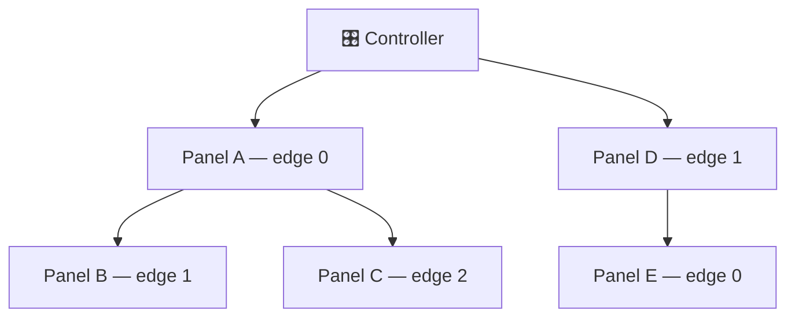

# Firmware Overview

Lightnet is embedded firmware for a tree network of addressable-LED panels. One ESP8266/ESP32 **controller** discovers and drives up to **100 ATmega panels** on ESP32 (**32** on ESP8266 — the firmware cap; the I²C address space allows more) over I²C. The controller exposes Wi-Fi APIs; panels run animations locally after a single setup packet.

!!! info "New to Lightnet?"
    Start with the **[Get Started](../getting-started/index.md)** guide on the hub — it walks you through hardware, toolchain, and the first flash before you dive into these reference pages.

## Controller vs Panel

Two entirely different binaries are compiled from one source tree. The preprocessor flag `LIGHTNET_TARGET_CONTROLLER` (set in `platformio.ini`) selects the target — the unused half is eliminated at compile time.

| Target | MCU | Role |
|---|---|---|
| **Controller** | ESP8266 / ESP32 | Discovery, Wi-Fi, HTTP + WebSocket API, animation scheduling, panel OTA |
| **Panel** | ATmega328P / 328PB | Local animation playback, single WS2812 LED, I²C slave |

There is no runtime branching. Shared code lives in `lib/Lightnet/Common/`.

## Discovery & topology

Panels form a **tree** rooted at the controller. Each panel has up to 3 physical edge connectors. On boot the controller pings each edge over GPIO — receiving panels respond and register over I²C, getting a sequential index for all later unicast traffic.

Deep dive: [Architecture → Discovery sequence](architecture.md#6-discovery-sequence).

## Animation system

!!! success "Zero per-frame I²C for local animations"
    Panel-local animations (BREATHE, PULSE, REACTIVE, …) run entirely on the ATmega after a single PREPARE packet. The bus is free between beats.

- **Panel-local animations** — BREATHE, FADE, PULSE, BLINK, HUE_CYCLE, STROBE, REACTIVE, TRANSITION, SOLID. Zero per-frame I²C traffic.
- **Controller runners** — WAVE, RIPPLE, CHASE, WHEEL, BOUNCE compile to per-panel local pulses (one setup burst); RAIN, SPARKLE, MATRIX are particle spawners driven over the step window.
- **Scenes** — multi-layer JSON containers stored on LittleFS, played back by `ScenePlayer`.
- **Palettes** — 1–16 stop RGB gradients, sampled in 256 positions at frame time.
- **Groups** — synchronisation units; panels in the same group fire simultaneously (±2.5 µs jitter via I²C General Call).

Full schema: [Animations & Scenes](animations/concepts.md).

## External interfaces

| Where | What |
|---|---|
| `ws://lightnet-<chipid>.local/ws` | Binary WebSocket — low-latency panel control and reactive triggers |
| `http://lightnet-<chipid>.local` | JSON REST — appearance, scenes, palettes, panel control, firmware updates |
| `_lightnet._tcp` (mDNS) | Service discovery as `lightnet-<chipid>.local` |

Full surface: [API Reference](api.md).

---

[:fontawesome-brands-github: przemczan/lightnet-firmware](https://github.com/przemczan/lightnet-firmware){ .md-button }
